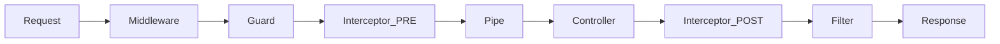

# 1. Introducing More Building Blocks

## 🎯 Learning Goal

Understand the complete NestJS **Request Lifecycle** and where each "Building Block" fits into the request processing pipeline.

## 🧠 Concept

So far, you know **Controllers** (handle requests), **Providers** (business logic), and **Modules** (organization).
But what happens _before_ a request hits your controller? Or _after_ it returns?

NestJS has a specific order of operations:

1.  **Middleware**: Executes first. Good for logging, modifying the request object (Express/Fastify layer).
2.  **Guards**: Authorization. "Can this request proceed?" 🛡️
3.  **Interceptors (Pre-Controller)**: Extra logic before the handler.
4.  **Pipes**: Validation & Transformation of input data. 🚰
5.  **Controller Handler**: Your actual method.
6.  **Interceptors (Post-Controller)**: Modifying the response.
7.  **Filters**: Exception handling. Catches errors thrown anywhere. 🥅

## 💻 Implementation

You don't implement anything right here, but visualize this flow:

## 🧩 Activity / Challenge

1.  Review the diagram above.
2.  Imagine you want to ensure the user is an Admin. Where would that go? (Answer: **Guard**)
3.  Imagine you want to ensure the `id` param is a number. Where would that go? (Answer: **Pipe**)
4.  Imagine you want to format all dates in the response to ISO strings. Where would that go? (Answer: **Interceptor**)

## 🔑 Key Takeaways

- NestJS has a strict pipeline.
- **Guards**: AuthZ.
- **Pipes**: Validation.
- **Interceptors**: Transform Request/Response.
- **Filters**: Error Handling.
