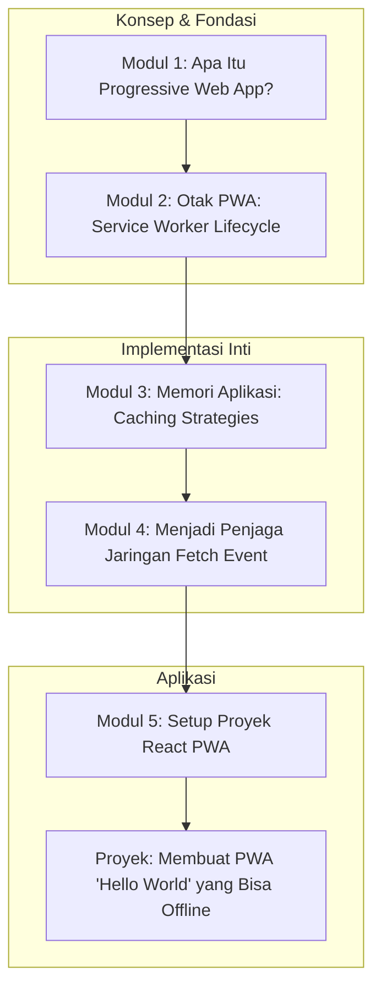

# 📘 Silabus: Pengantar PWA dan Service Workers (CD01)

**Judul Pembelajaran: Memberi Kekuatan Super pada Web: Langkah Pertama Anda dengan Progressive Web Apps**

Selamat datang di evolusi web berikutnya. Progressive Web App (PWA) adalah aplikasi web yang terasa seperti aplikasi native—cepat, dapat diandalkan, dan menarik. Kursus ini adalah gerbang Anda untuk memahami fondasi PWA, dengan fokus pada **Service Worker**, skrip di latar belakang yang menjadi otak dari kemampuan offline dan fitur-fitur canggih lainnya.

### 🎯 **Tujuan Utama Pembelajaran**

Setelah menyelesaikan kursus ini, Anda akan mampu:

1. **Memahami Konsep PWA:** Menjelaskan tiga pilar utama PWA: _Capable, Reliable, Installable_.
2. **Menguasai Siklus Hidup Service Worker:** Memahami proses registrasi, instalasi, dan aktivasi dari sebuah _service worker_.
3. **Menerapkan Strategi Caching Dasar:** Menggunakan _Cache API_ di dalam _service worker_ untuk menyimpan aset statis (_app shell_) secara lokal.
4. **Mencegat Permintaan Jaringan:** Menggunakan _event_ `fetch` di _service worker_ untuk menyajikan respons dari _cache_ saat offline.
5. **Mengatur Proyek PWA dengan React & TypeScript:** Melakukan _setup_ awal proyek React yang siap untuk diubah menjadi PWA.

### 🗺️ **Alur Pembelajaran**

Kita akan mulai dari konsep PWA, lalu mempelajari "otak"-nya (_service worker_), belajar cara "mengingat" (_caching_), cara "mencegat" permintaan, dan diakhiri dengan setup proyek.

### 📚 **Modul Pembelajaran**

Berikut adalah rincian materi dari setiap modul.

### **💡 Modul 1: Apa Itu Progressive Web App (PWA)?**

**Tujuan Modul:**

- Menjelaskan manfaat PWA bagi pengguna dan developer.
- Mengidentifikasi kriteria inti sebuah PWA (HTTPS, Manifest, Service Worker).
- Membedakan PWA dari aplikasi web biasa dan aplikasi native.
- Melihat contoh-contoh PWA yang sukses.

**Daftar Lesson:**

- **Lesson 1.1:** Evolusi Aplikasi Web.
- **Lesson 1.2:** Tiga Pilar PWA: _Capable, Reliable, Installable_.
- **Lesson 1.3:** PWA vs. Native.
- **Lesson 1.4:** Studi Kasus PWA di Dunia Nyata.

**Aktivitas Utama Modul:**

- 📱 **Latihan:** Peserta mengunjungi beberapa PWA terkenal (misalnya, Twitter Lite, Starbucks PWA) di perangkat mobile mereka dan mencoba fitur "Add to Home Screen".

### **🧠 Modul 2: Otak PWA: Siklus Hidup _Service Worker_**

**Tujuan Modul:**

- Memahami _service worker_ sebagai _proxy_ jaringan di _browser_.
- Mendaftarkan (_register_) sebuah _service worker_ di aplikasi React.
- Memahami _event_ `install` dan `activate` dalam siklus hidup.
- Menggunakan _Developer Tools_ untuk menginspeksi dan men-debug _service worker_.

**Daftar Lesson:**

- **Lesson 2.1:** Pengantar _Service Workers_.
- **Lesson 2.2:** Registrasi _Service Worker_.
- **Lesson 2.3:** Siklus Hidup: _Install, Activate, Fetch_.
- **Lesson 2.4:** _Debugging_ dengan _Browser DevTools_.

**Aktivitas Utama Modul:**

- 💻 **Latihan:** Peserta membuat file `service-worker.js` yang kosong dan berhasil mendaftarkannya di aplikasi React mereka, lalu memverifikasinya di tab _Application_ di Chrome DevTools.

### **💾 Modul 3: Memori Aplikasi: Strategi _Caching_**

**Tujuan Modul:**

- Memahami _Cache API_ sebagai penyimpanan lokal untuk _request/response_.
- Menggunakan _event_ `install` untuk melakukan _pre-cache_ aset _app shell_ (HTML, CSS, JS).
- Membuat dan membuka _cache_ dengan nama yang spesifik.
- Mengelola versi _cache_ di dalam _event_ `activate`.

**Daftar Lesson:**

- **Lesson 3.1:** Pengantar _Cache API_.
- **Lesson 3.2:** _Precaching_ Aset Statis saat Instalasi.
- **Lesson 3.3:** Mengelola Versi _Cache_.
- **Lesson 3.4:** Strategi _Cache-First_ untuk _App Shell_.

**Aktivitas Utama Modul:**

- ✍️ **Latihan:** Peserta menulis kode di dalam _event_ `install` untuk menyimpan file `index.html` dan CSS utama ke dalam _cache_.

### * interception**

**Tujuan Modul:**

- Menggunakan _event listener_ untuk `fetch`.
- Mencegat semua permintaan jaringan dari aplikasi.
- Menerapkan strategi _cache-first_: memeriksa _cache_ terlebih dahulu sebelum ke jaringan.
- Menyajikan aset dari _cache_ saat aplikasi sedang offline.

**Daftar Lesson:**

- **Lesson 4.1:** Mencegat Permintaan dengan _Fetch Event_.
- **Lesson 4.2:** Strategi _Cache-First_.
- **Lesson 4.3:** Menangani Permintaan yang Tidak Ada di _Cache_.
- **Lesson 4.4:** Mensimulasikan Kondisi Offline.

**Aktivitas Utama Modul:**

- 🔌 **Proyek: Membuat PWA "Hello World" yang Bisa Offline:** Peserta menyelesaikan _service worker_ mereka. Aplikasi React sederhana mereka harus bisa diakses bahkan saat mode offline diaktifkan di DevTools, karena _app shell_nya disajikan dari _cache_.

### 📖 **Sumber Belajar Tambahan**

- **Dokumentasi:**
    - [web.dev by Google - Progressive Web Apps](https://web.dev/progressive-web-apps/)
    - [MDN Web Docs - Service Worker API](https://developer.mozilla.org/en-US/docs/Web/API/Service_Worker_API)
- **Tools:**
    - Chrome DevTools (Tab Application -> Service Workers & Cache Storage).