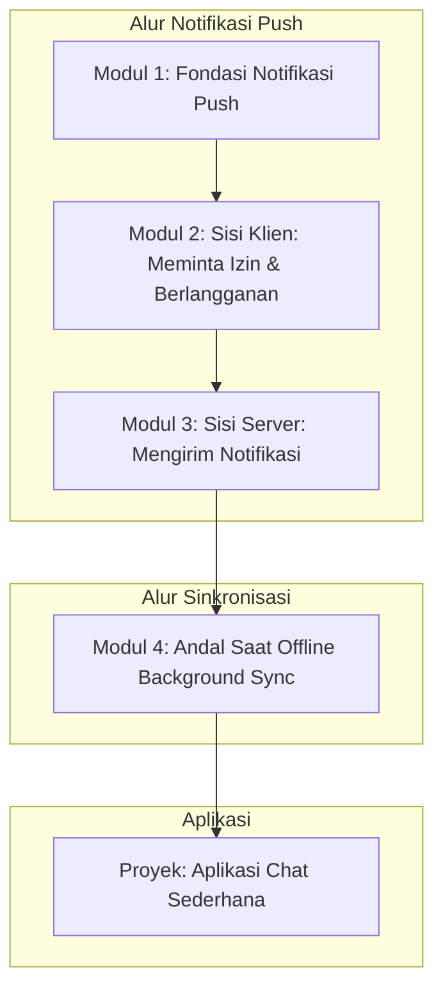

# 📘 Silabus: Push Notifications dan Background Sync (CT01)

**Judul Pembelajaran: Membuat Aplikasi Tetap Hidup: Notifikasi Push dan Sinkronisasi Latar Belakang**

Bagaimana cara membuat PWA Anda tetap menarik dan fungsional bahkan saat tidak sedang dibuka? Kursus tingkat lanjut ini akan mengajarkan Anda dua API PWA yang sangat kuat: **Push API** untuk mengirim notifikasi yang relevan kepada pengguna, dan **Background Sync API** untuk menunda aksi hingga koneksi internet kembali stabil, menciptakan pengalaman yang benar-benar andal.

### 🎯 **Tujuan Utama Pembelajaran**

Setelah menyelesaikan kursus ini, Anda akan mampu:

1. **Memahami Alur Kerja Notifikasi Push:** Menjelaskan proses lengkap dari permintaan izin, berlangganan (_subscription_), hingga pengiriman notifikasi dari server.
2. **Mengimplementasikan Langganan Notifikasi:** Menggunakan _Push API_ di sisi klien untuk meminta izin dan mendapatkan objek langganan dari pengguna.
3. **Mengirim Notifikasi dari Server:** Menggunakan _library_ di sisi _backend_ (Node.js) untuk mengirim notifikasi _push_ ke _endpoint_ langganan.
4. **Menangani Notifikasi di _Service Worker_:** Menampilkan notifikasi kustom saat pesan _push_ diterima di _service worker_.
5. **Menerapkan _Background Sync_:** Menggunakan _Background Sync API_ untuk memastikan permintaan yang gagal (misalnya, mengirim pesan) akan otomatis dicoba kembali saat koneksi pulih.

### 🗺️ **Alur Pembelajaran**

Kita akan fokus pada dua alur kerja: pertama, alur notifikasi (dari klien meminta, ke server mengirim, kembali ke klien menampilkan), dan kedua, alur sinkronisasi (klien gagal, mendaftar, lalu berhasil saat online).

### 📚 **Modul Pembelajaran**

Berikut adalah rincian materi dari setiap modul.

### **🔔 Modul 1: Fondasi Notifikasi Push**

**Tujuan Modul:**

- Memahami manfaat dan etika dari notifikasi _push_.
- Menjelaskan peran _Service Worker_, Klien, Server Aplikasi, dan _Push Service_.
- Meng-generate kunci VAPID (_Voluntary Application Server Identification_).
- Memahami alur kerja lengkap secara konseptual.

**Daftar Lesson:**

- **Lesson 1.1:** Menarik Kembali Pengguna dengan Notifikasi.
- **Lesson 1.2:** Empat Aktor dalam Drama Notifikasi Push.
- **Lesson 1.3:** Kunci Identitas Server Anda: VAPID Keys.
- **Lesson 1.4:** Gambaran Besar Alur Kerja.

**Aktivitas Utama Modul:**

- ✍️ **Latihan:** Peserta meng-generate sepasang kunci VAPID (publik dan privat) menggunakan _library_ `web-push`.

### **📲 Modul 2: Sisi Klien: Meminta Izin dan Berlangganan**

**Tujuan Modul:**

- Memeriksa apakah _browser_ mendukung notifikasi _push_.
- Meminta izin dari pengguna untuk mengirim notifikasi.
- Berlangganan ke _push service_ menggunakan `pushManager.subscribe()`.
- Mengirim objek langganan (_subscription_) ke server aplikasi.

**Daftar Lesson:**

- **Lesson 2.1:** Meminta Izin dengan Sopan.
- **Lesson 2.2:** Berlangganan ke _Push Service_.
- **Lesson 2.3:** Mengirim Objek Langganan ke Server.
- **Lesson 2.4:** Menangani Pembatalan Langganan.

**Aktivitas Utama Modul:**

- 💻 **Latihan:** Peserta membuat sebuah tombol di aplikasi React yang, saat diklik, akan meminta izin notifikasi dan mencetak objek langganan ke konsol.

### **📤 Modul 3: Sisi Server: Mengirim Notifikasi**

**Tujuan Modul:**

- Membuat _backend_ sederhana (misalnya, dengan Node.js/Express) untuk menyimpan langganan.
- Menginstal dan menggunakan _library_ `web-push`.
- Membuat _endpoint_ API untuk menerima dan menyimpan objek langganan.
- Membuat logika untuk mengirim notifikasi _push_ ke semua pelanggan.
- Menangani _event_ `push` di _service worker_ untuk menampilkan notifikasi.

**Daftar Lesson:**

- **Lesson 3.1:** Menyiapkan _Backend_ untuk Notifikasi.
- **Lesson 3.2:** Mengirim Notifikasi dengan `web-push`.
- **Lesson 3.3:** Menampilkan Notifikasi di _Service Worker_.
- **Lesson 3.4:** Kustomisasi Notifikasi (Ikon, Aksi).

**Aktivitas Utama Modul:**

- 📤 **Latihan:** Peserta membuat _endpoint_ API sederhana yang, saat dipanggil, akan mengirim notifikasi "Hello World" ke perangkat mereka sendiri.

### **🔄 Modul 4: Andal Saat Offline (_Background Sync_)**

**Tujuan Modul:**

- Memahami masalah permintaan yang gagal saat offline.
- Menggunakan `SyncManager` untuk mendaftarkan tugas sinkronisasi.
- Mendengarkan _event_ `sync` di _service worker_.
- Menjalankan kembali permintaan jaringan yang gagal di dalam _event handler_ `sync`.

**Daftar Lesson:**

- **Lesson 4.1:** Pengantar _Background Sync API_.
- **Lesson 4.2:** Mendaftarkan Tugas Sinkronisasi.
- **Lesson 4.3:** Menangani _Event_ `sync` di _Service Worker_.
- **Lesson 4.4:** Pola Desain untuk Aplikasi yang Andal.

**Aktivitas Utama Modul:**

- 🚀 **Proyek: Aplikasi Chat Sederhana:** Peserta membangun aplikasi chat PWA sederhana. (1) Pengguna dapat berlangganan notifikasi. (2) Saat pesan baru diterima, server akan mengirim notifikasi _push_. (3) Jika pengguna mengirim pesan saat offline, aplikasi akan menggunakan _Background Sync_ untuk mengirim pesan tersebut secara otomatis saat koneksi kembali.

### 📖 **Sumber Belajar Tambahan**

- **Dokumentasi:**
    - [web.dev - Push Notifications](https://web.dev/push-notifications-overview/)
    - [MDN - Push API](https://developer.mozilla.org/en-US/docs/Web/API/Push_API)
    - [MDN - Background Sync API](https://developer.mozilla.org/en-US/docs/Web/API/Background_Synchronization_API)
- **Library:**
    - [`web-push`](https://www.google.com/search?q=%5Bhttps://www.npmjs.com/package/web-push%5D\(https://www.npmjs.com/package/web-push\)) (untuk Node.js).