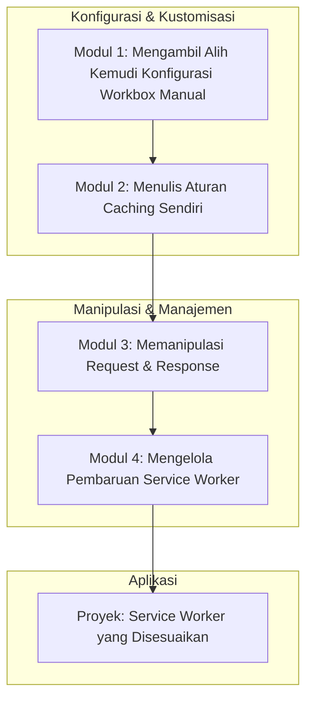

# 📘 Silabus: Advanced Service Workers (AD01)

**Judul Pembelajaran: Mengendalikan Jaringan: Kustomisasi Lanjutan _Service Worker_ dengan Workbox**

Anda sudah tahu cara menggunakan Workbox untuk strategi dasar. Sekarang saatnya menjadi master dan membuat _service worker_ yang disesuaikan sepenuhnya dengan kebutuhan aplikasi Anda. Kursus ini akan membawa Anda menyelami konfigurasi Workbox yang lebih dalam, memungkinkan Anda menulis strategi _caching_ kustom, mencegat dan memodifikasi _request_, dan mengelola _service worker_ Anda dengan presisi.

### 🎯 **Tujuan Utama Pembelajaran**

Setelah menyelesaikan kursus ini, Anda akan mampu:

1. **Mengkonfigurasi Workbox secara Manual:** Beralih dari _template_ otomatis ke konfigurasi Workbox yang eksplisit untuk kontrol penuh.
2. **Menerapkan Strategi _Caching_ Kustom:** Menulis fungsi _handler_ kustom untuk strategi _caching_ yang tidak tercakup oleh strategi bawaan.
3. **Mencegat dan Memodifikasi _Request_:** Menggunakan _plugin_ Workbox untuk memodifikasi _header_ atau _body_ dari _request_ sebelum dikirim ke jaringan atau _cache_.
4. **Menangani Navigasi dan _App Shell_:** Mengimplementasikan _Navigation Preloading_ dan menyajikan _app shell_ kustom untuk semua navigasi.
5. **Mengelola Pembaruan _Service Worker_:** Memahami alur pembaruan _service worker_ dan memberikan UI kepada pengguna untuk mengaktifkan versi baru.

### 🗺️ **Alur Pembelajaran**

Kita akan mulai dari mengambil alih kontrol (konfigurasi manual), lalu belajar cara membuat aturan sendiri (strategi kustom), memanipulasi lalu lintas (intersepsi), dan diakhiri dengan manajemen pembaruan.

### 📚 **Modul Pembelajaran**

Berikut adalah rincian materi dari setiap modul.

### **🔧 Modul 1: Mengambil Alih Kemudi (Konfigurasi Workbox Manual)**

**Tujuan Modul:**

- Memahami mode `generateSW` vs. `injectManifest`.
- Beralih ke mode `injectManifest` untuk kontrol penuh.
- Membuat file _service worker_ kustom (`src/sw.js`) sebagai sumber.
- Mengimpor dan menggunakan _library_ Workbox di dalam _service worker_ kustom.

**Daftar Lesson:**

- **Lesson 1.1:** Dua Mode Konfigurasi Workbox.
- **Lesson 1.2:** Beralih ke `injectManifest`.
- **Lesson 1.3:** File _Service Worker_ Sumber Anda.
- **Lesson 1.4:** Menggunakan API Workbox secara Langsung.

**Aktivitas Utama Modul:**

- 💻 **Latihan:** Peserta merefaktor proyek PWA mereka untuk menggunakan mode `injectManifest`, memindahkan logika _precaching_ ke dalam file _service worker_ kustom.

### **✍️ Modul 2: Menulis Aturan _Caching_ Sendiri**

**Tujuan Modul:**

- Memahami arsitektur `Router` dan `Route` di Workbox.
- Mendaftarkan rute berdasarkan URL (string, regex) atau _callback_ kustom.
- Menggabungkan beberapa strategi _caching_ (misalnya, coba _cache_, jika gagal coba jaringan, jika gagal sajikan halaman _fallback_).
- Membuat _handler_ strategi kustom dari awal.

**Daftar Lesson:**

- **Lesson 2.1:** _Routing_ Permintaan di Workbox.
- **Lesson 2.2:** Mencocokkan Permintaan dengan Regex dan _Callbacks_.
- **Lesson 2.3:** Menggabungkan Strategi Bawaan.
- **Lesson 2.4:** Menulis Fungsi _Handler_ Kustom.

**Aktivitas Utama Modul:**

- ✍️ **Latihan:** Peserta menulis sebuah rute kustom yang akan menangani semua permintaan gambar dan menerapkan strategi _Cache-First_ dengan batas waktu kedaluwarsa.

### **🔄 Modul 3: Memanipulasi _Request_ dan _Response_**

**Tujuan Modul:**

- Memahami konsep _plugin_ Workbox.
- Menggunakan `CacheableResponsePlugin` untuk hanya men-cache respons dengan status tertentu.
- Menggunakan `ExpirationPlugin` untuk mengatur batas jumlah item atau waktu kedaluwarsa _cache_.
- Menulis _plugin_ kustom sederhana untuk memodifikasi _header_ sebelum _request_ di-cache.

**Daftar Lesson:**

- **Lesson 3.1:** Memperluas Fungsionalitas dengan _Plugins_.
- **Lesson 3.2:** Hanya Cache Respons yang "Baik".
- **Lesson 3.3:** Membersihkan _Cache_ Secara Otomatis.
- **Lesson 3.4:** Menulis _Plugin_ Kustom Anda.

**Aktivitas Utama Modul:**

- 🔄 **Latihan:** Peserta menambahkan `ExpirationPlugin` pada rute gambar mereka untuk memastikan _cache_ tidak tumbuh terlalu besar.

### **🆕 Modul 4: Mengelola Pembaruan _Service Worker_**

**Tujuan Modul:**

- Memahami siklus pembaruan _service worker_ (_installing, waiting, active_).
- Mendeteksi kapan _service worker_ baru tersedia dan sedang dalam status _waiting_.
- Menampilkan UI (misalnya, tombol "Update Tersedia") kepada pengguna.
- Mengirim pesan ke _service worker_ untuk melewati fase _waiting_ dan mengaktifkan versi baru.

**Daftar Lesson:**

- **Lesson 4.1:** Siklus Hidup Pembaruan.
- **Lesson 4.2:** Mendeteksi Versi Baru di Klien.
- **Lesson 4.3:** Memberi Pengguna Kontrol untuk Memperbarui.
- **Lesson 4.4:** Melewati Fase _Waiting_.

**Aktivitas Utama Modul:**

- 🚀 **Proyek: _Service Worker_ yang Disesuaikan:** Peserta membangun sebuah PWA yang: (1) Menggunakan `injectManifest`. (2) Memiliki rute kustom untuk API dengan strategi _Stale-While-Revalidate_ dan _plugin_ untuk _cache_ kedaluwarsa. (3) Memiliki rute kustom untuk gambar dengan strategi _Cache-First_. (4) Mengimplementasikan UI yang memberi tahu pengguna saat ada versi baru aplikasi dan memungkinkan mereka untuk me-refresh.

### 📖 **Sumber Belajar Tambahan**

- **Dokumentasi:**
    - [Workbox Docs - Advanced Guides](https://developer.chrome.com/docs/workbox/modules/)
- **Artikel:**
    - Artikel dari web.dev tentang resep-resep _service worker_ kustom.