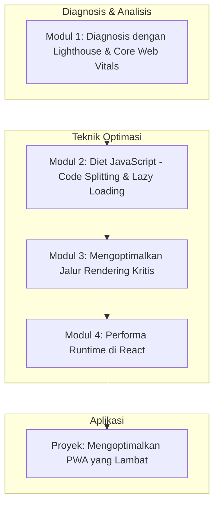

# 📘 Silabus: Performance Optimization (AM01)

**Judul Pembelajaran: Memeras Setiap Milidetik: Mengoptimalkan Performa PWA Anda**

PWA yang hebat harus terasa instan. Kursus ini fokus pada teknik-teknik untuk mengoptimalkan performa PWA Anda secara menyeluruh, memastikan pemuatan awal yang secepat kilat dan interaksi yang mulus. Kita akan menggunakan **Lighthouse** sebagai kompas, dan menerapkan strategi seperti _lazy loading_, _code splitting_, dan optimasi aset untuk mencapai skor performa tertinggi.

### 🎯 **Tujuan Utama Pembelajaran**

Setelah menyelesaikan kursus ini, Anda akan mampu:

1. **Menguasai Audit Performa dengan Lighthouse:** Menggunakan Lighthouse untuk mengidentifikasi _bottleneck_ performa dan memahami metrik _Core Web Vitals_.
2. **Menerapkan _Lazy Loading_ untuk Rute dan Komponen:** Menggunakan React.lazy dan Suspense untuk memuat kode hanya saat dibutuhkan.
3. **Mengoptimalkan _Bundle_ JavaScript:** Menganalisis ukuran _bundle_ dan menerapkan teknik _code splitting_ untuk mengurangi ukuran JavaScript awal.
4. **Mengoptimalkan Aset Kritis:** Menerapkan strategi untuk optimasi gambar, font, dan CSS agar tidak memblokir _rendering_.
5. **Meningkatkan Performa _Runtime_:** Menggunakan teknik _memoization_ di React untuk mencegah _re-rendering_ yang tidak perlu.

### 🗺️ **Alur Pembelajaran**

Kita akan mulai dari diagnosis (Lighthouse), lalu mengoptimalkan tiga pilar utama: JavaScript, Aset, dan _Rendering_, dan diakhiri dengan validasi hasil.

### 📚 **Modul Pembelajaran**

Berikut adalah rincian materi dari setiap modul.

### **📊 Modul 1: Diagnosis dengan Lighthouse dan _Core Web Vitals_**

**Tujuan Modul:**

- Menjalankan audit Lighthouse dan menginterpretasikan laporannya.
- Memahami metrik _Core Web Vitals_: LCP (_Largest Contentful Paint_), FID (_First Input Delay_)/INP (_Interaction to Next Paint_), dan CLS (_Cumulative Layout Shift_).
- Menggunakan _Performance_ tab di Chrome DevTools untuk analisis yang lebih dalam.
- Menetapkan target performa untuk aplikasi.

**Daftar Lesson:**

- **Lesson 1.1:** Pengantar Audit Performa dengan Lighthouse.
- **Lesson 1.2:** Memahami _Core Web Vitals_.
- **Lesson 1.3:** Analisis Mendalam dengan _Performance Profiler_.
- **Lesson 1.4:** Menetapkan Anggaran Performa (_Performance Budget_).

**Aktivitas Utama Modul:**

- 💻 **Latihan:** Peserta menjalankan audit Lighthouse pada situs web favorit mereka dan mencoba mengidentifikasi satu rekomendasi performa utama dari laporan tersebut.

### **🔪 Modul 2: Diet JavaScript (_Code Splitting_ dan _Lazy Loading_)**

**Tujuan Modul:**

- Memahami dampak JavaScript pada waktu muat dan interaktivitas.
- Menerapkan _route-based code splitting_ menggunakan `React.lazy()` dan `Suspense`.
- Menerapkan _component-based code splitting_ untuk komponen yang tidak terlihat di awal.
- Menganalisis _bundle_ menggunakan _tools_ seperti `source-map-explorer`.

**Daftar Lesson:**

- **Lesson 2.1:** JavaScript: Biaya Terbesar di Web.
- **Lesson 2.2:** _Lazy Loading_ Rute.
- **Lesson 2.3:** _Lazy Loading_ Komponen.
- **Lesson 2.4:** Menganalisis dan Memangkas _Bundle_ Anda.

**Aktivitas Utama Modul:**

- ✍️ **Latihan:** Peserta mengambil sebuah aplikasi React dengan beberapa rute dan merefaktornya agar setiap rute di-_lazy load_.

### **🖼️ Modul 3: Mengoptimalkan Jalur _Rendering_ Kritis**

**Tujuan Modul:**

- Mengoptimalkan gambar (kompresi, format modern seperti WebP, _lazy loading_).
- Menerapkan strategi pemuatan font yang efisien untuk menghindari _flash of invisible text_.
- Mengidentifikasi dan menghilangkan CSS yang memblokir _rendering_.
- Memprioritaskan pemuatan aset kritis.

**Daftar Lesson:**

- **Lesson 3.1:** Optimasi Gambar.
- **Lesson 3.2:** Strategi Pemuatan Font.
- **Lesson 3.3:** Mengoptimalkan Pengiriman CSS.
- **Lesson 3.4:** Memprioritaskan Aset Kritis.

**Aktivitas Utama Modul:**

- 🖼️ **Latihan:** Peserta menggunakan _tool_ online seperti Squoosh untuk mengkompres sebuah gambar dan membandingkan ukuran serta kualitasnya.

### **⚛️ Modul 4: Performa _Runtime_ di React**

**Tujuan Modul:**

- Menggunakan React DevTools Profiler untuk mengidentifikasi _re-rendering_ yang tidak perlu.
- Menerapkan `React.memo` untuk mencegah _re-rendering_ pada komponen fungsional.
- Menggunakan _hooks_ `useMemo` dan `useCallback` untuk _memoization_.
- Mengoptimalkan _rendering_ daftar panjang dengan virtualisasi.

**Daftar Lesson:**

- **Lesson 4.1:** Mendiagnosis _Re-rendering_ dengan _Profiler_.
- **Lesson 4.2:** _Memoization_ Komponen dengan `React.memo`.
- **Lesson 4.3:** `useMemo` dan `useCallback`.
- **Lesson 4.4:** Menangani Daftar Panjang dengan Virtualisasi.

**Aktivitas Utama Modul:**

- 🚀 **Proyek: Mengoptimalkan PWA yang Lambat:** Peserta diberi sebuah PWA React yang sengaja dibuat lambat. Tugas mereka adalah: (1) Melakukan audit Lighthouse untuk mendapatkan skor awal. (2) Mengidentifikasi _bottleneck_ utama. (3) Menerapkan berbagai teknik optimasi yang telah dipelajari. (4) Melakukan audit akhir dan menyajikan laporan perbandingan skor performa.

### 📖 **Sumber Belajar Tambahan**

- **Dokumentasi:**
    - [web.dev - Fast load times](https://web.dev/fast/)
    - [React Docs - Optimizing Performance](https://www.google.com/search?q=https://react.dev/learn/optimizing-performance)
- **Tools:**
    - Lighthouse, PageSpeed Insights, [WebPageTest.org](http://WebPageTest.org).
    - `source-map-explorer`.