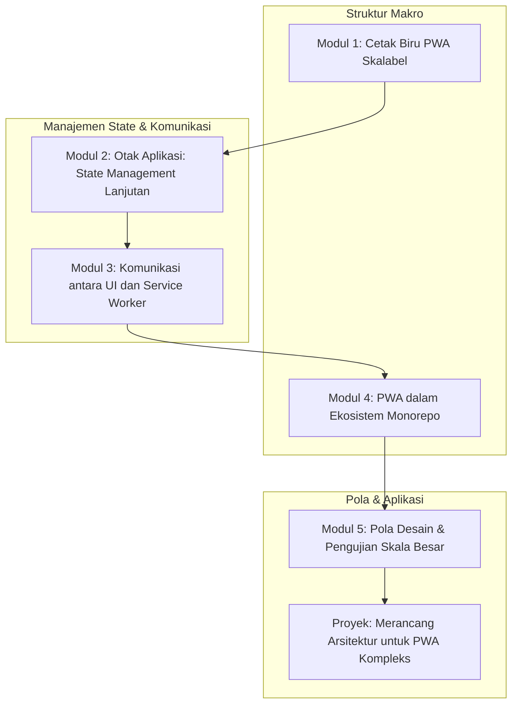

# 📘 Silabus: PWA Architecture dan Scalability (AT01)

**Judul Pembelajaran: Membangun untuk Jangka Panjang: Arsitektur PWA yang Skalabel dan Dapat Dipelihara**

Saat PWA tumbuh dari aplikasi sederhana menjadi produk yang kompleks, arsitektur menjadi penentu antara kesuksesan dan utang teknis. Kursus tingkat lanjut ini fokus pada prinsip dan pola desain untuk menstrukturkan PWA skala besar, memastikan kode Anda tetap modular, _state_ terkelola dengan baik, dan aplikasi siap untuk pertumbuhan fitur dan tim.

### 🎯 **Tujuan Utama Pembelajaran**

Setelah menyelesaikan kursus ini, Anda akan mampu:

1. **Merancang Arsitektur PWA Modular:** Menerapkan pola arsitektur berbasis fitur atau domain untuk mengorganisir kode.
2. **Mengelola _State_ yang Kompleks dan Persisten:** Mengintegrasikan Redux (dengan Redux Persist) atau _state manager_ lain untuk mengelola _state_ yang kompleks dan menyimpannya untuk penggunaan offline.
3. **Memisahkan Logika _Service Worker_:** Merancang arsitektur di mana logika _service worker_ terpisah dan dapat berkomunikasi dengan UI.
4. **Menerapkan Pola Desain untuk Kode Skalabel:** Menggunakan _custom hooks_, React Context, dan prinsip-prinsip SOLID untuk menciptakan _codebase_ yang bersih.
5. **Mengintegrasikan PWA ke dalam Monorepo:** Memahami bagaimana PWA dapat menjadi bagian dari _monorepo_ untuk berbagi kode dengan aplikasi lain (misalnya, web atau _backend_).

### 🗺️ **Alur Pembelajaran**

Kita akan membangun dari struktur makro (arsitektur & monorepo), lalu ke "otak" aplikasi (_state management_), dan diakhiri dengan pola-pola yang menjaga kode tetap bersih dan terorganisir.

### 📚 **Modul Pembelajaran**

Berikut adalah rincian materi dari setiap modul.

### **🏗️ Modul 1: Cetak Biru PWA Skalabel (Arsitektur Modular)**

**Tujuan Modul:**

- Menganalisis pro dan kontra dari berbagai pendekatan struktur direktori.
- Menerapkan struktur berbasis fitur (_feature-based_).
- Mengorganisir kode berdasarkan domain bisnis.
- Menetapkan konvensi penamaan dan struktur untuk tim.

**Daftar Lesson:**

- **Lesson 1.1:** Tantangan Skalabilitas di Proyek PWA.
- **Lesson 1.2:** Pola Arsitektur Berbasis Fitur.
- **Lesson 1.3:** Praktik Terbaik untuk Mengorganisir Kode.
- **Lesson 1.4:** Konvensi untuk Skalabilitas.

**Aktivitas Utama Modul:**

- ✍️ **Latihan Desain Struktur:** Peserta diberi serangkaian fitur untuk sebuah PWA e-commerce dan diminta untuk merancang struktur direktori berbasis fitur untuknya.

### **🧠 Modul 2: Otak Aplikasi: _State Management_ Lanjutan**

**Tujuan Modul:**

- Mengintegrasikan Redux Toolkit untuk _state management_ yang dapat diprediksi.
- Menggunakan `redux-persist` untuk menyimpan _state_ ke IndexedDB atau penyimpanan lokal.
- Merancang _state_ agar dapat dihidrasi kembali saat aplikasi dibuka dalam mode offline.
- Mengelola _state_ asinkron dan data API dengan _thunks_ atau Redux Saga.

**Daftar Lesson:**

- **Lesson 2.1:** _State Management_ untuk Aplikasi Offline-First.
- **Lesson 2.2:** Setup Redux Toolkit dan Redux Persist.
- **Lesson 2.3:** Merancang _State_ yang Persisten.
- **Lesson 2.4:** Menangani Data Asinkron di Redux.

**Aktivitas Utama Modul:**

- 🧠 **Latihan:** Peserta mengintegrasikan Redux Toolkit dan `redux-persist` ke dalam sebuah aplikasi sederhana untuk mengelola daftar item yang tetap ada setelah aplikasi ditutup dan dibuka kembali.

### **📡 Modul 3: Komunikasi antara UI dan _Service Worker_**

**Tujuan Modul:**

- Memahami batasan komunikasi antara _window context_ dan _service worker context_.
- Menggunakan `postMessage()` untuk mengirim pesan dari UI ke _service worker_ dan sebaliknya.
- Menerapkan pola untuk memberi tahu UI tentang status koneksi.
- Membangun antrian permintaan (_request queueing_) di sisi klien yang akan diproses oleh _service worker_.

**Daftar Lesson:**

- **Lesson 3.1:** Dua Dunia yang Terpisah.
- **Lesson 3.2:** Berkomunikasi dengan `postMessage()`.
- **Lesson 3.3:** Menampilkan Status Online/Offline di UI.
- **Lesson 3.4:** Membuat Antrian Permintaan untuk Sinkronisasi.

**Aktivitas Utama Modul:**

- 📡 **Latihan:** Peserta mengimplementasikan sebuah fitur di mana UI dapat mengirim pesan ke _service worker_ untuk secara manual memicu pembersihan _cache_ lama.

### **📦 Modul 4: PWA dalam Ekosistem Monorepo**

**Tujuan Modul:**

- Memahami manfaat _monorepo_ untuk berbagi logika antara PWA dan aplikasi web standar.
- Mengatur proyek PWA di dalam _monorepo_ Turborepo.
- Membuat paket `shared` untuk tipe TypeScript, utilitas, dan _hooks_ yang digunakan bersama.
- Mengelola _build_ dan _deployment_ PWA dari dalam _monorepo_.

**Daftar Lesson:**

- **Lesson 4.1:** Kapan PWA Perlu Monorepo?
- **Lesson 4.2:** Setup PWA dengan Turborepo.
- **Lesson 4.3:** Berbagi Logika dan Tipe.
- **Lesson 4.4:** Alur Kerja _Build_ di Monorepo.

**Aktivitas Utama Modul:**

- 📦 **Latihan:** Peserta membuat sebuah _monorepo_ baru dan memindahkan _custom hook_ untuk _data fetching_ ke dalam paket `shared` yang dapat digunakan oleh aplikasi PWA.

### **🧩 Modul 5: Pola Desain dan Pengujian Skala Besar**

**Tujuan Modul:**

- Menerapkan pola _Smart/Dumb Components_ untuk memisahkan logika dan tampilan.
- Menggunakan React Context untuk _dependency injection_.
- Menulis _unit test_ untuk _reducers_ dan _actions_ Redux.
- Menulis _integration test_ untuk alur kerja yang melibatkan interaksi dengan _state_ global.

**Daftar Lesson:**

- **Lesson 5.1:** Pola Komponen _Smart_ dan _Dumb_.
- **Lesson 5.2:** _Dependency Injection_ dengan React Context.
- **Lesson 5.3:** Menguji Logika _State Management_ Anda.
- **Lesson 5.4:** Menguji Alur Kerja Pengguna.

**Aktivitas Utama Modul:**

- 🚀 **Proyek: Merancang Arsitektur untuk PWA Kompleks:** Peserta diberi sebuah deskripsi PWA yang kompleks (misalnya, aplikasi kolaborasi tim offline-first). Tugas mereka adalah merancang arsitektur tingkat tingginya dalam sebuah dokumen, yang mencakup: (1) Desain struktur direktori, (2) Desain skema _state_ Redux, (3) Diagram alur data untuk fitur sinkronisasi offline, dan (4) Rencana untuk paket bersama di _monorepo_.

### 📖 **Sumber Belajar Tambahan**

- **Dokumentasi:**
    - [Redux Toolkit](https://redux-toolkit.js.org/)
    - [Redux Persist](https://github.com/rt2zz/redux-persist)
- **Buku:**
    - _Clean Architecture_ oleh Robert C. Martin (konsepnya).
- **Pola Desain:**
    - Artikel-artikel tentang arsitektur PWA dan _offline-first_.