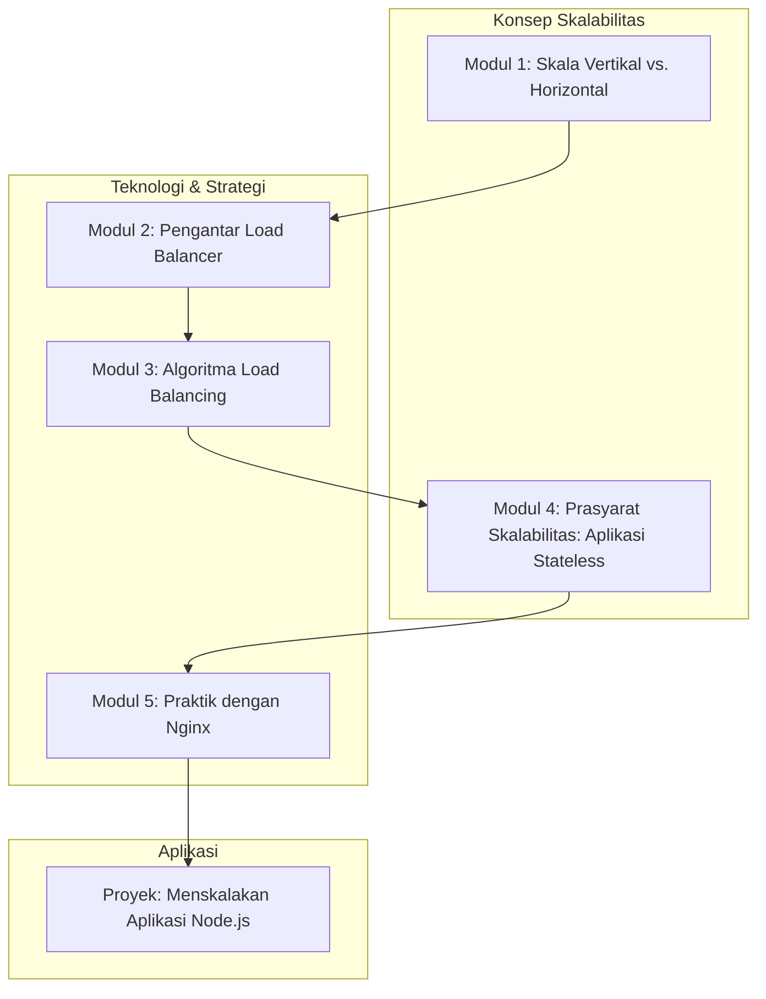

# 📘 Silabus: Load Balancing dan Scalability (AA01)

**Judul Pembelajaran: Bertumbuh Tanpa Batas: Skalabilitas Horizontal dan Load Balancing**

Satu server memiliki batas. Untuk menangani ribuan atau jutaan pengguna, Anda perlu mendistribusikan beban ke banyak server. Kursus tingkat lanjut ini akan mengajarkan Anda tentang **skalabilitas horizontal** dan peran krusial dari _**Load Balancer**_ dalam mendistribusikan lalu lintas, memastikan aplikasi Anda tetap responsif dan tersedia bahkan di bawah beban puncak.

### 🎯 **Tujuan Utama Pembelajaran**

Setelah menyelesaikan kursus ini, Anda akan mampu:

1. **Memahami Konsep Skalabilitas:** Membedakan antara skala vertikal (_scaling up_) dan skala horizontal (_scaling out_).
2. **Menjelaskan Cara Kerja _Load Balancer_:** Memahami fungsi _load balancer_ sebagai "polisi lalu lintas" untuk permintaan masuk.
3. **Mengenal Algoritma _Load Balancing_:** Membedakan algoritma dasar seperti _Round Robin, Least Connections_, dan _IP Hash_.
4. **Merancang Arsitektur yang _Stateless_:** Memahami mengapa aplikasi _backend_ harus _stateless_ agar dapat diskalakan secara horizontal.
5. **Menerapkan dalam Praktik:** Menggunakan _load balancer_ sederhana (seperti Nginx) untuk mendistribusikan lalu lintas ke beberapa instans aplikasi Node.js.

### 🗺️ **Alur Pembelajaran**

Kita akan mulai dari konsep skalabilitas, lalu mempelajari alat utamanya (_load balancer_), berbagai strateginya, prasyaratnya (aplikasi _stateless_), dan terakhir, implementasinya.

### 📚 **Modul Pembelajaran**

Berikut adalah rincian materi dari setiap modul.

### Modul 1: * scaling up vs scaling out**

**Tujuan Modul:**

- Memahami skala vertikal (_scaling up_): menambah sumber daya (CPU, RAM) ke satu server.
- Memahami skala horizontal (_scaling out_): menambah lebih banyak server.
- Menganalisis keuntungan dan kerugian dari masing-masing pendekatan.
- Memahami mengapa skala horizontal lebih disukai untuk aplikasi web modern.

**Daftar Lesson:**

- **Lesson 1.1:** Batas dari Satu Mesin.
- **Lesson 1.2:** Skala Vertikal.
- **Lesson 1.3:** Skala Horizontal.
- **Lesson 1.4:** Memilih Strategi yang Tepat.

**Aktivitas Utama Modul:**

- 🗣️ **Diskusi:** Peserta mendiskusikan jenis aplikasi apa yang mungkin lebih cocok untuk skala vertikal vs. horizontal.

### **🚦 Modul 2: Pengantar _Load Balancer_**

**Tujuan Modul:**

- Memahami _load balancer_ sebagai titik masuk tunggal untuk semua lalu lintas.
- Menjelaskan bagaimana _load balancer_ meningkatkan ketersediaan (_high availability_) dan skalabilitas.
- Membedakan antara _load balancer_ lapisan 4 (Transport) dan lapisan 7 (Aplikasi).
- Mengenal _health checks_ yang digunakan oleh _load balancer_.

**Daftar Lesson:**

- **Lesson 2.1:** Polisi Lalu Lintas untuk Server Anda.
- **Lesson 2.2:** Manfaat Ganda: Skalabilitas dan Ketersediaan.
- **Lesson 2.3:** Lapisan 4 vs. Lapisan 7.
- **Lesson 2.4:** Memeriksa "Kesehatan" Server (_Health Checks_).

**Aktivitas Utama Modul:**

- ✍️ **Latihan Desain:** Peserta membuat diagram arsitektur sederhana yang menunjukkan posisi _load balancer_ di depan beberapa server aplikasi.

### **🔀 Modul 3: Algoritma _Load Balancing_**

**Tujuan Modul:**

- Memahami algoritma _Round Robin_.
- Memahami algoritma _Least Connections_.
- Memahami algoritma _IP Hash_ untuk sesi yang "lengket" (_sticky sessions_).
- Mengetahui kapan harus menggunakan setiap algoritma.

**Daftar Lesson:**

- **Lesson 3.1:** Berbagai Cara Mendistribusikan Lalu Lintas.
- **Lesson 3.2:** _Round Robin_ dan Variasinya.
- **Lesson 3.3:** _Least Connections_.
- **Lesson 3.4:** _Sticky Sessions_ dengan _IP Hash_.

**Aktivitas Utama Modul:**

- ⚖️ **Diskusi Skenario:** "Untuk sebuah aplikasi chat, algoritma _load balancing_ mana yang lebih cocok jika kita ingin pengguna tetap terhubung ke server yang sama? Mengapa?"

### **🧠 Modul 4: Prasyarat Skalabilitas: Aplikasi _Stateless_**

**Tujuan Modul:**

- Membedakan antara aplikasi _stateful_ dan _stateless_.
- Memahami mengapa _state_ sesi yang disimpan di memori server mencegah skala horizontal.
- Menerapkan strategi untuk mengeksternalisasi _state_ (misalnya, menyimpan sesi di Redis atau database).
- Merancang aplikasi agar setiap server dapat menangani permintaan dari pengguna mana pun.

**Daftar Lesson:**

- **Lesson 4.1:** _Stateful_ vs. _Stateless_.
- **Lesson 4.2:** Masalah dengan _State_ Lokal.
- **Lesson 4.3:** Mengeksternalisasi Sesi Anda.
- **Lesson 4.4:** Merancang untuk Skalabilitas.

**Aktivitas Utama Modul:**

- 💻 **Latihan Refaktor:** Peserta mengambil sebuah aplikasi Express sederhana yang menggunakan _in-memory session_ dan merefaktornya untuk menyimpan sesi di Redis.

### **🛠️ Modul 5: Praktik dengan Nginx sebagai _Load Balancer_**

**Tujuan Modul:**

- Menginstal dan menjalankan Nginx menggunakan Docker.
- Mengkonfigurasi Nginx sebagai _reverse proxy_ dan _load balancer_.
- Mendefinisikan grup _upstream_ dari server aplikasi.
- Menerapkan algoritma _load balancing_ yang berbeda di konfigurasi Nginx.

**Daftar Lesson:**

- **Lesson 5.1:** Nginx: Pisau Swiss Army untuk Web.
- **Lesson 5.2:** Konfigurasi Nginx sebagai _Load Balancer_.
- **Lesson 5.3:** Mendefinisikan _Upstream Servers_.
- **Lesson 5.4:** Mengubah Algoritma.

**Aktivitas Utama Modul:**

- 🚀 **Proyek: Menskalakan Aplikasi Node.js:** Peserta diberi sebuah aplikasi Node.js/TypeScript sederhana. Tugas mereka adalah: (1) Meng-kontainer-kan aplikasi tersebut. (2) Menggunakan Docker Compose untuk menjalankan 3 instans dari aplikasi tersebut. (3) Menjalankan kontainer Nginx. (4) Mengkonfigurasi Nginx untuk bertindak sebagai _load balancer_ di depan 3 instans aplikasi. (5) Mendemonstrasikan bahwa permintaan didistribusikan di antara ketiga instans.

### 📖 **Sumber Belajar Tambahan**

- **Dokumentasi:**
    - [Nginx Docs - Load Balancing](http://nginx.org/en/docs/http/load_balancing.html)
- **Buku:**
    - _The Art of Scalability_ oleh Martin L. Abbott dan Michael T. Fisher.
- **Penyedia Cloud:**
    - Dokumentasi tentang Elastic Load Balancing (AWS), Cloud Load Balancing (GCP).