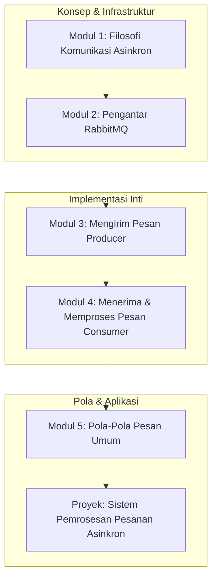

# 📘 Silabus: Async Processing (AA02)

**Judul Pembelajaran: Bekerja di Balik Layar: Menguasai Pemrosesan Asinkron dengan Message Queues**

Tidak semua tugas harus diselesaikan secara instan. Untuk operasi yang memakan waktu, pendekatan terbaik adalah menjalankannya di latar belakang. Kursus ini akan mengajarkan Anda cara menggunakan **Message Queues** (dengan fokus pada **RabbitMQ**) untuk memisahkan (_decouple_) bagian-bagian dari aplikasi Anda dan memproses tugas secara asinkron, meningkatkan responsivitas dan ketahanan sistem Anda.

### 🎯 **Tujuan Utama Pembelajaran**

Setelah menyelesaikan kursus ini, Anda akan mampu:

1. **Memahami Arsitektur Berbasis Pesan:** Menjelaskan manfaat dari komunikasi asinkron dan arsitektur yang digerakkan oleh _event_.
2. **Menguasai Konsep Inti _Message Queue_:** Membedakan antara _Producer, Consumer, Exchange_, dan _Queue_ di RabbitMQ.
3. **Mengimplementasikan _Producer_:** Membuat layanan (misalnya, di NestJS) yang mempublikasikan pesan ke sebuah _exchange_.
4. **Mengimplementasikan _Consumer_:** Membuat _worker_ terpisah yang berlangganan ke sebuah _queue_ dan memproses pesan yang masuk.
5. **Menerapkan Pola Pesan Umum:** Menggunakan pola _work queues_ untuk mendistribusikan tugas dan pola _publish/subscribe_ untuk menyiarkan _event_.

### 🗺️ **Alur Pembelajaran**

Kita akan mulai dari konsepnya, lalu menyiapkan infrastrukturnya, belajar cara mengirim dan menerima pesan, dan terakhir, menerapkan pola-pola yang umum digunakan.

### 📚 **Modul Pembelajaran**

Berikut adalah rincian materi dari setiap modul.

### **💡 Modul 1: Filosofi Komunikasi Asinkron**

**Tujuan Modul:**

- Membedakan antara komunikasi sinkron (misalnya, panggilan REST API langsung) dan asinkron.
- Memahami manfaat dari _decoupling_: layanan tidak perlu saling mengetahui secara langsung.
- Menjelaskan bagaimana _message queues_ meningkatkan ketahanan (_resilience_) dan skalabilitas.
- Mengidentifikasi kasus penggunaan yang ideal untuk pemrosesan asinkron.

**Daftar Lesson:**

- **Lesson 2.1:** Sinkron vs. Asinkron.
- **Lesson 2.2:** Manfaat _Decoupling_.
- **Lesson 2.3:** Ketahanan dan Skalabilitas.
- **Lesson 2.4:** Kasus Penggunaan di Dunia Nyata.

**Aktivitas Utama Modul:**

- 🗣️ **Diskusi:** "Dalam proses checkout e-commerce, bagian mana yang harus sinkron (misalnya, validasi pembayaran) dan bagian mana yang bisa asinkron (misalnya, mengirim email konfirmasi)?"

### **🐇 Modul 2: Pengantar RabbitMQ**

**Tujuan Modul:**

- Memahami RabbitMQ sebagai _message broker_.
- Menjalankan RabbitMQ menggunakan Docker.
- Mengenal komponen utama: _Producer, Consumer, Exchange, Queue, Binding_.
- Menggunakan antarmuka manajemen RabbitMQ.

**Daftar Lesson:**

- **Lesson 2.1:** Apa Itu RabbitMQ?
- **Lesson 2.2:** Menjalankan RabbitMQ dengan Docker.
- **Lesson 2.3:** Anatomi RabbitMQ.
- **Lesson 2.4:** Dasbor Manajemen.

**Aktivitas Utama Modul:**

- 💻 **Latihan:** Peserta menjalankan kontainer Docker RabbitMQ dan berhasil mengakses serta menjelajahi antarmuka manajemen webnya.

### **📤 Modul 3: Mengirim Pesan (_Producer_)**

**Tujuan Modul:**

- Menginstal _library client_ AMQP untuk Node.js (misalnya, `amqplib`).
- Menghubungkan ke server RabbitMQ.
- Membuat _channel_.
- Mempublikasikan pesan ke sebuah _exchange_.
- Membungkus logika _producer_ di dalam sebuah _service_ di NestJS.

**Daftar Lesson:**

- **Lesson 3.1:** _Library Client_ AMQP.
- **Lesson 3.2:** Menghubungkan dan Membuat _Channel_.
- **Lesson 3.3:** Mempublikasikan Pesan.
- **Lesson 3.4:** Integrasi dengan NestJS.

**Aktivitas Utama Modul:**

- ✍️ **Latihan:** Peserta menulis sebuah skrip _producer_ sederhana yang mengirim pesan "Hello World" ke sebuah _exchange_.

### **📥 Modul 4: Menerima dan Memproses Pesan (_Consumer_)**

**Tujuan Modul:**

- Membuat aplikasi _worker_ terpisah.
- Menghubungkan ke RabbitMQ.
- Mendeklarasikan sebuah _queue_ dan mengikatnya (_bind_) ke sebuah _exchange_.
- Mengonsumsi pesan dari _queue_.
- Mengirim _acknowledgement_ (ack) setelah pesan berhasil diproses.

**Daftar Lesson:**

- **Lesson 4.1:** Membangun _Worker_ Anda.
- **Lesson 4.2:** Berlangganan ke _Queue_.
- **Lesson 4.3:** Mengonsumsi Pesan.
- **Lesson 4.4:** Konfirmasi Pemrosesan (_Acknowledgements_).

**Aktivitas Utama Modul:**

- 📥 **Latihan:** Peserta menulis sebuah skrip _consumer_ yang akan menerima pesan "Hello World" dari _producer_ dan mencetaknya ke konsol.

### **🧩 Modul 5: Pola-Pola Pesan Umum**

**Tujuan Modul:**

- Mengimplementasikan pola _Work Queues_ untuk mendistribusikan tugas ke beberapa _worker_.
- Mengimplementasikan pola _Publish/Subscribe_ menggunakan _fanout exchange_.
- Pengenalan singkat tentang _routing_ dan _topic exchanges_.
- Menerapkan pola _dead-letter queue_ untuk menangani pesan yang gagal diproses.

**Daftar Lesson:**

- **Lesson 5.1:** Pola _Work Queues_.
- **Lesson 5.2:** Pola _Publish/Subscribe_.
- **Lesson 5.3:** _Routing_ Pesan yang Lebih Canggih.
- **Lesson 5.4:** Menangani Pesan yang Gagal.

**Aktivitas Utama Modul:**

- 🚀 **Proyek: Sistem Pemrosesan Pesanan Asinkron:** Peserta membangun sebuah sistem mikro layanan sederhana. (1) Sebuah API NestJS akan menerima permintaan untuk "membuat pesanan" dan mempublikasikan _event_ `order_created` ke RabbitMQ. (2) Dua _worker_ terpisah (`email_worker` dan `inventory_worker`) akan berlangganan ke _event_ tersebut. `email_worker` akan mensimulasikan pengiriman email, dan `inventory_worker` akan mensimulasikan pengurangan stok.

### 📖 **Sumber Belajar Tambahan**

- **Dokumentasi:**
    - [RabbitMQ Tutorials](https://www.rabbitmq.com/getstarted.html)
- **Buku:**
    - _Enterprise Integration Patterns_ oleh Gregor Hohpe dan Bobby Woolf.
- **Library:**
    - [`amqplib`](https://www.google.com/search?q=%5Bhttps://www.npmjs.com/package/amqplib%5D\(https://www.npmjs.com/package/amqplib\))