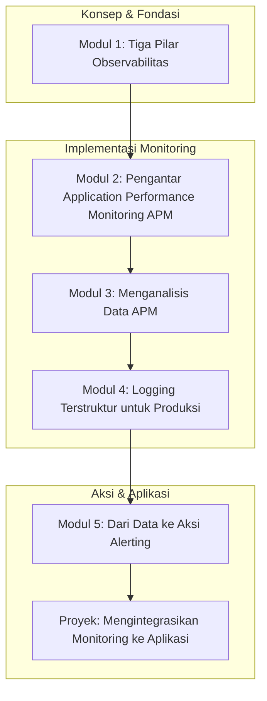

# 📘 Silabus: Performance Monitoring (AE01)

**Judul Pembelajaran: Mata Elang di Produksi: Memantau Performa Backend dengan APM dan Logging**

Optimasi yang dilakukan saat pengembangan perlu divalidasi di dunia nyata. Kursus tingkat ahli ini akan mengajarkan Anda cara memantau dan mengukur performa aplikasi _backend_ Anda di **produksi**. Anda akan belajar tentang **Application Performance Monitoring (APM)** untuk mendapatkan visibilitas mendalam, dan praktik **logging** terstruktur untuk _debugging_ dan analisis.

### 🎯 **Tujuan Utama Pembelajaran**

Setelah menyelesaikan kursus ini, Anda akan mampu:

1. **Memahami Konsep Observabilitas:** Menjelaskan tiga pilar observabilitas: _Logs, Metrics_, dan _Traces_.
2. **Mengimplementasikan _Application Performance Monitoring_ (APM):** Mengintegrasikan agen APM (seperti New Relic atau Datadog) ke dalam aplikasi Node.js.
3. **Menganalisis Data APM:** Menggunakan dasbor APM untuk mengidentifikasi _endpoint_ yang lambat, _query_ database yang tidak efisien, dan eror.
4. **Menerapkan _Logging_ Terstruktur untuk Produksi:** Menggunakan _library_ seperti Pino atau Winston untuk menghasilkan _log_ dalam format JSON yang mudah dianalisis.
5. **Mengatur Peringatan (_Alerting_):** Mengkonfigurasi aturan peringatan di platform APM atau _logging_ untuk mendapatkan notifikasi proaktif tentang masalah performa atau eror.

### 🗺️ **Alur Pembelajaran**

Kita akan mulai dari konsep observabilitas, lalu mempelajari alat utamanya (APM), memperdalam visibilitas dengan _logging_, dan terakhir, belajar cara bertindak secara proaktif dengan _alerting_.

### 📚 **Modul Pembelajaran**

Berikut adalah rincian materi dari setiap modul.

### **🔭 Modul 1: Tiga Pilar Observabilitas**

**Tujuan Modul:**

- Memahami observabilitas sebagai kemampuan untuk memahami keadaan internal sistem dari output eksternalnya.
- Menjelaskan peran _Logs_ (peristiwa diskrit).
- Menjelaskan peran _Metrics_ (pengukuran numerik dari waktu ke waktu).
- Menjelaskan peran _Traces_ (representasi perjalanan sebuah _request_ melalui sistem).

**Daftar Lesson:**

- **Lesson 1.1:** Apa Itu Observabilitas?
- **Lesson 1.2:** Pilar 1: _Logs_.
- **Lesson 1.3:** Pilar 2: _Metrics_.
- **Lesson 1.4:** Pilar 3: _Traces_.

**Aktivitas Utama Modul:**

- 🗣️ **Diskusi:** Peserta mendiskusikan bagaimana ketiga pilar ini dapat digunakan bersama untuk mendiagnosis masalah: "Metrik menunjukkan lonjakan latensi, _trace_ menunjukkan _bottleneck_ di database, dan _log_ memberikan detail eror dari _query_ tersebut."

### **📈 Modul 2: Pengantar _Application Performance Monitoring_ (APM)**

**Tujuan Modul:**

- Memahami apa itu APM dan masalah yang dipecahkannya.
- Memilih penyedia layanan APM (New Relic, Datadog, Sentry APM, dll.).
- Menginstal dan mengkonfigurasi agen APM di dalam aplikasi Node.js/TypeScript.
- Memverifikasi bahwa data transaksi mulai muncul di dasbor APM.

**Daftar Lesson:**

- **Lesson 2.1:** Pengantar APM.
- **Lesson 2.2:** Memilih _Tool_ APM.
- **Lesson 2.3:** Menginstal Agen APM.
- **Lesson 2.4:** Melihat Data Pertama Anda.

**Aktivitas Utama Modul:**

- 💻 **Latihan:** Peserta mendaftar untuk akun uji coba gratis di salah satu layanan APM dan berhasil mengintegrasikan agennya ke dalam aplikasi Node.js sederhana.

### **📊 Modul 3: Menganalisis Data APM**

**Tujuan Modul:**

- Membaca dasbor APM utama.
- Mengidentifikasi transaksi web yang paling lambat.
- Melihat detail _trace_ untuk membedah waktu respons (misalnya, waktu di _middleware_, _controller_, panggilan database).
- Mengidentifikasi _query_ database yang paling sering atau paling lama dieksekusi.
- Menganalisis tingkat eror.

**Daftar Lesson:**

- **Lesson 3.1:** Membaca Dasbor APM.
- **Lesson 3.2:** Menemukan _Endpoint_ yang Lambat.
- **Lesson 3.3:** Menyelami _Distributed Tracing_.
- **Lesson 3.4:** Pemantauan Performa Database.
- **Lesson 3.5:** Analisis Eror.

**Aktivitas Utama Modul:**

- 📊 **Analisis Data:** Peserta diberi akses ke dasbor APM demo (atau menggunakan data dari aplikasi mereka) dan ditugaskan untuk menemukan 3 _endpoint_ paling lambat.

### **📝 Modul 4: _Logging_ Terstruktur untuk Produksi**

**Tujuan Modul:**

- Memahami kembali pentingnya _logging_ terstruktur (JSON).
- Mengintegrasikan _library_ seperti Pino (fokus performa) ke dalam aplikasi.
- Menambahkan konteks ke dalam _log_ (misalnya, `requestId`, `userId`).
- Mengirim _log_ ke layanan agregasi _log_ (pengenalan singkat).

**Daftar Lesson:**

- **Lesson 4.1:** _Logging_ yang Siap untuk Mesin.
- **Lesson 4.2:** Implementasi dengan Pino.
- **Lesson 4.3:** Memperkaya _Log_ Anda dengan Konteks.
- **Lesson 4.4:** Mengirim _Log_ ke Tempat Terpusat.

**Aktivitas Utama Modul:**

- 📝 **Latihan:** Peserta merefaktor aplikasi mereka untuk menggunakan Pino sebagai _logger_ utama dan memastikan setiap _log_ memiliki format JSON.

### **🔔 Modul 5: Dari Data ke Aksi (_Alerting_)**

**Tujuan Modul:**

- Memahami pentingnya _alerting_ proaktif.
- Mengatur aturan _alert_ di platform APM untuk anomali (misalnya, jika latensi p95 melebihi ambang batas).
- Mengatur _alert_ untuk lonjakan tingkat eror.
- Mengintegrasikan _alert_ dengan alat komunikasi tim (misalnya, Slack).

**Daftar Lesson:**

- **Lesson 5.1:** Dari Reaktif menjadi Proaktif.
- **Lesson 5.2:** Mengatur _Alert_ untuk Performa.
- **Lesson 5.3:** Mengatur _Alert_ untuk Eror.
- **Lesson 5.4:** Integrasi _Alerting_.

**Aktivitas Utama Modul:**

- 🚀 **Proyek: Mengintegrasikan Monitoring ke Aplikasi:** Peserta mengambil sebuah aplikasi API yang sudah ada. Tugas mereka adalah: (1) Mengintegrasikan agen APM (New Relic/Sentry). (2) Mengganti `console.log` dengan _logger_ terstruktur (Pino). (3) Menjalankan _load test_ sederhana untuk menghasilkan data. (4) Membuat dasbor sederhana di platform APM dan mengatur satu aturan _alert_ (misalnya, jika tingkat eror di atas 5%).

### 📖 **Sumber Belajar Tambahan**

- **Dokumentasi:**
    - Dokumentasi dari New Relic, Datadog, Sentry.
- **Konsep:**
    - Observability, APM, Structured Logging.
- **Library:**
    - `pino`, `winston`.