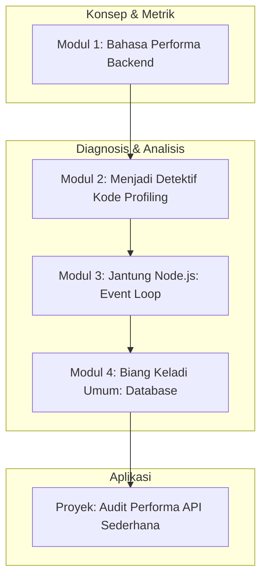

# 📘 Silabus: Pengantar Backend Performance (CI01)

**Judul Pembelajaran: Mengukur Kecepatan Server: Fondasi Performa Backend**

Selamat datang di ruang mesin aplikasi Anda. Performa _backend_ adalah tulang punggung dari pengalaman pengguna yang cepat dan responsif. Kursus ini adalah fondasi Anda untuk menjadi seorang _performance-aware backend engineer_. Anda akan belajar cara mengukur kecepatan API, menggunakan _profiler_ untuk menemukan kode yang lambat, dan memahami metrik-metrik kunci yang menentukan performa _backend_.

### 🎯 **Tujuan Utama Pembelajaran**

Setelah menyelesaikan kursus ini, Anda akan mampu:

1. **Memahami Metrik Performa Backend:** Menjelaskan metrik-metrik kunci seperti _response time, throughput_ (RPS), dan latensi.
2. **Melakukan _Profiling_ Aplikasi Node.js:** Menggunakan _profiler_ bawaan Node.js dan _tools_ seperti `clinic.js` untuk mengidentifikasi _bottleneck_ dalam kode.
3. **Menganalisis _Event Loop_:** Memahami cara kerja _event loop_ di Node.js dan bagaimana operasi yang memblokir dapat merusak performa.
4. **Mengidentifikasi _Query_ Database yang Lambat:** Mengenali _query_ database sebagai salah satu penyebab utama kelambatan API.
5. **Menerapkan Pola Pikir Performa:** Mengintegrasikan pengujian dan pengukuran performa ke dalam alur kerja pengembangan Anda.

### 🗺️ **Alur Pembelajaran**

Kita akan mulai dari "apa" yang diukur, lalu belajar "bagaimana" cara mengukurnya, memahami "mengapa" bisa lambat, dan diakhiri dengan diagnosis masalah.

### 📚 **Modul Pembelajaran**

Berikut adalah rincian materi dari setiap modul.

### **⏱️ Modul 1: Bahasa Performa Backend**

**Tujuan Modul:**

- Membedakan antara latensi dan _throughput_.
- Memahami _response time_ dan komponen-komponennya (misalnya, waktu proses, waktu jaringan).
- Mengenal persentil (p95, p99) dalam pengukuran performa.
- Menetapkan target performa atau SLO (_Service Level Objective_) sederhana.

**Daftar Lesson:**

- **Lesson 1.1:** Apa Artinya "Cepat"?
- **Lesson 1.2:** Latensi vs. _Throughput_.
- **Lesson 1.3:** Membedah _Response Time_.
- **Lesson 1.4:** Mengukur untuk Pengguna Nyata: Persentil.

**Aktivitas Utama Modul:**

- 💻 **Latihan:** Peserta menggunakan _tool_ seperti Postman atau `curl` untuk mengukur _response time_ dari sebuah API publik dan mengidentifikasi komponen-komponen waktunya.

### **🕵️ Modul 2: Menjadi Detektif Kode (_Profiling_)**

**Tujuan Modul:**

- Memahami apa itu _profiling_ dan kapan melakukannya.
- Menggunakan _profiler_ bawaan V8 di Node.js.
- Menggunakan _tools_ seperti `clinic.js` untuk visualisasi _bottleneck_ yang mudah dipahami.
- Membaca _flame graph_ untuk mengidentifikasi fungsi yang paling banyak memakan waktu.

**Daftar Lesson:**

- **Lesson 2.1:** Pengantar _Profiling_ Aplikasi Node.js.
- **Lesson 2.2:** _Profiling_ dengan _Inspector_ Bawaan.
- **Lesson 2.3:** Diagnosis Mudah dengan _Clinic.js_.
- **Lesson 2.4:** Membaca _Flame Graphs_.

**Aktivitas Utama Modul:**

- 🕵️ **Latihan:** Peserta sengaja membuat sebuah _endpoint_ yang memiliki fungsi yang sangat lambat, lalu menggunakan `clinic.js` untuk mem-profil dan mengidentifikasi fungsi tersebut sebagai penyebabnya.

### **🔄 Modul 3: Jantung Node.js: _Event Loop_**

**Tujuan Modul:**

- Memahami cara kerja _event loop_ secara konseptual.
- Mengidentifikasi operasi sinkron yang memblokir (_blocking_) _event loop_.
- Memahami dampak dari _blocking code_ pada _throughput_ server.
- Menganalisis _event loop delay_ sebagai metrik kesehatan aplikasi.

**Daftar Lesson:**

- **Lesson 3.1:** Review _Event Loop_.
- **Lesson 3.2:** Musuh #1: Operasi yang Memblokir.
- **Lesson 3.3:** Dampak pada Skalabilitas.
- **Lesson 3.4:** Mengukur Kesehatan _Event Loop_.

**Aktivitas Utama Modul:**

- 🔄 **Latihan:** Peserta membuat dua _endpoint_, satu asinkron dan satu lagi dengan operasi sinkron yang berat. Mereka kemudian menggunakan _load testing tool_ sederhana untuk melihat bagaimana _endpoint_ yang memblokir merusak kemampuan server untuk menangani permintaan lain.

### **💾 Modul 4: Biang Keladi Umum: Database**

**Tujuan Modul:**

- Memahami mengapa interaksi dengan database sering menjadi _bottleneck_.
- Mengidentifikasi pola _query_ N+1.
- Menggunakan _logging_ dari ORM untuk melihat _query_ SQL yang sebenarnya dijalankan.
- Membedakan antara optimasi di level aplikasi dan kebutuhan optimasi di level database (indeks).

**Daftar Lesson:**

- **Lesson 4.1:** Saat Database Menjadi Lambat.
- **Lesson 4.2:** Masalah Klasik: N+1 _Query_.
- **Lesson 4.3:** Mengintip di Balik ORM.
- **Lesson 4.4:** Kapan Harus Melihat ke Database?

**Aktivitas Utama Modul:**

- 📝 **Proyek: Audit Performa API Sederhana:** Peserta diberi sebuah aplikasi API Node.js/TypeScript yang sengaja dibuat tidak efisien. Tugas mereka adalah: (1) Menggunakan Postman untuk mengukur _response time_ awal. (2) Menggunakan _profiler_ untuk mengidentifikasi fungsi yang lambat. (3) Menganalisis kode untuk menemukan potensi _blocking code_ atau _query_ N+1. (4) Menulis laporan singkat yang berisi temuan dan hipotesis tentang penyebab kelambatan.

### 📖 **Sumber Belajar Tambahan**

- **Dokumentasi:**
    - [Node.js Guides - The Node.js Event Loop](https://nodejs.org/en/docs/guides/event-loop-timers-and-nexttick/)
- **Tools:**
    - [Clinic.js](https://clinicjs.org/)
    - [Postman](https://www.postman.com/), [autocannon](https://github.com/mcollina/autocannon) (untuk _load testing_).
- **Buku:**
    - _Node.js Design Patterns_ oleh Mario Casciaro & Luciano Mammino.