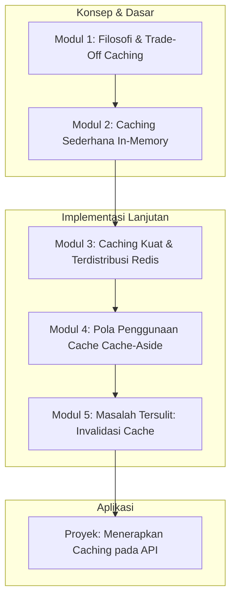

# 📘 Silabus: Caching Strategies (CI03)

**Judul Pembelajaran: Jalan Tol Menuju Data: Menguasai Strategi Caching di Backend**

Panggilan database adalah salah satu operasi paling mahal di _backend_. **Caching** adalah teknik fundamental untuk menyimpan hasil dari operasi yang mahal dan menyajikannya kembali dengan cepat. Kursus ini akan mengajarkan Anda berbagai strategi _caching_, dengan fokus pada penggunaan **Redis** sebagai _cache store_ eksternal untuk aplikasi Node.js/TypeScript Anda.

### 🎯 **Tujuan Utama Pembelajaran**

Setelah menyelesaikan kursus ini, Anda akan mampu:

1. **Memahami Konsep Inti _Caching_:** Menjelaskan manfaat _caching_ dan _trade-off_ utamanya (performa vs. konsistensi data).
2. **Mengimplementasikan _In-Memory Caching_:** Menggunakan _cache_ sederhana di dalam memori aplikasi untuk kasus penggunaan dasar.
3. **Mengintegrasikan Redis:** Menyiapkan dan menghubungkan aplikasi Node.js Anda ke server Redis.
4. **Menerapkan Pola _Caching_ Umum:** Mengimplementasikan pola _Cache-Aside_ untuk membaca dan menulis data.
5. **Mengelola Invalidasi _Cache_:** Menerapkan strategi untuk menghapus atau memperbarui _cache_ saat data asli di database berubah.

### 🗺️ **Alur Pembelajaran**

Kita akan mulai dari konsepnya, lalu implementasi paling sederhana, beralih ke solusi yang lebih kuat (Redis), mempelajari pola penggunaannya, dan terakhir, tantangan terbesarnya (invalidasi).

### 📚 **Modul Pembelajaran**

Berikut adalah rincian materi dari setiap modul.

### **💡 Modul 1: Filosofi dan _Trade-Off Caching_**

**Tujuan Modul:**

- Memahami kapan _caching_ merupakan solusi yang tepat.
- Menjelaskan _trade-off_ antara konsistensi data dan performa.
- Membedakan berbagai lapisan _caching_ (CDN, aplikasi, database).
- Mengenal berbagai strategi _caching_ secara umum.

**Daftar Lesson:**

- **Lesson 3.1:** Kenapa Perlu _Caching_?
- **Lesson 3.2:** _Trade-off_ Utama: Konsistensi vs. Kecepatan.
- **Lesson 3.3:** Lapisan-Lapisan _Caching_.
- **Lesson 3.4:** Peta Strategi _Caching_.

**Aktivitas Utama Modul:**

- 🗣️ **Diskusi:** Peserta mendiskusikan jenis data apa di sebuah situs e-commerce yang merupakan kandidat baik untuk di-_cache_ (misalnya, daftar produk) dan mana yang tidak (misalnya, stok produk).

### **🧠 Modul 2: _Caching_ Sederhana (_In-Memory_)**

**Tujuan Modul:**

- Mengimplementasikan _cache_ sederhana menggunakan `Map` di JavaScript/TypeScript.
- Memahami keuntungan (sangat cepat) dan kerugian (_stateful_, tidak terdistribusi) dari _in-memory cache_.
- Menggunakan _library_ seperti `node-cache` untuk fitur tambahan (misalnya, TTL).

**Daftar Lesson:**

- **Lesson 3.1:** _Cache_ Paling Dasar: di dalam Memori.
- **Lesson 3.2:** Keuntungan dan Kerugian _In-Memory Cache_.
- **Lesson 3.3:** Implementasi dengan `node-cache`.
- **Lesson 3.4:** Kapan _In-Memory Cache_ Cukup?

**Aktivitas Utama Modul:**

- 💻 **Latihan:** Peserta membuat sebuah _service_ yang menggunakan `node-cache` untuk menyimpan hasil dari sebuah fungsi yang mahal.

### **⚡ Modul 3: _Caching_ Kuat dan Terdistribusi (Redis)**

**Tujuan Modul:**

- Memahami Redis sebagai _in-memory data store_.
- Menjalankan Redis menggunakan Docker.
- Menginstal dan menggunakan _client library_ Redis untuk Node.js (misalnya, `ioredis`).
- Menggunakan perintah dasar Redis: `SET`, `GET`, `DEL`, `EXPIRE`.

**Daftar Lesson:**

- **Lesson 3.1:** Pengantar Redis.
- **Lesson 3.2:** Menjalankan Redis dengan Docker.
- **Lesson 3.3:** Berinteraksi dengan Redis dari Node.js.
- **Lesson 3.4:** Perintah-Perintah Dasar Redis.

**Aktivitas Utama Modul:**

- ⚡ **Latihan:** Peserta menulis skrip Node.js sederhana yang terhubung ke Redis, menyimpan sebuah _key-value_, membacanya kembali, dan kemudian menghapusnya.

### **📝 Modul 4: Pola Penggunaan _Cache_ (_Cache-Aside_)**

**Tujuan Modul:**

- Memahami pola _Cache-Aside_ (atau _Lazy Loading_).
- Mengimplementasikan logika:
    1. Cari data di _cache_.
    2. Jika ada (_cache hit_), kembalikan.
    3. Jika tidak ada (_cache miss_), ambil dari database, simpan ke _cache_, lalu kembalikan.
- Membungkus logika ini dalam sebuah _repository_ atau _service_.

**Daftar Lesson:**

- **Lesson 4.1:** Pola _Cache-Aside_.
- **Lesson 4.2:** Logika _Cache Hit_ dan _Cache Miss_.
- **Lesson 4.3:** Implementasi di _Service Layer_.
- **Lesson 4.4:** Menetapkan Waktu Kedaluwarsa (TTL).

**Aktivitas Utama Modul:**

- ✍️ **Latihan:** Peserta merefaktor sebuah fungsi `getProductById` untuk mengimplementasikan pola _Cache-Aside_ menggunakan Redis.

### **🗑️ Modul 5: Masalah Tersulit: Invalidasi _Cache_**

**Tujuan Modul:**

- Memahami mengapa invalidasi _cache_ adalah salah satu masalah tersulit dalam ilmu komputer.
- Menerapkan strategi _write-through caching_ (memperbarui _cache_ saat database diperbarui).
- Menerapkan strategi penghapusan _cache_ saat data diperbarui.
- Memahami _trade-off_ dari setiap strategi invalidasi.

**Daftar Lesson:**

- **Lesson 5.1:** Dua Masalah Tersulit: Penamaan dan Invalidasi _Cache_.
- **Lesson 5.2:** Strategi _Write-Through_.
- **Lesson 5.3:** Strategi Penghapusan Eksplisit.
- **Lesson 5.4:** Memilih Strategi Invalidasi yang Tepat.

**Aktivitas Utama Modul:**

- 🚀 **Proyek: Menerapkan _Caching_ pada API:** Peserta diberi sebuah API yang lambat karena selalu melakukan _query_ database. Tugas mereka adalah: (1) Mengintegrasikan Redis. (2) Menerapkan pola _Cache-Aside_ pada _endpoint_ `GET` yang membaca data. (3) Menerapkan strategi invalidasi _cache_ (hapus _key_) pada _endpoint_ `PUT` dan `DELETE` yang mengubah data.

### 📖 **Sumber Belajar Tambahan**

- **Dokumentasi:**
    - [Redis Docs](https://redis.io/docs/)
- **Pola Desain:**
    - Artikel dari Microsoft atau AWS tentang pola-pola _caching_.
- **Library:**
    - `ioredis`, `node-cache`.