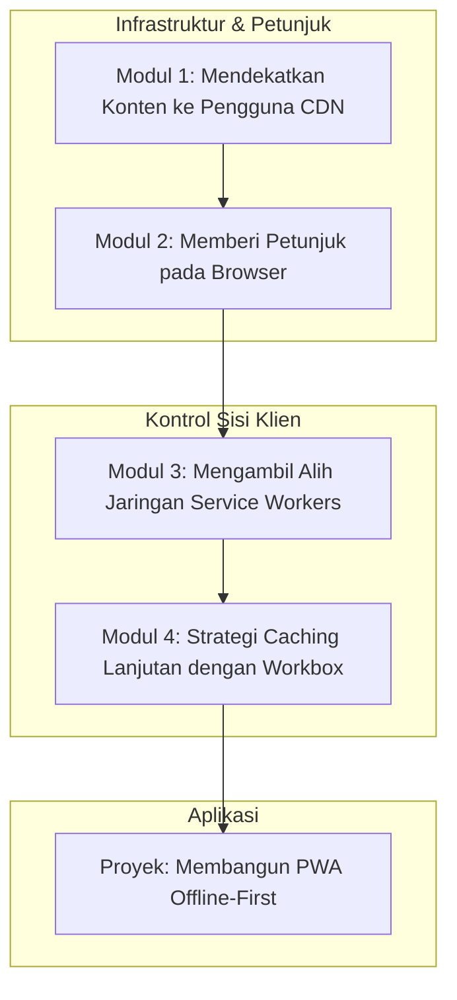

# 📘 Silabus: Network Optimization (AA02)

**Judul Pembelajaran: Mempercepat Pengiriman: Menguasai Optimasi Jaringan dengan CDN, Prefetching, dan Service Workers**

Performa web tidak hanya ditentukan oleh kode Anda, tetapi juga oleh seberapa cepat dan efisien aset Anda dikirimkan melalui jaringan. Kursus tingkat lanjut ini akan mengajarkan Anda cara mengoptimalkan lapisan jaringan, menggunakan **CDN**, teknik **prefetching** cerdas, dan kekuatan **Service Workers** untuk menciptakan pengalaman yang terasa instan bagi pengguna.

### 🎯 **Tujuan Utama Pembelajaran**

Setelah menyelesaikan kursus ini, Anda akan mampu:

1. **Memanfaatkan _Content Delivery Network_ (CDN):** Menjelaskan cara kerja CDN dan bagaimana ia mengurangi latensi dengan menyajikan aset dari lokasi yang lebih dekat dengan pengguna.
2. **Menerapkan _Prefetching_ dan _Preloading_:** Menggunakan `rel="prefetch"` dan `rel="preload"` untuk memberi petunjuk kepada _browser_ tentang sumber daya yang akan dibutuhkan di masa depan.
3. **Menguasai _Caching_ di _Service Worker_:** Menggunakan Workbox untuk mengimplementasikan strategi _caching_ yang canggih (_Stale-While-Revalidate, Cache-First_) untuk aset dan panggilan API.
4. **Mengoptimalkan Protokol Jaringan:** Memahami manfaat dari HTTP/2 dan HTTP/3.
5. **Membangun Aplikasi _Offline-First_:** Menggabungkan semua teknik ini untuk menciptakan aplikasi yang dapat diandalkan bahkan dalam kondisi jaringan yang buruk.

### 🗺️ **Alur Pembelajaran**

Kita akan mengoptimalkan jaringan dari lapisan terluar (CDN), lalu memberi petunjuk kepada browser (prefetching), dan terakhir, mengambil alih kontrol jaringan sepenuhnya (Service Workers).

### 📚 **Modul Pembelajaran**

Berikut adalah rincian materi dari setiap modul.

### **🌍 Modul 1: Mendekatkan Konten ke Pengguna (CDN)**

**Tujuan Modul:**

- Memahami masalah latensi jaringan.
- Menjelaskan cara kerja CDN dan _edge locations_.
- Memahami bagaimana platform seperti Vercel atau Netlify menggunakan CDN secara otomatis.
- Mengkonfigurasi _caching headers_ (seperti `Cache-Control`) untuk menginstruksikan CDN.

**Daftar Lesson:**

- **Lesson 2.1:** Musuh #1: Latensi.
- **Lesson 2.2:** Pengantar _Content Delivery Network_.
- **Lesson 2.3:** CDN Otomatis di Platform Modern.
- **Lesson 2.4:** Mengontrol _Cache_ CDN dengan _Headers_.

**Aktivitas Utama Modul:**

- 💻 **Latihan:** Peserta menggunakan _tool_ seperti `curl -I` atau _Network tab_ DevTools untuk memeriksa _header_ respons dari sebuah situs besar dan mengidentifikasi _header_ yang terkait dengan CDN (misalnya, `X-Vercel-Cache`).

### **🔮 Modul 2: Memberi Petunjuk pada _Browser_ (_Prefetching_ & _Preloading_)**

**Tujuan Modul:**

- Membedakan antara `preload`, `prefetch`, dan `preconnect`.
- Menggunakan `rel="preload"` untuk sumber daya kritis yang dibutuhkan di halaman saat ini.
- Menggunakan `rel="prefetch"` untuk sumber daya yang mungkin dibutuhkan untuk navigasi berikutnya.
- Memahami bagaimana _framework_ seperti Next.js mengimplementasikan _prefetching_ rute secara otomatis.

**Daftar Lesson:**

- **Lesson 2.1:** _Resource Hints_: Berbicara dengan _Browser_.
- **Lesson 2.2:** Memuat Aset Kritis Lebih Awal dengan `preload`.
- **Lesson 2.3:** Mempersiapkan Navigasi Berikutnya dengan `prefetch`.
- **Lesson 2.4:** _Prefetching_ Otomatis di _Framework_ Modern.

**Aktivitas Utama Modul:**

- ✍️ **Latihan:** Peserta menambahkan tag `<link rel="preload">` untuk sebuah font web atau file CSS penting di halaman HTML mereka dan mengamati di _waterfall chart_ bagaimana ia dimuat lebih awal.

### **🤖 Modul 3: Mengambil Alih Jaringan (_Service Workers_)**

**Tujuan Modul:**

- Mereview siklus hidup _service worker_.
- Memahami _service worker_ sebagai _programmable network proxy_.
- Menggunakan _event_ `fetch` untuk mencegat semua permintaan jaringan.
- Mengimplementasikan strategi _cache-first_ sederhana secara manual.

**Daftar Lesson:**

- **Lesson 3.1:** Review _Service Worker Lifecycle_.
- **Lesson 3.2:** _Service Worker_ sebagai _Proxy_.
- **Lesson 3.3:** Mencegat Permintaan dengan _Fetch Event_.
- **Lesson 3.4:** Resep _Cache-First_ Manual.

**Aktivitas Utama Modul:**

- 🤖 **Latihan:** Peserta menulis sebuah _service worker_ sederhana yang mencegat permintaan untuk sebuah gambar dan selalu menyajikannya dari _cache_ jika tersedia.

### **📦 Modul 4: Strategi _Caching_ Lanjutan dengan Workbox**

**Tujuan Modul:**

- Menggunakan Workbox untuk mengimplementasikan strategi _Stale-While-Revalidate_ untuk API.
- Menggunakan Workbox untuk strategi _Cache-First_ untuk font atau gambar.
- Menggunakan Workbox untuk strategi _Network-First_ untuk data yang harus selalu segar.
- Mengkonfigurasi _plugin_ Workbox untuk kedaluwarsa _cache_.

**Daftar Lesson:**

- **Lesson 4.1:** Menyederhanakan Logika dengan Workbox.
- **Lesson 4.2:** Strategi _Stale-While-Revalidate_.
- **Lesson 4.3:** Strategi _Cache-First_ dan _Network-First_.
- **Lesson 4.4:** Mengelola Kedaluwarsa _Cache_.

**Aktivitas Utama Modul:**

- 🚀 **Proyek: Membangun PWA _Offline-First_:** Peserta diberi sebuah aplikasi React sederhana. Tugas mereka adalah mengubahnya menjadi PWA yang _offline-first_. Mereka harus: (1) Menambahkan _service worker_ menggunakan Workbox. (2) Melakukan _precaching app shell_. (3) Menerapkan strategi _caching runtime_ yang sesuai untuk API dan gambar. (4) Memastikan aplikasi tetap fungsional saat mode offline diaktifkan.

### 📖 **Sumber Belajar Tambahan**

- **Dokumentasi:**
    - [web.dev - Network reliability](https://www.google.com/search?q=https://web.dev/learn/pwa/network-reliability/)
    - [Workbox Documentation](https://developer.chrome.com/docs/workbox/)
- **Buku:**
    - _High Performance Browser Networking_ oleh Ilya Grigorik.