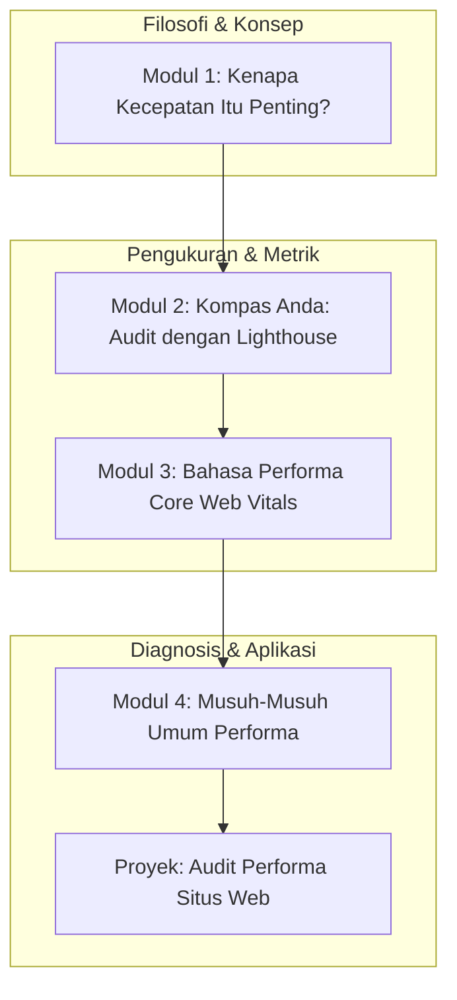

# 📘 Silabus: Pengantar Frontend Performance (CI01)

**Judul Pembelajaran: Membangun Web Secepat Kilat: Fondasi Performa Frontend**

Selamat datang di dunia di mana setiap milidetik berharga. Performa web bukan lagi sekadar "nice-to-have", melainkan faktor krusial untuk kesuksesan bisnis dan pengalaman pengguna. Kursus ini adalah fondasi Anda untuk menjadi seorang _performance-aware engineer_. Anda akan belajar cara mengukur performa menggunakan **Lighthouse**, memahami metrik-metrik kunci, dan mengidentifikasi "pembunuh performa" yang paling umum.

### 🎯 **Tujuan Utama Pembelajaran**

Setelah menyelesaikan kursus ini, Anda akan mampu:

1. **Memahami Pentingnya Performa:** Menjelaskan dampak performa web terhadap konversi, SEO, dan kepuasan pengguna.
2. **Menguasai Audit Lighthouse:** Menjalankan audit Lighthouse dan menginterpretasikan skor serta rekomendasi yang diberikan.
3. **Memahami Metrik Kunci:** Mendefinisikan metrik-metrik performa utama seperti _First Contentful Paint_ (**FCP**), _Largest Contentful Paint_ (**LCP**), dan _Cumulative Layout Shift_ (**CLS**).
4. **Mengidentifikasi _Bottleneck_ Dasar:** Mengenali penyebab umum dari performa yang lambat, seperti gambar yang tidak teroptimasi dan JavaScript yang memblokir _render_.
5. **Menerapkan Pola Pikir Performa:** Mengintegrasikan pertimbangan performa ke dalam alur kerja pengembangan Anda sejak awal.

### 🗺️ **Alur Pembelajaran**

Kita akan mulai dari "mengapa" performa itu penting, lalu belajar "bagaimana" cara mengukurnya, memahami "apa" yang diukur, dan diakhiri dengan identifikasi masalah.

### 📚 **Modul Pembelajaran**

Berikut adalah rincian materi dari setiap modul.

### **🚀 Modul 1: Kenapa Kecepatan Itu Penting?**

**Tujuan Modul:**

- Menjelaskan hubungan antara waktu muat halaman dan _bounce rate_.
- Memahami bagaimana Google menggunakan performa sebagai faktor peringkat SEO.
- Menganalisis studi kasus dari perusahaan besar tentang ROI dari perbaikan performa.
- Memahami persepsi pengguna terhadap kecepatan.

**Daftar Lesson:**

- **Lesson 1.1:** Dampak Bisnis dari Performa Web.
- **Lesson 1.2:** Performa dan SEO.
- **Lesson 1.3:** Studi Kasus: Milidetik yang Menghasilkan Jutaan Dolar.
- **Lesson 1.4:** Psikologi di Balik Kecepatan.

**Aktivitas Utama Modul:**

- 🗣️ **Diskusi:** Peserta berbagi pengalaman pribadi mereka saat meninggalkan sebuah situs web karena terlalu lambat dan apa dampaknya pada persepsi mereka terhadap merek tersebut.

### * Lighthouse**

**Tujuan Modul:**

- Menjalankan audit Lighthouse dari Chrome DevTools.
- Memahami lima kategori skor: _Performance, Accessibility, Best Practices, SEO, PWA_.
- Membaca bagian _Opportunities_ dan _Diagnostics_ untuk mendapatkan rekomendasi konkret.
- Membedakan antara data lab (Lighthouse) dan data lapangan (_field data_).

**Daftar Lesson:**

- **Lesson 2.1:** Pengantar Lighthouse.
- **Lesson 2.2:** Menjalankan Audit Pertama Anda.
- **Lesson 2.3:** Membaca dan Menginterpretasikan Laporan.
- **Lesson 2.4:** Data Lab vs. Data Lapangan.

**Aktivitas Utama Modul:**

- 💻 **Latihan:** Peserta menjalankan audit Lighthouse pada situs web favorit mereka dan situs web kompetitornya, lalu membandingkan skor performa keduanya.

### **⏱️ Modul 3: Bahasa Performa (_Core Web Vitals_ dan Metrik Lainnya)**

**Tujuan Modul:**

- FCP Memahami _First Contentful Paint_ (FCP) sebagai ukuran kecepatan persepsi.
- LCP Memahami _Largest Contentful Paint_ (LCP) sebagai ukuran konten utama dimuat.
- CLS Memahami _Cumulative Layout Shift_ (CLS) sebagai ukuran stabilitas visual.
- TBT Memahami _Total Blocking Time_ (TBT) sebagai ukuran interaktivitas.

**Daftar Lesson:**

- **Lesson 3.1:** Pengantar _Core Web Vitals_.
- **Lesson 3.2:** _Loading_: LCP dan FCP.
- **Lesson 3.3:** _Interactivity_: TBT dan FID/INP.
- **Lesson 3.4:** _Visual Stability_: CLS.

**Aktivitas Utama Modul:**

- 📊 **Analisis Laporan Lighthouse:** Peserta melihat kembali laporan Lighthouse mereka dan secara spesifik mengidentifikasi skor untuk setiap metrik _Core Web Vitals_ dan elemen apa yang menjadi LCP di halaman tersebut.

### **🐢 Modul 4: Musuh-Musuh Umum Performa**

**Tujuan Modul:**

- Mengidentifikasi gambar yang tidak teroptimasi sebagai penyebab utama LCP yang buruk.
- Memahami bagaimana JavaScript yang memblokir _render_ dapat menunda FCP.
- Mengidentifikasi penyebab umum CLS, seperti gambar tanpa dimensi atau iklan yang dimuat secara dinamis.
- Mengenali dampak dari _request_ jaringan yang berlebihan.

**Daftar Lesson:**

- **Lesson 4.1:** Pembunuh LCP: Gambar dan Font.
- **Lesson 4.2:** Pembunuh FCP: CSS dan JS yang Memblokir.
- **Lesson 4.3:** Pembunuh Stabilitas: Penyebab CLS.
- **Lesson 4.4:** Terlalu Banyak Perjalanan: Beban Jaringan.

**Aktivitas Utama Modul:**

- 📝 **Proyek: Audit Performa Situs Web:** Peserta memilih sebuah situs web (bisa milik sendiri atau situs publik). Tugas mereka adalah menjalankan audit Lighthouse yang komprehensif dan menulis laporan singkat (1 halaman) yang berisi: (1) Skor _Core Web Vitals_. (2) Tiga masalah performa teratas yang diidentifikasi oleh Lighthouse. (3) Hipotesis tentang penyebab masalah tersebut berdasarkan materi modul ini.

### 📖 **Sumber Belajar Tambahan**

- **Dokumentasi:**
    - [web.dev by Google](https://web.dev/)
- **Tools:**
    - [Lighthouse](https://developer.chrome.com/docs/lighthouse/)
    - [PageSpeed Insights](https://pagespeed.web.dev/)
- **Buku:**
    - _High Performance Browser Networking_ oleh Ilya Grigorik.