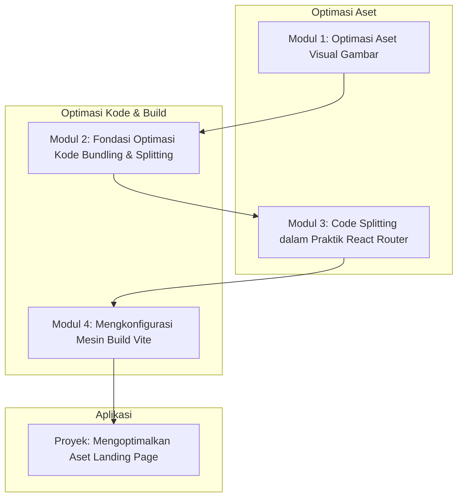

# 📘 Silabus: Asset Optimization (CI03)

**Judul Pembelajaran: Aset Ramping, Aplikasi Cepat: Menguasai Optimasi Gambar dan Kode**

Aset seperti gambar, CSS, dan JavaScript adalah "berat" dari sebuah situs web. Semakin besar ukurannya, semakin lambat situs dimuat. Kursus ini fokus pada strategi dan _tools_ praktis untuk mengoptimalkan aset-aset ini. Anda akan belajar cara mengkompresi gambar, memecah kode Anda menjadi bagian-bagian yang lebih kecil (_code splitting_), dan mengkonfigurasi _bundler_ seperti Vite untuk performa maksimal.

### 🎯 **Tujuan Utama Pembelajaran**

Setelah menyelesaikan kursus ini, Anda akan mampu:

1. **Mengoptimalkan Gambar untuk Web:** Memilih format gambar yang tepat (JPEG, PNG, WebP, AVIF) dan menggunakan _tools_ untuk mengkompresinya tanpa kehilangan kualitas visual yang signifikan.
2. **Memahami Konsep _Code Splitting_:** Menjelaskan bagaimana _bundler_ memecah kode JavaScript menjadi beberapa _chunk_ untuk pemuatan yang lebih efisien.
3. **Menerapkan _Code Splitting_ di Level Rute:** Mengkonfigurasi _lazy loading_ untuk rute di aplikasi React menggunakan React Router.
4. **Mengoptimalkan Pengiriman Aset:** Menerapkan teknik untuk memprioritaskan pemuatan aset kritis dan menunda yang tidak kritis.
5. **Mengkonfigurasi _Build Tool_ (Vite):** Memahami dan mengkonfigurasi opsi-opsi _build_ di Vite yang terkait dengan performa, seperti _minification_ dan _tree-shaking_.

### 🗺️ **Alur Pembelajaran**

Kita akan mengoptimalkan dua jenis aset utama: gambar dan kode, lalu mempelajari cara _bundler_ membantu kita, dan diakhiri dengan praktik terbaik pengiriman aset.

### 📚 **Modul Pembelajaran**

Berikut adalah rincian materi dari setiap modul.

### **🖼️ Modul 1: Optimasi Aset Visual (Gambar)**

**Tujuan Modul:**

- Memilih format gambar yang tepat untuk setiap kasus penggunaan.
- Menggunakan format gambar modern seperti WebP dan AVIF.
- Menggunakan _tools_ kompresi gambar (misalnya, Squoosh, ImageOptim).
- Menerapkan _responsive images_ menggunakan atribut `srcset`.
- Menggunakan _lazy loading_ untuk gambar di bawah lipatan (_below the fold_).

**Daftar Lesson:**

- **Lesson 3.1:** Gambar: Penyebab Lambat #1.
- **Lesson 3.2:** Memilih Format yang Tepat dan Menggunakan Format Modern.
- **Lesson 3.3:** Kompresi Gambar: Ukuran vs. Kualitas.
- **Lesson 3.4:** Gambar Responsif dan _Lazy Loading_.

**Aktivitas Utama Modul:**

- 🖼️ **Latihan:** Peserta mengambil sebuah gambar beresolusi tinggi, mengkompresinya menggunakan Squoosh ke dalam format WebP, dan membandingkan ukuran file sebelum dan sesudah.

### **📦 Modul 2: Fondasi Optimasi Kode (_Bundling_ dan _Splitting_)**

**Tujuan Modul:**

- Memahami peran _module bundler_ (seperti Vite/Webpack).
- Menjelaskan konsep _tree-shaking_ untuk menghilangkan kode mati.
- Memahami konsep _code splitting_ dan bagaimana ia menghasilkan beberapa _chunk_ JS.
- Menganalisis _bundle_ output untuk melihat komposisinya.

**Daftar Lesson:**

- **Lesson 3.1:** Apa yang Dilakukan oleh _Bundler_?
- **Lesson 3.2:** Membuang Kode Mati dengan _Tree-Shaking_.
- **Lesson 3.3:** Pengantar _Code Splitting_.
- **Lesson 3.4:** Menganalisis Hasil _Build_ Anda.

**Aktivitas Utama Modul:**

- 📦 **Diskusi:** Peserta melihat direktori `dist` atau `build` dari proyek React mereka dan mendiskusikan mengapa ada beberapa file JavaScript, bukan hanya satu.

### **🔪 Modul 3: _Code Splitting_ dalam Praktik (React Router)**

**Tujuan Modul:**

- Mengidentifikasi rute-rute dalam aplikasi sebagai titik pemisahan kode yang alami.
- Menggunakan `React.lazy()` untuk mengimpor komponen halaman secara dinamis.
- Menggunakan `<Suspense>` untuk menangani status pemuatan rute.
- Memverifikasi di _Network tab_ bahwa kode untuk sebuah rute hanya dimuat saat rute tersebut dikunjungi.

**Daftar Lesson:**

- **Lesson 3.1:** _Route-Based Code Splitting_.
- **Lesson 3.2:** Implementasi dengan `React.lazy()`.
- **Lesson 3.3:** Menangani Pemuatan dengan `<Suspense>`.
- **Lesson 3.4:** Memverifikasi Hasilnya.

**Aktivitas Utama Modul:**

- 🔪 **Latihan:** Peserta mengambil sebuah aplikasi React dengan beberapa rute yang dimuat secara serentak dan merefaktornya untuk menggunakan _lazy loading_ untuk setiap rute.

### **🔧 Modul 4: Mengkonfigurasi Mesin _Build_ (Vite)**

**Tujuan Modul:**

- Memahami file `vite.config.ts`.
- Mengkonfigurasi opsi _build_ yang terkait performa.
- Menggunakan _plugin_ Vite untuk optimasi (misalnya, kompresi gambar).
- Memahami bagaimana Vite menangani _code splitting_ secara default.

**Daftar Lesson:**

- **Lesson 4.1:** Pengantar Konfigurasi Vite.
- **Lesson 4.2:** Opsi _Build_ Penting.
- **Lesson 4.3:** Memperluas Vite dengan _Plugins_.
- **Lesson 4.4:** Kontrol Manual atas _Code Splitting_.

**Aktivitas Utama Modul:**

- 🚀 **Proyek: Mengoptimalkan Aset _Landing Page_:** Peserta diberi sebuah proyek _landing page_ React yang tidak teroptimasi. Tugas mereka adalah: (1) Mengkompresi semua gambar ke format WebP. (2) Menerapkan _lazy loading_ pada gambar di bagian bawah. (3) Melakukan _code splitting_ pada sebuah seksi yang berat (misalnya, galeri). (4) Mengkonfigurasi Vite untuk _build_ produksi yang optimal.

### 📖 **Sumber Belajar Tambahan**

- **Dokumentasi:**
    - [Vite Docs - Build Options](https://vitejs.dev/config/build-options.html)
    - [React Docs - Code-Splitting](https://react.dev/reference/react/lazy)
- **Tools:**
    - Squoosh.app, ImageOptim.
    - `rollup-plugin-visualizer` (untuk Vite).