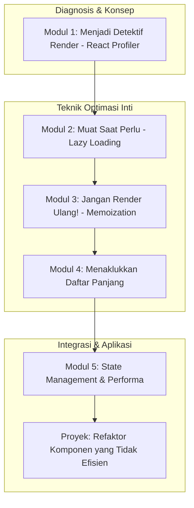

# 📘 Silabus: Rendering Optimization (CI02)

**Judul Pembelajaran: Membuat UI Merespons Seketika: Optimasi Rendering di React**

Performa frontend bukan hanya tentang kecepatan muat, tetapi juga tentang seberapa mulus aplikasi merespons interaksi pengguna. Kursus ini akan membawa Anda menyelami mekanisme _rendering_ React dan mengajarkan teknik-teknik esensial untuk mencegah pembaruan UI yang tidak perlu dan boros sumber daya, menggunakan **lazy loading**, **memoization**, dan **React hooks**.

### 🎯 Tujuan Utama Pembelajaran

Setelah menyelesaikan kursus ini, Anda akan mampu:

1. **Menganalisis Proses _Rendering_ React:** Menggunakan React DevTools Profiler untuk mengidentifikasi komponen mana yang di-_render_ ulang dan mengapa.
2. **Menerapkan _Lazy Loading_ Komponen:** Menggunakan `React.lazy` dan `Suspense` untuk memuat komponen hanya saat dibutuhkan.
3. **Menguasai _Memoization_:** Menggunakan `React.memo` untuk mencegah _re-rendering_ pada komponen fungsional, serta `useMemo` dan `useCallback` untuk meng-cache nilai dan fungsi.
4. **Mengoptimalkan _Rendering_ Daftar:** Menggunakan kunci (`key`) yang stabil dan virtualisasi untuk merender daftar panjang secara efisien.
5. **Memahami Dampak pada _State Management_:** Mengetahui bagaimana cara _state management_ (Redux/Zustand) memengaruhi strategi optimasi _rendering_.

### 🗺️ Alur Pembelajaran

Kita akan mulai dari diagnosis (profiling), lalu mempelajari teknik-teknik utama untuk mengurangi pekerjaan _rendering_ (lazy loading & memoization), fokus pada kasus khusus (daftar), dan terakhir, melihat hubungannya dengan _state_.

### 📚 Modul Pembelajaran

Berikut adalah rincian materi dari setiap modul.

### 🕵️ Modul 1: Menjadi Detektif Render (React Profiler)

**Tujuan Modul:**

- Menginstal dan menggunakan ekstensi React DevTools.
- Menggunakan tab _Profiler_ untuk merekam dan menganalisis interaksi.
- Membaca _flame graph_ untuk mengidentifikasi komponen yang paling "mahal".
- Mengidentifikasi penyebab _re-render_ yang tidak perlu.

**Daftar Lesson:**

- **Lesson 2.1:** Pengantar React DevTools Profiler.
- **Lesson 2.2:** Merekam Sesi Profiling.
- **Lesson 2.3:** Membaca _Flame Graph_ dan _Ranked Chart_.
- **Lesson 2.4:** Menemukan "Biang Kerok" _Re-render_.

**Aktivitas Utama Modul:**

- 💻 **Latihan:** Peserta sengaja membuat sebuah aplikasi dengan _re-render_ yang tidak efisien, lalu menggunakan _Profiler_ untuk merekam interaksi dan mengidentifikasi komponen mana yang menjadi masalah.

### ⏳ Modul 2: Muat Saat Perlu (Lazy Loading Komponen)

**Tujuan Modul:**

- Memahami manfaat _lazy loading_ untuk _code splitting_.
- Menggunakan `React.lazy()` untuk impor dinamis.
- Menggunakan komponen `<Suspense>` untuk menampilkan UI _fallback_ (misalnya, _spinner_).
- Menerapkannya pada komponen yang berat atau tidak langsung terlihat.

**Daftar Lesson:**

- **Lesson 2.1:** Pengantar _Lazy Loading_ Komponen.
- **Lesson 2.2:** Implementasi dengan `React.lazy` dan `Suspense`.
- **Lesson 2.3:** Menangani Status _Loading_ dengan _Fallback_.
- **Lesson 2.4:** Kasus Penggunaan Ideal.

**Aktivitas Utama Modul:**

- ✍️ **Latihan:** Peserta mengambil sebuah komponen modal yang berat dan merefaktornya agar di-_lazy load_, hanya dimuat saat tombol untuk membukanya diklik.

### ✨ Modul 3: Jangan Render Ulang! (Memoization)

**Tujuan Modul:**

- Menggunakan `React.memo` untuk meng-cache hasil render dari komponen fungsional.
- Menggunakan _hook_ `useCallback` untuk meng-cache definisi fungsi agar referensinya stabil.
- Menggunakan _hook_ `useMemo` untuk meng-cache hasil dari perhitungan yang berat.
- Memahami kapan harus (dan kapan tidak harus) melakukan _memoization_.

**Daftar Lesson:**

- **Lesson 3.1:** Masalah _Re-rendering_ yang Tidak Perlu.
- **Lesson 3.2:** Mengingat Komponen dengan `React.memo`.
- **Lesson 3.3:** Mengingat Fungsi dengan `useCallback`.
- **Lesson 3.4:** Mengingat Nilai dengan `useMemo`.

**Aktivitas Utama Modul:**

- ✨ **Latihan Refaktor:** Peserta merefaktor sebuah komponen anak di dalam daftar yang selalu di-_render_ ulang karena menerima fungsi _prop_ baru di setiap _render_. Mereka harus menggunakan `useCallback` di induk dan `React.memo` di anak untuk memperbaikinya.

### 📜 Modul 4: Menaklukkan Daftar Panjang

**Tujuan Modul:**

- Memahami pentingnya _prop_ `key` yang stabil dan unik.
- Mengidentifikasi kapan _rendering_ daftar menjadi _bottleneck_.
- Pengenalan konsep virtualisasi (_windowing_).
- Menggunakan _library_ seperti `react-window` atau `react-virtualized` untuk merender hanya item yang terlihat.

**Daftar Lesson:**

- **Lesson 4.1:** Kunci dari Daftar yang Efisien: _Prop_ `key`.
- **Lesson 4.2:** Saat Daftar Menjadi Terlalu Besar.
- **Lesson 4.3:** Pengantar Virtualisasi.
- **Lesson 4.4:** Implementasi Daftar Virtual.

**Aktivitas Utama Modul:**

- 📜 **Latihan:** Peserta mengimplementasikan `react-window` untuk merender sebuah daftar yang berisi ribuan item dan membandingkan performanya dengan `map()` biasa.

### 🧠 Modul 5: State Management dan Performa

**Tujuan Modul:**

- Menganalisis bagaimana Redux/Zustand dapat menyebabkan _re-render_ yang tidak perlu jika tidak digunakan dengan benar.
- Menggunakan _selectors_ yang di-_memoize_ (misalnya, dengan `reselect` untuk Redux) untuk mencegah komputasi ulang.
- Memastikan komponen hanya berlangganan pada bagian _state_ yang benar-benar mereka butuhkan.
- Memahami _trade-off_ antara React Context dan _library state management_ dari segi performa.

**Daftar Lesson:**

- **Lesson 5.1:** _State Management_ dan Dampaknya pada _Rendering_.
- **Lesson 5.2:** _Selectors_ yang Cerdas dan Di-_memoize_.
- **Lesson 5.3:** Berlangganan pada Data Minimal.
- **Lesson 5.4:** Konteks vs. _Store_: Pertimbangan Performa.

**Aktivitas Utama Modul:**

- 🚀 **Proyek: Refaktor Komponen yang Tidak Efisien:** Peserta diberi sebuah aplikasi dasbor yang lambat. Tugas mereka adalah: (1) Menggunakan _Profiler_ untuk mengidentifikasi komponen mana yang paling banyak memakan waktu _render_. (2) Menerapkan `React.memo`, `useCallback`, dan `useMemo` di tempat yang sesuai. (3) Melakukan _lazy load_ pada salah satu _widget_ dasbor. (4) Mendokumentasikan perbaikan performa yang terukur.

### 📖 Sumber Belajar Tambahan

- **Dokumentasi:**
- **Tools:**
- **Library:**
