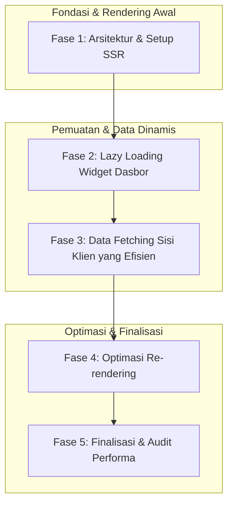

# 📘 Silabus: Mini Proyek: Performant Dashboard (PA01)

**Judul Pembelajaran: Membangun Pusat Kendali Cepat: Mengimplementasikan Dasbor Berperforma dengan SSR dan Code Splitting**

Dasbor seringkali menjadi aplikasi yang paling berat karena penuh dengan data dan visualisasi. Proyek ini akan menantang Anda untuk membangun sebuah **dasbor analitik** yang tidak hanya kaya fitur, tetapi juga cepat dimuat dan responsif. Anda akan menggunakan **Server-Side Rendering (SSR)** dengan Next.js untuk pemuatan awal yang cepat dan **code splitting** untuk memuat komponen secara _on-demand_.

### 🎯 Tujuan Utama Pembelajaran

Setelah menyelesaikan kursus ini, Anda akan mampu:

1. **Mengimplementasikan SSR untuk Pemuatan Cepat:** Menggunakan Next.js dan `getServerSideProps` untuk me-_render_ kerangka dasbor di server.
2. **Menerapkan _Code Splitting_ yang Agresif:** Menggunakan `next/dynamic` untuk melakukan _lazy load_ pada setiap _widget_ atau _chart_ di dalam dasbor.
3. **Mengoptimalkan _Rendering_ Data:** Menggunakan teknik _memoization_ (`React.memo`) untuk memastikan _widget_ tidak di-_render_ ulang secara tidak perlu.
4. **Mengelola _State_ Asinkron dengan Efisien:** Mengambil data di sisi klien menggunakan _library_ seperti SWR atau React Query.
5. **Menciptakan Pengalaman Pengguna yang Mulus:** Menampilkan _skeleton loaders_ saat _widget_ sedang dimuat untuk memberikan umpan balik visual yang baik.

### 🗺️ Alur Pembelajaran

Proyek ini akan dibangun dengan fokus pada performa di setiap lapisan: dari _rendering_ awal, pemuatan komponen, hingga pembaruan data.

### 📚 Modul Pembelajaran

Berikut adalah rincian materi dari setiap modul/fase.

### 🏗️ Fase 1: Arsitektur dan Setup SSR

**Tujuan Fase:**

- Menginisialisasi proyek Next.js baru dengan TypeScript.
- Merancang arsitektur dasbor dengan beberapa _widget_.
- Membangun komponen _layout_ utama (Sidebar, Header).
- Menggunakan `getServerSideProps` pada halaman dasbor utama untuk melakukan _pre-fetching_ data esensial atau sesi pengguna.

**Daftar Tugas:**

- **Tugas 1.1:** Inisialisasi proyek Next.js.
- **Tugas 1.2:** Buat komponen _layout_ dan _widget_ placeholder.
- **Tugas 1.3:** Implementasikan `getServerSideProps` dasar.

**Aktivitas Utama:**

- Peserta memiliki kerangka dasbor yang di-_render_ di sisi server, memberikan FCP yang sangat cepat.

### ⏳ Fase 2: _Lazy Loading_ Widget Dasbor

**Tujuan Fase:**

- Mengidentifikasi setiap _widget_ di dasbor sebagai kandidat untuk _lazy loading_.
- Menggunakan `next/dynamic` untuk mengimpor setiap komponen _widget_ secara dinamis.
- Mengimplementasikan komponen _skeleton loader_ sebagai UI _fallback_ selama pemuatan.

**Daftar Tugas:**

- **Tugas 2.1:** Buat komponen _skeleton loader_.
- **Tugas 2.2:** Refaktor setiap _widget_ untuk dimuat dengan `next/dynamic`.
- **Tugas 2.3:** Tentukan opsi `loading` untuk menampilkan _skeleton_.

**Aktivitas Utama:**

- Peserta berhasil membuat dasbor di mana kerangka utama muncul instan, dan setiap _widget_ dimuat secara independen.

### 📡 Fase 3: _Data Fetching_ Sisi Klien yang Efisien

**Tujuan Fase:**

- Menginstal dan mengatur SWR atau React Query.
- Setiap komponen _widget_ akan bertanggung jawab untuk mengambil datanya sendiri di sisi klien.
- Menangani status _loading_ dan _error_ di dalam setiap _widget_.
- Memastikan data yang diambil bersifat _type-safe_.

**Daftar Tugas:**

- **Tugas 3.1:** Setup SWR.
- **Tugas 3.2:** Implementasikan logika _data fetching_ di dalam setiap _widget_.
- **Tugas 3.3:** Ganti _skeleton loader_ dengan data nyata saat tersedia.
- **Tugas 3.4:** Tampilkan pesan eror jika API gagal.

**Aktivitas Utama:**

- Peserta memiliki dasbor yang memuat data secara paralel dan independen untuk setiap _widget_, meningkatkan persepsi kecepatan.

### ✨ Fase 4: Optimasi _Re-rendering_

**Tujuan Fase:**

- Menganalisis dasbor menggunakan React DevTools Profiler untuk menemukan _re-render_ yang tidak perlu.
- Membungkus setiap komponen _widget_ dengan `React.memo`.
- Menggunakan `useCallback` untuk fungsi-fungsi yang dilewatkan sebagai _props_ jika diperlukan.
- Memastikan bahwa pembaruan data di satu _widget_ tidak memicu _re-render_ di _widget_ lain.

**Daftar Tugas:**

- **Tugas 4.1:** Lakukan _profiling_ interaksi.
- **Tugas 4.2:** Terapkan `React.memo` pada _widget_.
- **Tugas 4.3:** Lakukan _memoize_ pada _props_ yang kompleks.

**Aktivitas Utama:**

- Peserta berhasil mengisolasi _render_ setiap _widget_, membuat aplikasi terasa sangat responsif.

### ✅ Fase 5: Finalisasi dan Audit Performa

**Tujuan Fase:**

- Melakukan audit Lighthouse akhir pada dasbor.
- Menganalisis metrik _Core Web Vitals_.
- Memoles UI dan pengalaman pengguna, terutama transisi dari _skeleton_ ke data.
- Mendeploy dasbor berperforma tinggi.

**Daftar Tugas:**

- **Tugas 5.1:** Jalankan audit Lighthouse.
- **Tugas 5.2:** Perbaiki isu-isu yang ditemukan.
- **Tugas 5.3:** Finalisasi _styling_.
- **Tugas 5.4:** Deploy ke Vercel.

**Aktivitas Utama:**

- **Proyek Akhir:** Peserta mendemonstrasikan dasbor mereka. Mereka harus bisa menjelaskan pilihan arsitektur (SSR untuk _shell_, CSR untuk _widget_), menunjukkan bagaimana _lazy loading_ dan _skeleton screens_ bekerja, dan menyajikan laporan Lighthouse yang menunjukkan skor performa yang sangat baik.

### 📖 Sumber Belajar Tambahan

- **Dokumentasi:**
- **Pola Desain:**
