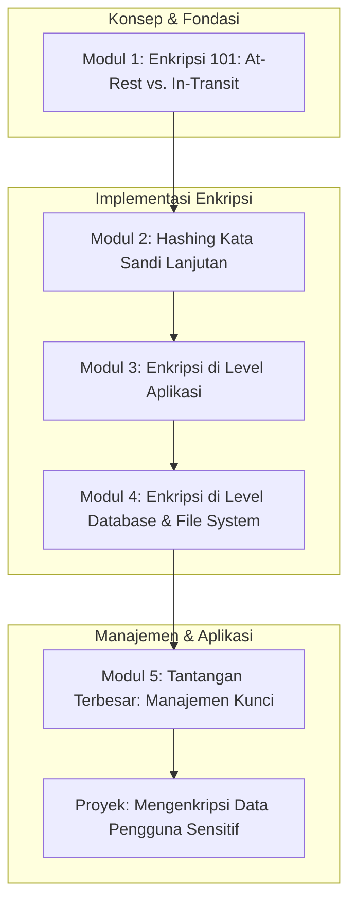

# 📘 Silabus: Data Protection dan Encryption (AA01)

**Judul Pembelajaran: Mengunci Brankas Digital: Enkripsi Data di Database dan Praktik Hashing Lanjutan**

Autentikasi melindungi akses, tetapi bagaimana jika seseorang berhasil menembus pertahanan dan mendapatkan akses ke database Anda? Kursus tingkat lanjut ini fokus pada perlindungan data itu sendiri, baik saat "diam" (_at rest_) di database maupun saat "bergerak" (_in transit_). Kita akan membahas **enkripsi database** dan praktik **password hashing** yang lebih aman.

### 🎯 **Tujuan Utama Pembelajaran**

Setelah menyelesaikan kursus ini, Anda akan mampu:

1. **Memahami Enkripsi _At-Rest_ vs. _In-Transit_:** Menjelaskan perbedaan dan pentingnya kedua jenis enkripsi ini.
2. **Menerapkan _Password Hashing_ yang Kuat:** Memahami mengapa `bcrypt` adalah pilihan yang baik dan mengenal algoritma yang lebih modern seperti Argon2.
3. **Mengimplementasikan Enkripsi di Level Aplikasi:** Mengenkripsi _field_ data sensitif tertentu di dalam database sebelum menyimpannya.
4. **Memahami Enkripsi di Level Database:** Mengenal fitur _Transparent Data Encryption_ (TDE) yang ditawarkan oleh beberapa sistem database.
5. **Mengelola Kunci Enkripsi dengan Aman:** Memahami tantangan dari manajemen kunci enkripsi dan pengenalan singkat tentang solusi seperti HashiCorp Vault.

### 🗺️ **Alur Pembelajaran**

Kita akan mulai dari mengamankan data paling kritis (kata sandi), lalu beralih ke mengenkripsi data sensitif lainnya, dan diakhiri dengan diskusi tentang manajemen kunci.

### 📚 **Modul Pembelajaran**

Berikut adalah rincian materi dari setiap modul.

### **🔒 Modul 1: Enkripsi 101: _At-Rest_ vs. _In-Transit_**

**Tujuan Modul:**

- Memahami enkripsi _in-transit_ dan perannya dalam melindungi data saat dikirim melalui jaringan (TLS/SSL).
- Memahami enkripsi _at-rest_ dan perannya dalam melindungi data saat disimpan di disk.
- Membedakan antara enkripsi simetris dan asimetris.
- Memahami mengapa HTTPS (enkripsi _in-transit_) saja tidak cukup.

**Daftar Lesson:**

- **Lesson 1.1:** Melindungi Data Saat Bergerak (_In-Transit_).
- **Lesson 1.2:** Melindungi Data Saat Diam (_At-Rest_).
- **Lesson 1.3:** Kunci Simetris vs. Asimetris.
- **Lesson 1.4:** Batasan HTTPS.

**Aktivitas Utama Modul:**

- 🗣️ **Diskusi:** "Jika seorang peretas berhasil mendapatkan _backup_ database fisik, jenis enkripsi mana (_in-transit_ atau _at-rest_) yang akan melindunginya?"

### **🔑 Modul 2: _Password Hashing_ Lanjutan**

**Tujuan Modul:**

- Memahami kembali mengapa _hashing_ lebih baik daripada enkripsi untuk kata sandi.
- Menganalisis properti dari algoritma _hashing_ yang baik (_slow, salted, adaptive_).
- Memahami cara kerja `bcrypt` dan _cost factor_nya.
- Pengenalan Argon2 sebagai standar yang lebih modern dan tahan terhadap serangan GPU.

**Daftar Lesson:**

- **Lesson 2.1:** Kenapa _Hashing_, Bukan Enkripsi?
- **Lesson 2.2:** Properti dari Algoritma _Hash_ yang Kuat.
- **Lesson 2.3:** Penyelaman Mendalam ke `bcrypt`.
- **Lesson 2.4:** Masa Depan _Hashing_: Argon2.

**Aktivitas Utama Modul:**

- 💻 **Latihan:** Peserta bereksperimen dengan mengubah _cost factor_ `bcrypt` dan mengamati bagaimana waktu yang dibutuhkan untuk melakukan _hash_ meningkat secara eksponensial.

### **📝 Modul 3: Enkripsi di Level Aplikasi**

**Tujuan Modul:**

- Mengidentifikasi data sensitif (PII) yang merupakan kandidat untuk enkripsi (misalnya, nomor KTP, nomor telepon).
- Menggunakan _library_ kriptografi bawaan Node.js (`crypto`) atau pihak ketiga.
- Mengenkripsi data sebelum menyimpannya ke database dan mendekripsinya setelah dibaca.
- Memahami _trade-off_ antara keamanan dan performa _query_ (karena data terenkripsi tidak bisa diindeks dengan cara biasa).

**Daftar Lesson:**

- **Lesson 3.1:** Kapan Harus Mengenkripsi Data di Database?
- **Lesson 3.2:** Menggunakan Modul `crypto` di Node.js.
- **Lesson 3.3:** Alur Kerja Enkripsi/Dekripsi di _Service Layer_.
- **Lesson 3.4:** _Trade-off_ Performa.

**Aktivitas Utama Modul:**

- ✍️ **Latihan:** Peserta membuat dua fungsi _helper_, `encrypt` dan `decrypt`, menggunakan AES-256-GCM, lalu menerapkannya pada _field_ nomor telepon di model `User` mereka.

### **💾 Modul 4: Enkripsi di Level Database dan _File System_**

**Tujuan Modul:**

- Memahami _Transparent Data Encryption_ (TDE) yang ditawarkan oleh database seperti PostgreSQL atau SQL Server.
- Memahami enkripsi level _filesystem_.
- Menganalisis model ancaman yang dilindungi oleh setiap lapisan enkripsi.
- Memahami pentingnya pendekatan pertahanan berlapis.

**Daftar Lesson:**

- **Lesson 4.1:** _Transparent Data Encryption_ (TDE).
- **Lesson 4.2:** Enkripsi di Level _File System_.
- **Lesson 4.3:** Model Ancaman dan Lapisan Pertahanan.
- **Lesson 4.4:** Menggabungkan Berbagai Lapisan Enkripsi.

**Aktivitas Utama Modul:**

- 🗣️ **Diskusi:** "Jika kita sudah menggunakan enkripsi _filesystem_ penuh, apakah kita masih perlu mengenkripsi data di level aplikasi? Diskusikan skenario di mana ini masih diperlukan."

### **🤯 Modul 5: Tantangan Terbesar: Manajemen Kunci**

**Tujuan Modul:**

- Memahami bahwa keamanan sistem enkripsi bergantung pada keamanan kunci.
- Menganalisis risiko dari menyimpan kunci enkripsi di dalam kode atau file konfigurasi.
- Pengenalan singkat tentang _Key Management Service_ (KMS) dari penyedia cloud (AWS KMS, Google Cloud KMS).
- Pengenalan singkat tentang solusi _self-hosted_ seperti HashiCorp Vault.

**Daftar Lesson:**

- **Lesson 5.1:** Masalah Manajemen Kunci.
- **Lesson 5.2:** Jangan Simpan Kunci di Repositori Git.
- **Lesson 5.3:** Solusi Berbasis Cloud: KMS.
- **Lesson 5.4:** Solusi _Self-Hosted_: Vault.

**Aktivitas Utama Modul:**

- 🚀 **Proyek: Mengenkripsi Data Pengguna Sensitif:** Peserta diberi sebuah API dengan model `User` yang menyimpan data PII (misalnya, nomor KTP) sebagai teks biasa. Tugas mereka adalah: (1) Merefaktor penyimpanan kata sandi untuk menggunakan `bcrypt` dengan _cost factor_ yang sesuai. (2) Mengimplementasikan enkripsi di level aplikasi untuk _field_ nomor KTP. (3) Menyimpan kunci enkripsi dengan aman menggunakan _environment variables_ (sebagai simulasi awal).

### 📖 **Sumber Belajar Tambahan**

- **Dokumentasi:**
    - [OWASP Cryptographic Storage Cheat Sheet](https://cheatsheetseries.owasp.org/cheatsheets/Cryptographic_Storage_Cheat_Sheet.html)
    - [OWASP Password Storage Cheat Sheet](https://cheatsheetseries.owasp.org/cheatsheets/Password_Storage_Cheat_Sheet.html)
- **Library:**
    - `bcrypt`, modul `crypto` Node.js.
- **Tools:**
    - HashiCorp Vault, AWS KMS.