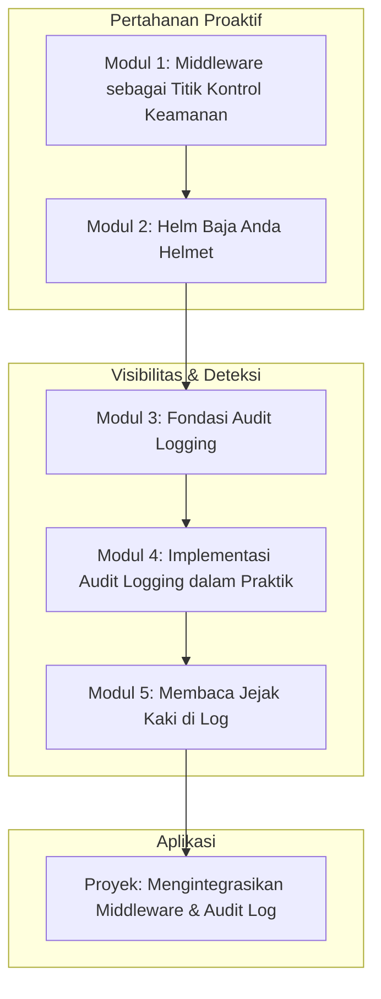

# 📘 Silabus: Secure Middleware dan Logging (AA02)

**Judul Pembelajaran: Mata dan Perisai Aplikasi Anda: Mengamankan Alur Kerja dengan Middleware dan Audit Logging**

Keamanan modern adalah tentang visibilitas dan kontrol proaktif. Kursus ini akan mengajarkan Anda cara menggunakan **middleware** sebagai titik kontrol keamanan terpusat di aplikasi Anda (dengan contoh di **NestJS/Express**) dan cara mengimplementasikan **audit logging** yang efektif untuk melacak peristiwa penting dan mendeteksi aktivitas mencurigakan.

### 🎯 **Tujuan Utama Pembelajaran**

Setelah menyelesaikan kursus ini, Anda akan mampu:

1. **Menerapkan Pola _Middleware_ untuk Keamanan:** Menggunakan _middleware_ untuk menerapkan pemeriksaan keamanan pada setiap _request_ yang masuk.
2. **Mengimplementasikan _Security Headers_:** Menggunakan _middleware_ seperti `helmet` untuk mengatur _header_ HTTP keamanan secara otomatis.
3. **Memahami Pentingnya _Audit Logging_:** Menjelaskan perbedaan antara _debug log_ dan _audit log_ serta mengapa _audit log_ penting untuk keamanan dan kepatuhan.
4. **Merancang dan Mengimplementasikan _Audit Log_:** Membuat _service_ dan skema data untuk mencatat peristiwa keamanan penting (misalnya, login berhasil/gagal, perubahan data kritis).
5. **Menganalisis _Log_ untuk Deteksi Ancaman:** Mengetahui jenis-jenis pola mencurigakan yang harus dicari di dalam _log_.

### 🗺️ **Alur Pembelajaran**

Kita akan mulai dari membangun "perisai" proaktif (_middleware_), lalu membangun "mata" reaktif (_logging_), dan terakhir, belajar cara menggunakan "mata" tersebut untuk melihat ancaman.

### 📚 **Modul Pembelajaran**

Berikut adalah rincian materi dari setiap modul.

### **🚦 Modul 1: _Middleware_ sebagai Titik Kontrol Keamanan**

**Tujuan Modul:**

- Memahami alur kerja _middleware_ di NestJS/Express.
- Membuat _middleware_ kustom untuk _logging request_ dasar.
- Menggunakan _middleware_ untuk validasi _header_ kustom.
- Menerapkan _middleware_ secara global atau pada rute tertentu.

**Daftar Lesson:**

- **Lesson 2.1:** Peran _Middleware_ dalam Keamanan.
- **Lesson 2.2:** Membuat _Middleware_ Kustom di NestJS.
- **Lesson 2.3:** Kasus Penggunaan: Validasi _Header_.
- **Lesson 2.4:** Menerapkan _Middleware_ secara Selektif.

**Aktivitas Utama Modul:**

- 💻 **Latihan:** Peserta membuat sebuah _middleware_ sederhana yang memeriksa keberadaan _header_ `X-Request-ID` pada setiap _request_ yang masuk.

### **🛡️ Modul 2: Helm Baja Anda (_Helmet_)**

**Tujuan Modul:**

- Memahami pentingnya _security headers_ HTTP.
- Menginstal dan mengimplementasikan `helmet` sebagai _middleware_.
- Memahami beberapa perlindungan utama yang disediakan oleh `helmet` (misalnya, HSTS, X-Frame-Options, X-XSS-Protection).
- Mengkonfigurasi `helmet` dengan kebijakan yang lebih spesifik.

**Daftar Lesson:**

- **Lesson 2.1:** Pengantar _Security Headers_.
- **Lesson 2.2:** Implementasi Mudah dengan `helmet`.
- **Lesson 2.3:** Membedah Perlindungan yang Diberikan.
- **Lesson 2.4:** Kustomisasi `helmet`.

**Aktivitas Utama Modul:**

- 🛡️ **Latihan:** Peserta menambahkan `helmet` ke aplikasi mereka dan menggunakan _tools_ online atau DevTools untuk memverifikasi bahwa _security headers_ yang relevan telah ditambahkan ke respons.

### **📝 Modul 3: Fondasi _Audit Logging_**

**Tujuan Modul:**

- Membedakan antara _debug log, application log_, dan _audit log_.
- Merancang skema data untuk _audit log_ (siapa, apa, kapan, dari mana).
- Memilih format _log_ yang terstruktur (JSON).
- Memahami pentingnya _timestamp_ yang akurat dan sinkronisasi waktu (NTP).

**Daftar Lesson:**

- **Lesson 3.1:** Tiga Jenis Utama _Logging_.
- **Lesson 3.2:** Apa yang Harus Dicatat dalam _Audit Log_?
- **Lesson 3.3:** _Logging_ Terstruktur dengan JSON.
- **Lesson 3.4:** Pentingnya Waktu yang Akurat.

**Aktivitas Utama Modul:**

- ✍️ **Latihan Desain:** Peserta merancang sebuah skema Mongoose atau model ORM untuk koleksi/tabel `AuditLog`.

### **✍️ Modul 4: Implementasi _Audit Logging_ dalam Praktik**

**Tujuan Modul:**

- Membuat `AuditService` yang terpusat.
- Membuat _decorator_ kustom (misalnya, `@Audit()`) atau _interceptor_ untuk memicu _logging_ secara deklaratif.
- Mencatat peristiwa autentikasi (login berhasil, login gagal, logout).
- Mencatat peristiwa perubahan data kritis (misalnya, perubahan peran pengguna, penghapusan data penting).

**Daftar Lesson:**

- **Lesson 4.1:** Membangun _Service_ untuk _Audit_.
- **Lesson 4.2:** _Logging_ Deklaratif dengan _Decorators_.
- **Lesson 4.3:** Mencatat Peristiwa Autentikasi.
- **Lesson 4.4:** Mencatat Peristiwa Perubahan Data.

**Aktivitas Utama Modul:**

- ✍️ **Latihan:** Peserta mengintegrasikan `AuditService` ke dalam `AuthService` mereka untuk mencatat setiap upaya login yang berhasil dan gagal, lengkap dengan alamat IP.

### **🕵️ Modul 5: Membaca Jejak Kaki di _Log_**

**Tujuan Modul:**

- Mengenali pola-pola serangan umum dari _log_ (misalnya, percobaan _brute-force_ dari satu IP).
- Menggunakan _tools_ agregasi _log_ (pengenalan singkat tentang ELK Stack atau Splunk).
- Mengatur peringatan (_alerting_) untuk peristiwa keamanan yang kritis.
- Memahami peran _log_ dalam investigasi forensik setelah insiden.

**Daftar Lesson:**

- **Lesson 5.1:** Pola-Pola Mencurigakan di _Log_.
- **Lesson 5.2:** Mengelola _Log_ dalam Skala Besar.
- **Lesson 5.3:** Peringatan Dini Otomatis.
- **Lesson 5.4:** _Log_ sebagai Bukti Digital.

**Aktivitas Utama Modul:**

- 🚀 **Proyek: Mengintegrasikan _Middleware_ dan _Audit Log_:** Peserta mengambil sebuah API yang sudah memiliki autentikasi. Tugas mereka adalah: (1) Mengimplementasikan `helmet`. (2) Membuat _middleware_ kustom untuk _logging request_. (3) Mengimplementasikan `AuditService` yang mencatat semua upaya login dan semua permintaan ke _endpoint_ admin.

### 📖 **Sumber Belajar Tambahan**

- **Dokumentasi:**
    - [OWASP Logging Cheat Sheet](https://cheatsheetseries.owasp.org/cheatsheets/Logging_Cheat_Sheet.html)
- **Library:**
    - `helmet` (untuk Express/NestJS).
    - `winston`, `pino` (untuk _logging_).
- **Tools:**
    - ELK Stack (Elasticsearch, Logstash, Kibana), Splunk, Graylog.