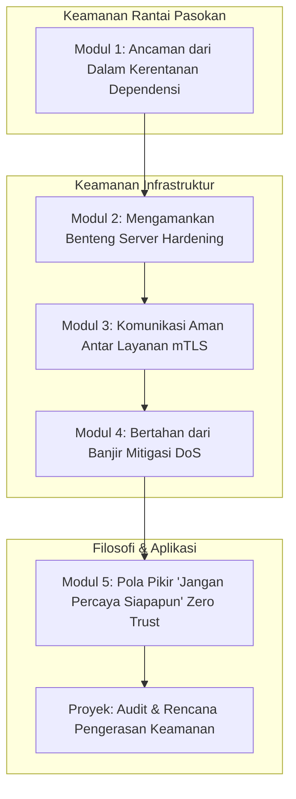

# 📘 Silabus: Advanced Threat Mitigation (AE01)

**Judul Pembelajaran: Pertahanan Tingkat Ahli: Melawan Ancaman Modern dengan Pengerasan Server dan Keamanan Rantai Pasokan**

Ancaman keamanan modern tidak hanya menargetkan kode Anda, tetapi juga dependensi yang Anda gunakan dan server tempat aplikasi Anda berjalan. Kursus tingkat ahli ini akan membekali Anda dengan pengetahuan untuk melawan ancaman lanjutan, fokus pada **keamanan rantai pasokan perangkat lunak** (_dependency vulnerabilities_) dan **pengerasan server** (_server hardening_).

### 🎯 **Tujuan Utama Pembelajaran**

Setelah menyelesaikan kursus ini, Anda akan mampu:

1. **Mengelola Kerentanan Dependensi:** Menggunakan _tools_ seperti `npm audit` atau Snyk untuk secara otomatis memindai dan memperbaiki kerentanan di dalam dependensi proyek.
2. **Menerapkan Prinsip _Server Hardening_:** Mengkonfigurasi server Linux dasar dengan praktik terbaik keamanan (misalnya, menonaktifkan login root, menggunakan _firewall_).
3. **Mengamankan Komunikasi Antar Layanan:** Menggunakan mTLS (_mutual TLS_) untuk memastikan komunikasi yang terenkripsi dan terautentikasi antar layanan mikro.
4. **Melindungi dari Serangan DoS:** Menerapkan strategi mitigasi untuk serangan _Denial-of-Service_ (DoS) di level aplikasi dan infrastruktur.
5. **Mengadopsi Pola Pikir _Zero Trust_:** Memahami dan menerapkan prinsip-prinsip dasar dari arsitektur _Zero Trust_.

### 🗺️ **Alur Pembelajaran**

Kita akan melihat dua medan pertempuran utama: di dalam kode kita (dependensi) dan di luar kode kita (server), lalu menggabungkannya dengan pola pikir modern.

### 📚 **Modul Pembelajaran**

Berikut adalah rincian materi dari setiap modul.

### **📦 Modul 1: Ancaman dari Dalam (Kerentanan Dependensi)**

**Tujuan Modul:**

- Memahami risiko dari rantai pasokan perangkat lunak (_software supply chain_).
- Menjalankan `npm audit` atau `yarn audit` untuk menemukan kerentanan.
- Menggunakan Snyk untuk pemindaian yang lebih mendalam dan pemantauan berkelanjutan.
- Mengelola proses pembaruan dependensi yang aman.
- Memahami serangan seperti _typosquatting_ dan _malicious scripts_.

**Daftar Lesson:**

- **Lesson 1.1:** Risiko dari Kode yang Tidak Anda Tulis.
- **Lesson 1.2:** Pemindaian Otomatis dengan `npm audit`.
- **Lesson 1.3:** Pemindaian Lanjutan dengan Snyk.
- **Lesson 1.4:** Strategi Pembaruan Dependensi yang Aman.
- **Lesson 1.5:** Serangan Rantai Pasokan Lainnya.

**Aktivitas Utama Modul:**

- 💻 **Latihan:** Peserta sengaja menginstal versi lama dari sebuah paket yang memiliki kerentanan yang diketahui, lalu menjalankan `npm audit` untuk mendeteksi dan memperbaikinya.

### **🛡️ Modul 2: Mengamankan Benteng (_Server Hardening_)**

**Tujuan Modul:**

- Menerapkan praktik terbaik untuk manajemen pengguna di server Linux (menonaktifkan login root, menggunakan `sudo`).
- Mengkonfigurasi _firewall_ dasar menggunakan `ufw` (Uncomplicated Firewall).
- Mengamankan SSH (menggunakan kunci, menonaktifkan login password, mengubah port).
- Menjaga sistem tetap ter-patch dengan pembaruan keamanan rutin.

**Daftar Lesson:**

- **Lesson 2.1:** Prinsip-Prinsip _Server Hardening_.
- **Lesson 2.2:** Manajemen Pengguna yang Aman.
- **Lesson 2.3:** Konfigurasi _Firewall_ Dasar.
- **Lesson 2.4:** Mengamankan Akses SSH.
- **Lesson 2.5:** Manajemen _Patch_.

**Aktivitas Utama Modul:**

- 🛡️ **Latihan:** Peserta (di dalam sebuah VM atau _sandbox_) berlatih mengkonfigurasi `ufw` untuk hanya mengizinkan lalu lintas masuk pada port SSH, HTTP, dan HTTPS.

### **🤝 Modul 3: Komunikasi Aman Antar Layanan (mTLS)**

**Tujuan Modul:**

- Memahami keterbatasan TLS/SSL standar dalam arsitektur mikro layanan.
- Menjelaskan _mutual TLS_ (mTLS) di mana baik klien maupun server saling memverifikasi identitas.
- Memahami peran _Certificate Authority_ (CA) dalam mTLS.
- Pengenalan singkat tentang bagaimana _service mesh_ seperti Istio mengotomatiskan mTLS.

**Daftar Lesson:**

- **Lesson 3.1:** Masalah Kepercayaan dalam Mikro Layanan.
- **Lesson 3.2:** Pengantar _Mutual TLS_.
- **Lesson 3.3:** Alur Kerja mTLS.
- **Lesson 3.4:** Otomatisasi dengan _Service Mesh_.

**Aktivitas Utama Modul:**

- 🗣️ **Diskusi:** Peserta mendiskusikan mengapa mTLS menjadi semakin penting seiring dengan pergeseran dari arsitektur monolitik ke mikro layanan.

### **🌊 Modul 4: Bertahan dari Banjir (Mitigasi DoS)**

**Tujuan Modul:**

- Membedakan antara serangan _Denial-of-Service_ (DoS) dan _Distributed Denial-of-Service_ (DDoS).
- Menerapkan _rate limiting_ yang lebih canggih di level aplikasi.
- Menggunakan layanan proksi seperti Cloudflare sebagai garis pertahanan pertama.
- Mengkonfigurasi _firewall_ untuk memblokir lalu lintas yang mencurigakan.

**Daftar Lesson:**

- **Lesson 4.1:** DoS vs. DDoS.
- **Lesson 4.2:** Mitigasi di Level Aplikasi.
- **Lesson 4.3:** Menggunakan Proksi Anti-DDoS.
- **Lesson 4.4:** Mitigasi di Level Infrastruktur.

**Aktivitas Utama Modul:**

- 🌊 **Latihan:** Peserta mengkonfigurasi aturan _rate limiting_ yang lebih kompleks, misalnya, membedakan batas untuk _endpoint_ yang tidak terautentikasi dan yang terautentikasi.

### **🤔 Modul 5: Pola Pikir "Jangan Percaya Siapapun" (_Zero Trust_)**

**Tujuan Modul:**

- Memahami prinsip dasar arsitektur _Zero Trust_: "never trust, always verify".
- Membedakan dari model keamanan berbasis perimeter tradisional.
- Menerapkan autentikasi dan otorisasi yang kuat untuk setiap permintaan (baik eksternal maupun internal).
- Memahami pentingnya segmentasi jaringan.

**Daftar Lesson:**

- **Lesson 5.1:** Pengantar Arsitektur _Zero Trust_.
- **Lesson 5.2:** Verifikasi di Setiap Langkah.
- **Lesson 5.3:** Menerapkan _Zero Trust_ dalam Praktik.
- **Lesson 5.4:** Manfaat Jangka Panjang.

**Aktivitas Utama Modul:**

- 🚀 **Proyek: Audit dan Rencana Pengerasan Keamanan:** Peserta diberi sebuah deskripsi arsitektur aplikasi. Tugas mereka adalah: (1) Membuat daftar potensi kerentanan dependensi dan merekomendasikan proses pemindaian. (2) Membuat _checklist server hardening_ dasar untuk server yang akan menjalankan aplikasi tersebut. (3) Mengusulkan 2-3 perubahan arsitektur untuk membuatnya lebih selaras dengan prinsip _Zero Trust_.

### 📖 **Sumber Belajar Tambahan**

- **Dokumentasi & Panduan:**
    - [OWASP Software Component Verification Standard](https://owasp.org/www-project-software-component-verification-standard/)
    - CIS Benchmarks (untuk pengerasan server).
    - NIST Special Publication on Zero Trust Architecture.
- **Tools:**
    - Snyk, `npm audit`, `ufw`.