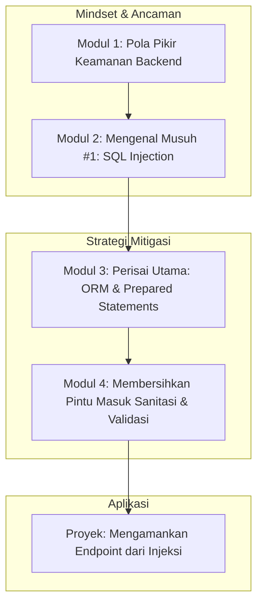

# 📘 Silabus: Pengantar Backend Security (CI01)

**Judul Pembelajaran: Membangun Benteng di Server: Fondasi Keamanan Backend**

Selamat datang di garis pertahanan terpenting aplikasi Anda. Keamanan _backend_ adalah fondasi dari kepercayaan pengguna dan integritas data. Kursus ini akan membekali Anda dengan pengetahuan fundamental untuk melindungi _backend_ Anda dari salah satu serangan paling umum dan merusak: **SQL Injection**, dan cara membangun pertahanan pertama melalui **sanitasi input** yang benar.

### 🎯 **Tujuan Utama Pembelajaran**

Setelah menyelesaikan kursus ini, Anda akan mampu:

1. **Mengadopsi Pola Pikir Keamanan Backend:** Memahami prinsip dasar keamanan seperti _defense-in-depth_ dan "never trust client data".
2. **Memahami Serangan Injeksi:** Menjelaskan cara kerja serangan _SQL Injection_ dan dampaknya yang merusak.
3. **Mencegah Injeksi dengan ORM:** Memahami bagaimana ORM (seperti Prisma/TypeORM/Sequelize) secara inheren melindungi dari serangan injeksi dasar.
4. **Menerapkan Sanitasi Input:** Menggunakan _library_ untuk membersihkan (_sanitize_) input dari pengguna untuk mencegah _payload_ berbahaya lainnya.
5. **Menerapkan Validasi Sisi Server:** Menggunakan _library_ seperti Zod atau `class-validator` untuk menerapkan aturan validasi yang ketat pada semua data yang masuk.

### 🗺️ **Alur Pembelajaran**

Kita akan mulai dari pola pikir, lalu mempelajari ancaman utama (injeksi), cara bertahan dengan _tools_ modern (ORM), dan memperkuat pertahanan dengan validasi dan sanitasi.

### 📚 **Modul Pembelajaran**

Berikut adalah rincian materi dari setiap modul.

### **🧠 Modul 1: Pola Pikir Keamanan Backend**

**Tujuan Modul:**

- Memahami prinsip _Defense-in-Depth_ (pertahanan berlapis).
- Memahami prinsip _Least Privilege_ (hak akses terkecil).
- Mengidentifikasi semua titik masuk data (_entry points_) di sebuah API.
- Mengenal OWASP Top 10 dan relevansinya untuk _backend_.

**Daftar Lesson:**

- **Lesson 1.1:** Prinsip Utama Keamanan Backend.
- **Lesson 1.2:** Jangan Pernah Percaya pada Klien.
- **Lesson 1.3:** Memetakan Permukaan Serangan API Anda.
- **Lesson 1.4:** Pengantar OWASP Top 10 untuk Backend.

**Aktivitas Utama Modul:**

- ✍️ **Latihan:** Peserta menganalisis sebuah spesifikasi API sederhana dan membuat daftar semua _endpoint_ dan parameter yang menerima input dari luar.

### **💉 Modul 2: Mengenal Musuh #1: _SQL Injection_**

**Tujuan Modul:**

- Memahami bagaimana _query_ SQL yang dibangun dengan konkatenasi string dapat dimanipulasi.
- Melihat contoh nyata serangan _SQL Injection_ (misalnya, `OR '1'='1'`).
- Menganalisis dampak serangan: bypass autentikasi, pencurian data, penghapusan data.
- Memahami mengapa ini masih menjadi salah satu kerentanan paling berbahaya.

**Daftar Lesson:**

- **Lesson 1.1:** Apa Itu _SQL Injection_?
- **Lesson 1.2:** Anatomi Serangan.
- **Lesson 1.3:** Dampak di Dunia Nyata.
- **Lesson 1.4:** Studi Kasus Serangan Injeksi Terkenal.

**Aktivitas Utama Modul:**

- 💻 **Simulasi:** Peserta melihat demonstrasi serangan _SQL Injection_ pada sebuah aplikasi web yang sengaja dibuat rentan untuk memahami mekanismenya secara langsung.

### **🛡️ Modul 3: Perisai Utama: ORM dan _Prepared Statements_**

**Tujuan Modul:**

- Memahami konsep _Prepared Statements_ (parameterisasi _query_) sebagai pertahanan utama.
- Menjelaskan bagaimana ORM modern (Prisma, TypeORM, Sequelize) menggunakan _prepared statements_ secara default.
- Memahami bahwa menggunakan ORM dengan benar hampir sepenuhnya menghilangkan risiko _SQL Injection_ standar.
- Mengidentifikasi situasi langka di mana _raw query_ mungkin diperlukan dan cara mengamankannya.

**Daftar Lesson:**

- **Lesson 3.1:** Pertahanan Terbaik: _Prepared Statements_.
- **Lesson 3.2:** Bagaimana ORM Melindungi Anda Secara Otomatis.
- **Lesson 3.3:** Kepercayaan pada ORM Anda.
- **Lesson 3.4:** Mengamankan _Raw Queries_ (Jika Terpaksa).

**Aktivitas Utama Modul:**

- ✍️ **Analisis Kode:** Peserta membandingkan cuplikan kode yang rentan (menggunakan konkatenasi string) dengan kode yang aman (menggunakan metode ORM) dan menjelaskan perbedaannya dari segi keamanan.

### **🧼 Modul 4: Membersihkan Pintu Masuk (Sanitasi dan Validasi)**

**Tujuan Modul:**

- Membedakan antara validasi (memeriksa format) dan sanitasi (membersihkan input).
- Menggunakan _library_ seperti `class-validator` (di NestJS) atau Zod untuk validasi skema di _backend_.
- Menerapkan sanitasi dasar untuk menghilangkan karakter berbahaya menggunakan _library_ seperti `sanitize-html`.
- Memahami bahwa validasi dan sanitasi adalah lapisan pertahanan penting selain ORM.

**Daftar Lesson:**

- **Lesson 4.1:** Validasi Sisi Server adalah Keharusan.
- **Lesson 4.2:** Validasi Berbasis Skema di Backend.
- **Lesson 4.3:** Membersihkan Input dengan Sanitasi.
- **Lesson 4.4:** Pertahanan Berlapis.

**Aktivitas Utama Modul:**

- 🚀 **Proyek: Mengamankan _Endpoint_ dari Injeksi:** Peserta diberi sebuah _endpoint_ API Node.js/TypeScript yang sengaja dibuat rentan terhadap _SQL Injection_ (menggunakan _raw query_ dengan konkatenasi). Tugas mereka adalah: (1) Merefaktornya untuk menggunakan metode ORM yang aman. (2) Menambahkan validasi input yang ketat menggunakan Zod atau `class-validator`.

### 📖 **Sumber Belajar Tambahan**

- **Dokumentasi:**
    - [OWASP SQL Injection Prevention Cheat Sheet](https://cheatsheetseries.owasp.org/cheatsheets/SQL_Injection_Prevention_Cheat_Sheet.html)
- **Library:**
    - `class-validator` (untuk NestJS), `zod`, `sanitize-html`.