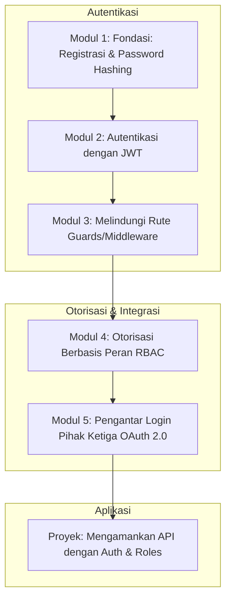

# 📘 Silabus: Authentication dan Authorization (CI02)

**Judul Pembelajaran: Gerbang dan Kunci Kerajaan: Menguasai Autentikasi dan Otorisasi di Backend**

Mengetahui _siapa_ pengguna Anda (Autentikasi) dan _apa_ yang boleh mereka lakukan (Otorisasi) adalah inti dari keamanan _backend_. Kursus ini akan mengajarkan Anda cara mengimplementasikan sistem autentikasi modern menggunakan **JWT** dan **OAuth2**, serta membangun sistem otorisasi berbasis peran (**RBAC**) yang kuat, dengan contoh implementasi di **NestJS**.

### 🎯 **Tujuan Utama Pembelajaran**

Setelah menyelesaikan kursus ini, Anda akan mampu:

1. **Mengimplementasikan _Password Hashing_ yang Aman:** Menggunakan `bcrypt` untuk menyimpan kata sandi pengguna dengan aman.
2. **Menguasai Alur Autentikasi JWT:** Membangun _endpoint_ login dan registrasi yang menghasilkan _JSON Web Tokens_ (JWT).
3. **Melindungi _Endpoint_ API:** Menggunakan _Guards_ di NestJS (atau _middleware_ di Express) untuk memvalidasi token JWT dan melindungi rute.
4. **Menerapkan Otorisasi Berbasis Peran (RBAC):** Membuat sistem yang dapat membedakan akses antara peran yang berbeda (misalnya, _user_ vs. _admin_).
5. **Memahami Alur OAuth 2.0:** Mengenal alur kerja dasar untuk mengintegrasikan login pihak ketiga (misalnya, "Login dengan Google").

### 🗺️ **Alur Pembelajaran**

Kita akan membangun sistem keamanan lapis demi lapis: mulai dari identifikasi (autentikasi), lalu hak akses (otorisasi), dan terakhir, integrasi dengan sistem lain (OAuth).

### 📚 **Modul Pembelajaran**

Berikut adalah rincian materi dari setiap modul.

### **🔐 Modul 1: Fondasi: Registrasi dan _Password Hashing_**

**Tujuan Modul:**

- Memahami pentingnya tidak pernah menyimpan kata sandi sebagai teks biasa.
- Menginstal dan menggunakan _library_ `bcrypt`.
- Mengimplementasikan _endpoint_ `/register` yang melakukan _hash_ pada kata sandi sebelum menyimpannya ke database.
- Memahami konsep _salt_.

**Daftar Lesson:**

- **Lesson 2.1:** Kejahatan Terbesar: Menyimpan Teks Polos.
- **Lesson 2.2:** Pengantar `bcrypt`.
- **Lesson 2.3:** Implementasi _Endpoint_ Registrasi yang Aman.
- **Lesson 2.4:** Apa Itu _Salt_ dan Mengapa Itu Penting?

**Aktivitas Utama Modul:**

- 💻 **Latihan:** Peserta membuat _endpoint_ `/register` di aplikasi NestJS/Node.js mereka yang menerima email dan kata sandi, lalu menyimpan _hash_ kata sandi ke database.

### **🔑 Modul 2: Autentikasi dengan JWT**

**Tujuan Modul:**

- Memahami struktur JWT (Header, Payload, Signature).
- Menginstal dan menggunakan _library_ JWT (misalnya, `@nestjs/jwt`).
- Mengimplementasikan _endpoint_ `/login` yang memverifikasi kata sandi dan menghasilkan _access token_.
- Menyertakan _payload_ (seperti `userId` dan `role`) di dalam token.

**Daftar Lesson:**

- **Lesson 2.1:** Anatomi sebuah JWT.
- **Lesson 2.2:** Setup _Library_ JWT.
- **Lesson 2.3:** Implementasi _Endpoint_ Login.
- **Lesson 2.4:** Mendesain _Payload_ Token Anda.

**Aktivitas Utama Modul:**

- 🔑 **Latihan:** Peserta membuat _endpoint_ `/login` yang, setelah berhasil memverifikasi kata sandi, akan menghasilkan dan mengembalikan sebuah JWT.

### **🛡️ Modul 3: Melindungi Rute (_Guards_ atau _Middleware_)**

**Tujuan Modul:**

- Memahami peran _middleware_ atau _guards_ dalam memeriksa _request_ masuk.
- Mengimplementasikan `AuthGuard` di NestJS menggunakan Passport.
- _Guard_ ini akan mengekstrak token dari _header_ `Authorization`, memvalidasinya, dan melampirkan data pengguna ke objek `request`.
- Menerapkan _guard_ ini pada _endpoint_ yang membutuhkan autentikasi.

**Daftar Lesson:**

- **Lesson 3.1:** Penjaga Pintu API Anda.
- **Lesson 3.2:** Mengimplementasikan _JWT Strategy_ dengan Passport.
- **Lesson 3.3:** Membuat `AuthGuard`.
- **Lesson 3.4:** Menerapkan _Guard_ pada _Controller_ atau Rute.

**Aktivitas Utama Modul:**

- 🛡️ **Latihan:** Peserta membuat sebuah `JwtAuthGuard` dan menerapkannya pada sebuah _endpoint_ `/profile`, lalu mengujinya dengan dan tanpa token yang valid.

### **👑 Modul 4: Otorisasi Berbasis Peran (RBAC)**

**Tujuan Modul:**

- Menambahkan kolom `role` pada model `User`.
- Membuat _decorator_ kustom (misalnya, `@Roles('admin')`) untuk menetapkan metadata peran.
- Membuat `RolesGuard` kustom yang memeriksa peran pengguna yang ada di `request.user`.
- Menggabungkan `AuthGuard` dan `RolesGuard` untuk melindungi _endpoint_ admin.

**Daftar Lesson:**

- **Lesson 4.1:** Pengantar Kontrol Akses Berbasis Peran (RBAC).
- **Lesson 4.2:** _Decorators_ Kustom untuk Metadata Peran.
- **Lesson 4.3:** Membangun `RolesGuard`.
- **Lesson 4.4:** Menerapkan RBAC pada _Endpoint_.

**Aktivitas Utama Modul:**

- 👑 **Latihan:** Peserta membuat `RolesGuard` dan melindung sebuah _endpoint_ `DELETE /users/:id` agar hanya bisa diakses oleh pengguna dengan peran "admin".

### **🌐 Modul 5: Pengantar Login Pihak Ketiga (OAuth 2.0)**

**Tujuan Modul:**

- Memahami alur _Authorization Code_ OAuth 2.0 dari perspektif _backend_.
- Mengimplementasikan _endpoint_ _callback_ yang menerima kode otorisasi dari klien.
- Menukar kode tersebut dengan _access token_ dari penyedia OAuth (misalnya, Google).
- Menggunakan _access token_ untuk mengambil profil pengguna, lalu membuat atau me-login-kan pengguna di sistem kita dan menerbitkan JWT kita sendiri.

**Daftar Lesson:**

- **Lesson 5.1:** Alur Kerja OAuth 2.0 di Backend.
- **Lesson 5.2:** Menangani _Callback_ dari Klien.
- **Lesson 5.3:** Menukar Kode dengan Token dan Profil.
- **Lesson 5.4:** Mengintegrasikan dengan Sistem Pengguna Lokal.

**Aktivitas Utama Modul:**

- 🚀 **Proyek: Mengamankan API dengan Auth dan Roles:** Peserta mengambil sebuah API CRUD sederhana. Tugas mereka adalah mengimplementasikan sistem autentikasi dan otorisasi penuh: (1) Registrasi dan login dengan JWT. (2) Semua _endpoint_ CRUD harus dilindungi. (3) _Endpoint_ `DELETE` hanya boleh diakses oleh admin.

### 📖 **Sumber Belajar Tambahan**

- **Dokumentasi:**
    - [NestJS Docs - Authentication](https://docs.nestjs.com/security/authentication)
    - [OWASP JWT Cheat Sheet](https://www.google.com/search?q=https://cheatsheetseries.owasp.org/cheatsheets/JSON_Web_Token_Cheat_Sheet_for_Java.html)
- **Library:**
    - `bcrypt`, `passport`, `passport-jwt`, `@nestjs/jwt`.