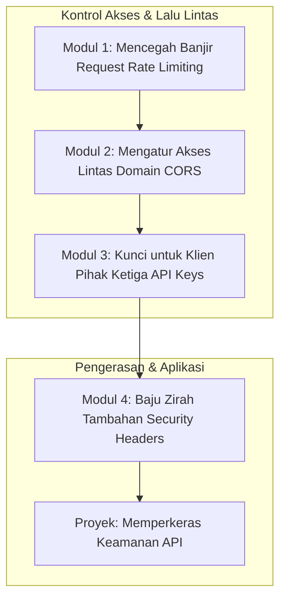

# 📘 Silabus: Secure API Design (CI03)

**Judul Pembelajaran: Merancang API Anti Peluru: Menguasai Rate Limiting, CORS, dan Kunci API**

Keamanan API lebih dari sekadar autentikasi. Ini tentang merancang API yang tangguh terhadap penyalahgunaan dan serangan. Kursus ini akan mengajarkan Anda cara mengimplementasikan tiga pilar penting dari desain API yang aman: **Rate Limiting** untuk mencegah serangan _brute-force_, **CORS** untuk mengontrol akses lintas domain, dan manajemen **Kunci API** untuk klien pihak ketiga.

### 🎯 **Tujuan Utama Pembelajaran**

Setelah menyelesaikan kursus ini, Anda akan mampu:

1. **Mengimplementasikan _Rate Limiting_:** Mengatur pembatasan jumlah permintaan dari satu IP atau pengguna untuk mencegah penyalahgunaan dan serangan DoS.
2. **Mengkonfigurasi CORS dengan Benar:** Memahami _Cross-Origin Resource Sharing_ (CORS) dan mengkonfigurasinya dengan aman untuk mengizinkan akses dari domain yang sah.
3. **Mengelola Kunci API (_API Keys_):** Merancang sistem untuk membuat, menyimpan, dan memvalidasi kunci API untuk klien atau layanan pihak ketiga.
4. **Menerapkan _Security Headers_:** Mengatur _header_ HTTP keamanan penting (seperti HSTS, X-Content-Type-Options) untuk memperkeras API Anda.
5. **Merancang API dengan Prinsip Keamanan:** Mengintegrasikan pertimbangan keamanan ke dalam setiap tahap desain API.

### 🗺️ **Alur Pembelajaran**

Kita akan membangun lapisan-lapisan pertahanan: pertama, membatasi lalu lintas, lalu mengatur siapa yang boleh "berbicara" dari mana, memberikan "kunci" khusus, dan terakhir, menambahkan "baju zirah" tambahan.

### 📚 **Modul Pembelajaran**

Berikut adalah rincian materi dari setiap modul.

### **🚦 Modul 1: Mencegah Banjir _Request_ (_Rate Limiting_)**

**Tujuan Modul:**

- Memahami pentingnya _rate limiting_ untuk melindungi dari serangan _brute-force_ dan DoS.
- Mengintegrasikan _middleware rate limiter_ (misalnya, `express-rate-limit` untuk Node.js/Express).
- Mengkonfigurasi batas permintaan per jendela waktu.
- Menyimpan data _rate limit_ di memori atau di Redis untuk skala yang lebih besar.

**Daftar Lesson:**

- **Lesson 3.1:** Kenapa Perlu Membatasi Permintaan?
- **Lesson 3.2:** Implementasi _Rate Limiter_ Sederhana.
- **Lesson 3.3:** Konfigurasi Batas dan Jendela Waktu.
- **Lesson 3.4:** _Rate Limiting_ Terdistribusi dengan Redis.

**Aktivitas Utama Modul:**

- 💻 **Latihan:** Peserta menerapkan _middleware rate limiter_ pada _endpoint_ login mereka untuk membatasi percobaan login menjadi, misalnya, 5 kali per menit dari satu alamat IP.

### **🌐 Modul 2: Mengatur Akses Lintas Domain (CORS)**

**Tujuan Modul:**

- Memahami _Same-Origin Policy_ dan masalah yang dipecahkan oleh CORS.
- Mengkonfigurasi _middleware_ CORS (misalnya, `cors` di Express atau `enableCors()` di NestJS).
- Mengatur `origin` yang diizinkan secara spesifik, bukan menggunakan .
- Memahami permintaan _preflight_ (OPTIONS).

**Daftar Lesson:**

- **Lesson 3.1:** Pengantar _Cross-Origin Resource Sharing_.
- **Lesson 3.2:** Konfigurasi CORS yang Aman.
- **Lesson 3.3:** Menghindari _Wildcard_ ().
- **Lesson 3.4:** Memahami Permintaan _Preflight_.

**Aktivitas Utama Modul:**

- 🌐 **Latihan:** Peserta mengkonfigurasi CORS pada API mereka agar hanya menerima permintaan dari `localhost` pada port yang berbeda (mensimulasikan _frontend_ dan _backend_ yang terpisah).

### **🔑 Modul 3: Kunci untuk Klien Pihak Ketiga (_API Keys_)**

**Tujuan Modul:**

- Memahami kasus penggunaan untuk kunci API.
- Merancang sistem untuk men-generate, menyimpan (hash), dan memvalidasi kunci API.
- Membuat _middleware_ atau _guard_ untuk memeriksa keberadaan dan validitas kunci API di _header_.
- Mengelola _rate limiting_ per kunci API.

**Daftar Lesson:**

- **Lesson 3.1:** Kapan dan Mengapa Menggunakan Kunci API?
- **Lesson 3.2:** Merancang Sistem Kunci API.
- **Lesson 3.3:** Memvalidasi Kunci API pada Setiap Permintaan.
- **Lesson 3.4:** Mengaitkan Penggunaan dengan Kunci API.

**Aktivitas Utama Modul:**

- 🔑 **Latihan:** Peserta membuat sebuah _middleware_ `apiKeyAuth` yang memeriksa _header_ `X-API-Key` dan memvalidasinya terhadap database.

### **🛡️ Modul 4: Baju Zirah Tambahan (_Security Headers_)**

**Tujuan Modul:**

- Menggunakan _library_ seperti `helmet` untuk mengatur _security headers_ dengan mudah.
- Mengimplementasikan HSTS (_HTTP Strict Transport Security_).
- Mengatur _header_ `X-Content-Type-Options`, `X-Frame-Options`, dll.
- Memahami peran setiap _header_ dalam memitigasi berbagai jenis serangan.

**Daftar Lesson:**

- **Lesson 4.1:** Pengantar _Security Headers_.
- **Lesson 4.2:** Mengatur _Header_ Keamanan dengan `helmet`.
- **Lesson 4.3:** Memaksa HTTPS dengan HSTS.
- **Lesson 4.4:** _Header-header_ Penting Lainnya.

**Aktivitas Utama Modul:**

- 🚀 **Proyek: Memperkeras Keamanan API:** Peserta mengambil sebuah API yang sudah memiliki autentikasi. Tugas mereka adalah: (1) Menambahkan _rate limiting_ pada semua _endpoint_. (2) Mengkonfigurasi CORS dengan benar. (3) Menambahkan dukungan untuk autentikasi berbasis kunci API pada satu _endpoint_. (4) Menerapkan _security headers_ menggunakan `helmet`.

### 📖 **Sumber Belajar Tambahan**

- **Dokumentasi:**
    - [OWASP REST Security Cheat Sheet](https://cheatsheetseries.owasp.org/cheatsheets/REST_Security_Cheat_Sheet.html)
    - [MDN - CORS](https://developer.mozilla.org/en-US/docs/Web/HTTP/CORS)
- **Library:**
    - `express-rate-limit`, `cors`, `helmet`.