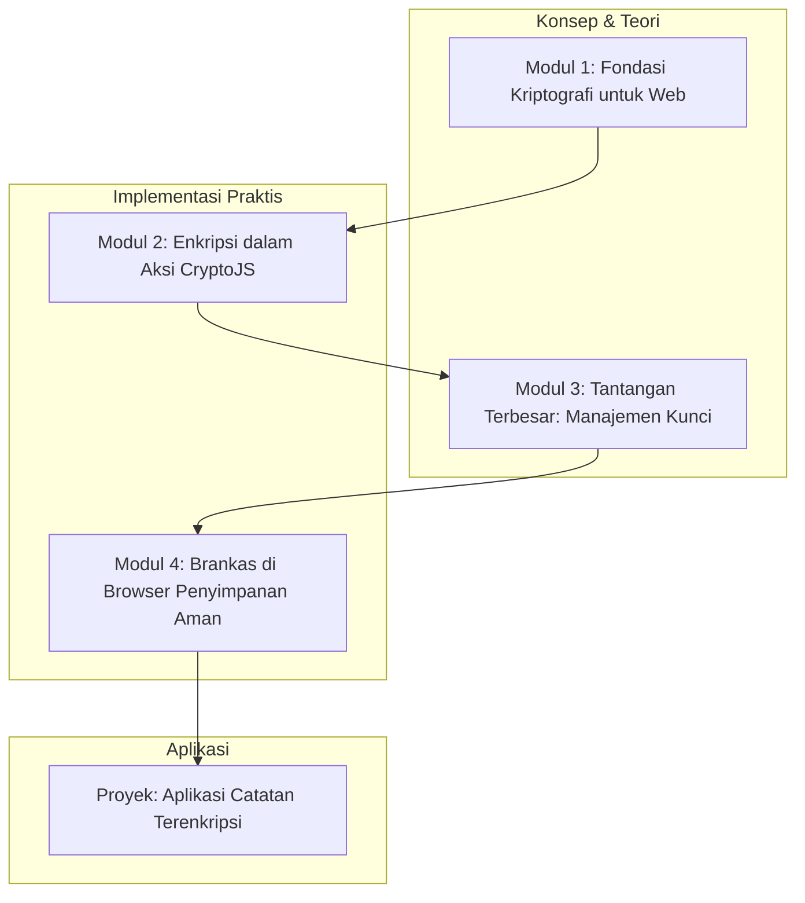

# 📘 Silabus: Client-Side Encryption (AA02)

**Judul Pembelajaran: Mengunci Data di Browser: Enkripsi Sisi Klien dan Penyimpanan Aman**

Terkadang, data begitu sensitif sehingga bahkan server pun tidak boleh melihatnya dalam bentuk teks biasa. Kursus ini akan memperkenalkan Anda pada konsep **enkripsi sisi klien**, di mana data dienkripsi di _browser_ pengguna sebelum dikirim ke server. Kita akan belajar cara menggunakan _library_ kriptografi standar dan strategi untuk penyimpanan data sensitif di klien.

### 🎯 **Tujuan Utama Pembelajaran**

Setelah menyelesaikan kursus ini, Anda akan mampu:

1. **Memahami Kriptografi Dasar:** Menjelaskan perbedaan antara enkripsi simetris dan asimetris secara konseptual.
2. **Menerapkan Enkripsi Sisi Klien:** Menggunakan _library_ seperti CryptoJS atau Web Crypto API untuk mengenkripsi dan mendekripsi data di _browser_.
3. **Mengelola Kunci Enkripsi:** Memahami tantangan dalam mengelola kunci enkripsi di sisi klien.
4. **Memilih Penyimpanan Klien yang Aman:** Membandingkan keamanan `localStorage`, `sessionStorage`, dan `IndexedDB`.
5. **Membangun Aplikasi dengan Enkripsi _End-to-End_ (E2EE):** Merancang alur kerja sederhana untuk aplikasi di mana server tidak pernah melihat data mentah.

### 🗺️ **Alur Pembelajaran**

Kita akan mulai dari konsep kriptografi, lalu belajar cara menerapkannya di _browser_, memikirkan cara mengelola kuncinya, dan terakhir, menggabungkannya dengan penyimpanan yang aman.

### 📚 **Modul Pembelajaran**

Berikut adalah rincian materi dari setiap modul.

### **🔑 Modul 1: Fondasi Kriptografi untuk Web**

**Tujuan Modul:**

- Memahami konsep enkripsi, dekripsi, kunci, dan ciphertext.
- Membedakan enkripsi simetris (satu kunci) dan asimetris (_public/private key_).
- Memahami fungsi _hashing_ dan perbedaannya dengan enkripsi.
- Mengetahui kapan enkripsi sisi klien diperlukan.

**Daftar Lesson:**

- **Lesson 2.1:** Pengantar Kriptografi.
- **Lesson 2.2:** Simetris vs. Asimetris.
- **Lesson 2.3:** _Hashing_ vs. Enkripsi.
- **Lesson 2.4:** Kasus Penggunaan untuk Enkripsi Sisi Klien.

**Aktivitas Utama Modul:**

- 🗣️ **Diskusi:** "Untuk aplikasi chat dengan privasi tinggi, jenis enkripsi apa (simetris atau asimetris) yang lebih cocok untuk pesan antar pengguna? Mengapa?"

### **✨ Modul 2: Enkripsi dalam Aksi (CryptoJS atau Web Crypto API)**

**Tujuan Modul:**

- Menginstal dan menggunakan _library_ CryptoJS.
- Mengenkripsi sebuah string menggunakan algoritma AES (simetris).
- Mendekripsi ciphertext kembali menjadi teks biasa.
- Menggunakan _salt_ dan turunan kunci untuk keamanan yang lebih baik.

**Daftar Lesson:**

- **Lesson 2.1:** Pengantar CryptoJS.
- **Lesson 2.2:** Enkripsi Simetris dengan AES.
- **Lesson 2.3:** Dekripsi Data.
- **Lesson 2.4:** Praktik Terbaik: _Salting_ dan KDF.

**Aktivitas Utama Modul:**

- 💻 **Latihan:** Peserta menulis fungsi TypeScript sederhana yang menerima sebuah teks dan kata sandi, lalu mengembalikannya dalam bentuk terenkripsi AES menggunakan CryptoJS.

### **🤯 Modul 3: Tantangan Terbesar: Manajemen Kunci**

**Tujuan Modul:**

- Memahami bahwa keamanan sistem bergantung pada keamanan kunci.
- Menganalisis tantangan menyimpan kunci enkripsi di sisi klien.
- Menggunakan kata sandi pengguna untuk menghasilkan kunci enkripsi secara _on-the-fly_.
- Pengenalan singkat tentang bagaimana sistem E2EE seperti Signal mengelola kunci.

**Daftar Lesson:**

- **Lesson 3.1:** Masalah Manajemen Kunci.
- **Lesson 3.2:** Jangan Simpan Kunci di `localStorage`.
- **Lesson 3.3:** Menurunkan Kunci dari Kata Sandi Pengguna.
- **Lesson 3.4:** Studi Kasus: Manajemen Kunci di Aplikasi _Real-Time_.

**Aktivitas Utama Modul:**

- 🧠 **Diskusi Arsitektur:** Peserta berdiskusi tentang bagaimana cara merancang sistem di mana pengguna dapat memulihkan datanya jika ia lupa kata sandi, padahal kata sandi tersebut adalah satu-satunya kunci enkripsi.

### **💾 Modul 4: Brankas di _Browser_ (Penyimpanan Sisi Klien yang Aman)**

**Tujuan Modul:**

- Membandingkan `localStorage`, `sessionStorage`, dan `IndexedDB`.
- Memahami bahwa semua penyimpanan ini rentan terhadap serangan XSS.
- Menerapkan pola di mana hanya data terenkripsi yang disimpan di penyimpanan klien.
- Data mentah hanya ada di memori saat aplikasi berjalan.

**Daftar Lesson:**

- **Lesson 4.1:** Pilihan Penyimpanan di Klien.
- **Lesson 4.2:** Kerentanan `localStorage`.
- **Lesson 4.3:** Pola: Simpan Ciphertext, Bukan Plaintext.
- **Lesson 4.4:** Alur Kerja yang Aman.

**Aktivitas Utama Modul:**

- 🚀 **Proyek: Aplikasi Catatan Terenkripsi:** Peserta membangun sebuah aplikasi catatan sederhana. (1) Pengguna harus membuat akun dengan kata sandi. (2) Setiap catatan yang ditulis akan dienkripsi di _browser_ menggunakan kunci yang diturunkan dari kata sandi pengguna. (3) Hanya ciphertext yang dikirim dan disimpan di server (atau `localStorage` untuk simulasi). (4) Saat pengguna login, catatan diunduh dalam bentuk terenkripsi dan didekripsi di _browser_ untuk ditampilkan.

### 📖 **Sumber Belajar Tambahan**

- **Dokumentasi:**
    - [MDN - Web Crypto API](https://developer.mozilla.org/en-US/docs/Web/API/Web_Crypto_API)
    - [OWASP Cheat Sheet - Cryptographic Storage](https://cheatsheetseries.owasp.org/cheatsheets/Cryptographic_Storage_Cheat_Sheet.html)
- **Library:**
    - [CryptoJS](https://github.com/brix/crypto-js)