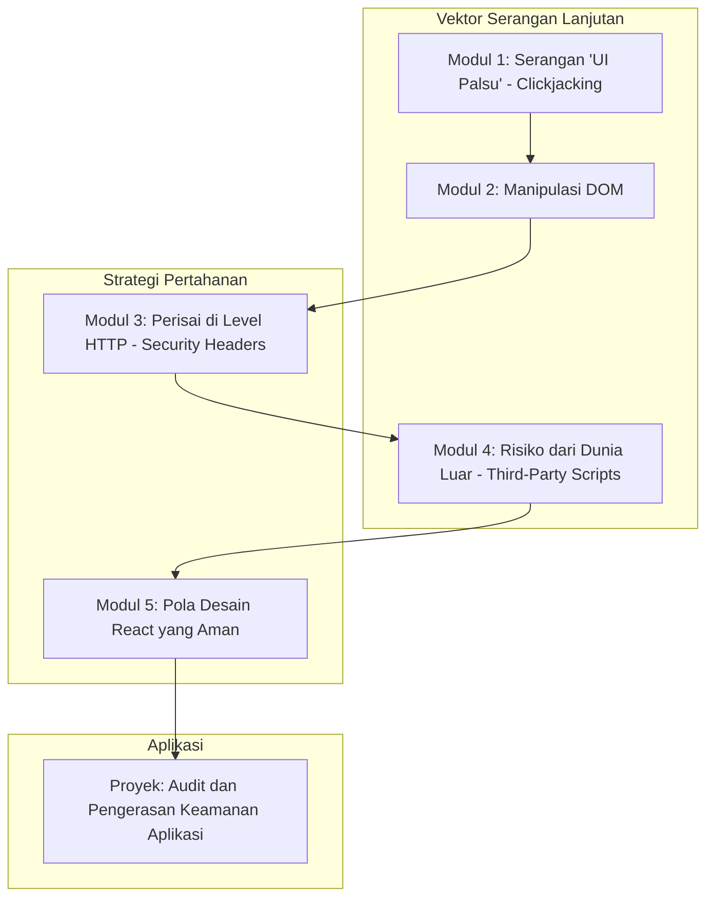

# 📘 Silabus: Advanced Threat Mitigation (AE01)

**Judul Pembelajaran: Pertahanan Tingkat Lanjut: Melawan Clickjacking, Serangan DOM, dan Ancaman Modern Lainnya**

Ancaman di dunia web terus berevolusi. Kursus tingkat ahli ini akan membekali Anda dengan pengetahuan untuk melawan vektor serangan yang lebih licik dan modern. Kita akan fokus pada **Clickjacking**, **serangan berbasis DOM**, dan bagaimana menerapkan pola-pola keamanan di React untuk membangun aplikasi yang benar-benar tangguh.

### 🎯 **Tujuan Utama Pembelajaran**

Setelah menyelesaikan kursus ini, Anda akan mampu:

1. **Mencegah _Clickjacking_:** Memahami serangan _clickjacking_ dan cara memitigasinya menggunakan _header_ HTTP `X-Frame-Options` dan CSP `frame-ancestors`.
2. **Mengamankan dari Serangan Berbasis DOM:** Mengidentifikasi dan mencegah kerentanan seperti _DOM Clobbering_ dan _DOM-based XSS_.
3. **Menerapkan _Security Headers_:** Mengkonfigurasi berbagai _header_ HTTP keamanan lainnya (seperti `Strict-Transport-Security`, `X-Content-Type-Options`).
4. **Mengamankan Komunikasi Pihak Ketiga:** Menganalisis risiko dari skrip dan `iframe` pihak ketiga serta cara mengisolasinya.
5. **Menerapkan Pola Keamanan React Lanjutan:** Menggunakan pola-pola desain untuk membangun komponen yang aman secara default.

### 🗺️ **Alur Pembelajaran**

Kita akan membahas ancaman-ancaman canggih satu per satu, lalu mempelajari pertahanan di level server (_headers_) dan di level kode (pola React).

### 📚 **Modul Pembelajaran**

Berikut adalah rincian materi dari setiap modul.

### **🖱️ Modul 1: Serangan "UI Palsu" (_Clickjacking_)**

**Tujuan Modul:**

- Memahami bagaimana penyerang dapat menempatkan situs Anda di dalam `iframe` transparan di atas situs jahat.
- Menganalisis dampak serangan _clickjacking_.
- Mengimplementasikan pertahanan menggunakan _header_ `X-Frame-Options`.
- Menggunakan direktif CSP `frame-ancestors` sebagai solusi yang lebih modern.

**Daftar Lesson:**

- **Lesson 1.1:** Apa Itu _Clickjacking_?
- **Lesson 1.2:** Demo Serangan.
- **Lesson 1.3:** Mitigasi dengan `X-Frame-Options`.
- **Lesson 1.4:** Mitigasi dengan CSP.

**Aktivitas Utama Modul:**

- 💻 **Latihan:** Peserta mencoba membuat halaman HTML sederhana yang menempatkan situs lain di dalam `iframe` untuk memahami mekanisme serangan, lalu memeriksa _header_ dari situs-situs besar untuk melihat bagaimana mereka melindunginya.

### **🌳 Modul 2: Manipulasi DOM**

**Tujuan Modul:**

- Memahami kembali _DOM-based XSS_ dan bagaimana ia berbeda dari XSS lainnya.
- Mengenal serangan _DOM Clobbering_ dan bagaimana ia bisa menimpa variabel JavaScript global.
- Menerapkan praktik pengkodean yang aman untuk memanipulasi DOM.
- Menggunakan _Trusted Types_ sebagai pertahanan yang sedang berkembang.

**Daftar Lesson:**

- **Lesson 2.1:** _DOM-based XSS_ Lanjutan.
- **Lesson 2.2:** Pengantar _DOM Clobbering_.
- **Lesson 2.3:** Praktik Pengkodean DOM yang Aman.
- **Lesson 2.4:** Masa Depan Keamanan DOM: _Trusted Types_.

**Aktivitas Utama Modul:**

- ✍️ **Latihan Analisis Kode:** Peserta menganalisis beberapa cuplikan kode JavaScript yang rentan terhadap _DOM-based XSS_ dan mencoba memperbaikinya.

### **🛡️ Modul 3: Perisai di Level HTTP (_Security Headers_)**

**Tujuan Modul:**

- Mengimplementasikan HSTS (_HTTP Strict Transport Security_) untuk memaksa penggunaan HTTPS.
- Menggunakan `X-Content-Type-Options: nosniff`.
- Menggunakan `Referrer-Policy` untuk mengontrol kebocoran informasi.
- Menggunakan _tools_ online untuk memindai _security headers_ sebuah situs.

**Daftar Lesson:**

- **Lesson 3.1:** Pengantar _Security Headers_.
- **Lesson 3.2:** Memaksa HTTPS dengan HSTS.
- **Lesson 3.3:** _Header-header_ Keamanan Penting Lainnya.
- **Lesson 3.4:** Mengaudit _Header_ Anda.

**Aktivitas Utama Modul:**

- 🔬 **Latihan:** Peserta menggunakan _tool_ seperti `securityheaders.com` untuk memindai situs web favorit mereka dan menganalisis laporan yang dihasilkan.

### **🌍 Modul 4: Risiko dari Dunia Luar (_Third-Party Scripts_)**

**Tujuan Modul:**

- Menganalisis risiko keamanan dari menyertakan skrip pihak ketiga (misalnya, untuk analitik, iklan).
- Menggunakan _Subresource Integrity_ (SRI) untuk memastikan skrip tidak diubah.
- Menggunakan atribut `sandbox` pada `iframe` untuk mengisolasi konten.
- Mengelola risiko dari dependensi NPM (_supply chain attacks_).

**Daftar Lesson:**

- **Lesson 4.1:** Risiko dari Skrip Pihak Ketiga.
- **Lesson 4.2:** Memastikan Integritas Skrip dengan SRI.
- **Lesson 4.3:** Mengisolasi Konten dengan `iframe sandbox`.
- **Lesson 4.4:** Keamanan Rantai Pasokan Perangkat Lunak.

**Aktivitas Utama Modul:**

- 🌍 **Latihan:** Peserta mencoba menambahkan atribut `integrity` pada sebuah tag `<script>` dan melihat bagaimana _browser_ akan memblokirnya jika _hash_nya tidak cocok.

### **⚛️ Modul 5: Pola Desain React yang Aman**

**Tujuan Modul:**

- Membangun komponen yang aman secara default.
- Membuat _wrapper_ komponen untuk pustaka pihak ketiga yang berpotensi tidak aman.
- Menggunakan _type system_ TypeScript untuk mencegah kelas-kelas kerentanan tertentu.
- Menerapkan _checklist_ keamanan untuk _code review_.

**Daftar Lesson:**

- **Lesson 5.1:** Komponen yang Aman secara Default.
- **Lesson 5.2:** Membungkus Dependensi yang Tidak Aman.
- **Lesson 5.3:** Keamanan Berbasis Tipe dengan TypeScript.
- **Lesson 5.4:** _Checklist_ Keamanan untuk _Code Review_.

**Aktivitas Utama Modul:**

- 🚀 **Proyek: Audit dan Pengerasan Keamanan Aplikasi:** Peserta diberi sebuah aplikasi React yang memiliki beberapa kerentanan (tidak ada CSP, rentan _clickjacking_, _state_ tidak aman). Tugas mereka adalah: (1) Melakukan audit keamanan. (2) Menulis laporan yang mengidentifikasi kerentanan. (3) Memperbaiki kerentanan tersebut dengan mengimplementasikan _security headers_, pola komponen yang aman, dan praktik terbaik lainnya.

### 📖 **Sumber Belajar Tambahan**

- **Dokumentasi:**
    - [OWASP Secure Headers Project](https://owasp.org/www-project-secure-headers/)
    - [MDN Web Security](https://developer.mozilla.org/en-US/docs/Web/Security)
- **Buku:**
    - _The Tangled Web: A Guide to Securing Modern Web Applications_ oleh Michal Zalewski.