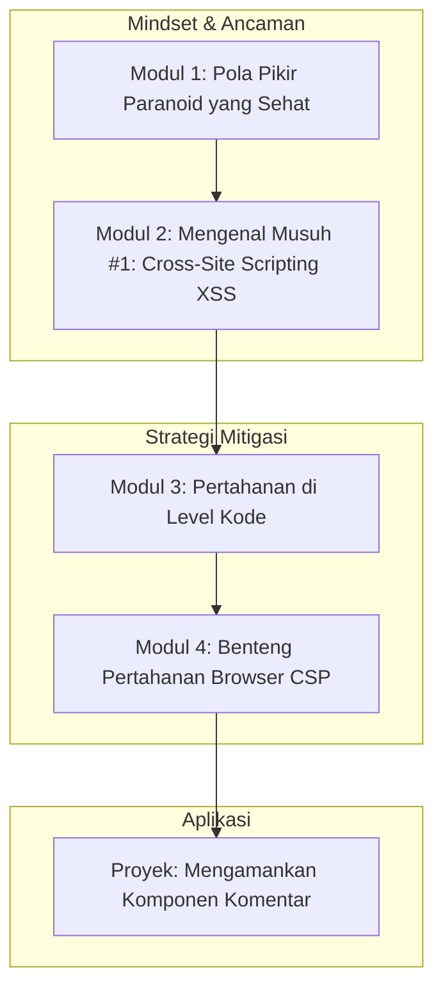

# 📘 Silabus: Pengantar Frontend Security (CI01)

**Judul Pembelajaran: Membangun Benteng di Browser: Fondasi Keamanan Frontend**

Selamat datang di garis depan pertahanan web. Keamanan bukan lagi hanya urusan _backend_. Kursus ini adalah fondasi Anda untuk memahami dan memitigasi ancaman keamanan yang paling umum terjadi di sisi klien. Kita akan fokus pada **Cross-Site Scripting (XSS)**, ancaman nomor satu di frontend, dan bagaimana cara membangun pertahanan berlapis menggunakan **Content Security Policy (CSP)**.

### 🎯 **Tujuan Utama Pembelajaran**

Setelah menyelesaikan kursus ini, Anda akan mampu:

1. **Mengadopsi Pola Pikir Keamanan:** Memahami bahwa semua input dari pengguna tidak dapat dipercaya dan harus divalidasi atau disanitasi.
2. **Mencegah Serangan XSS:** Menjelaskan berbagai jenis XSS (_Stored, Reflected, DOM-based_) dan cara React secara default membantu melindunginya.
3. **Mengimplementasikan Sanitasi Output:** Menggunakan _library_ seperti `dompurify` untuk membersihkan HTML yang dibuat oleh pengguna sebelum di-render.
4. **Mengkonfigurasi _Content Security Policy_ (CSP):** Membuat dan menerapkan kebijakan CSP dasar untuk membatasi sumber daya yang dapat dimuat dan dieksekusi oleh browser.
5. **Menerapkan dalam Konteks React/TypeScript:** Menulis komponen React yang aman dari kerentanan XSS umum.

### 🗺️ **Alur Pembelajaran**

Kita akan mulai dari memahami ancamannya (XSS), lalu belajar cara bertahan di level kode (React & sanitasi), dan terakhir, membangun benteng pertahanan di level browser (CSP).

### 📚 **Modul Pembelajaran**

Berikut adalah rincian materi dari setiap modul.

### **🧠 Modul 1: Pola Pikir Paranoid yang Sehat**

**Tujuan Modul:**

- Memahami prinsip dasar keamanan: "Never Trust User Input".
- Mengidentifikasi semua titik masuk data dari pengguna di sebuah aplikasi.
- Membedakan antara validasi input dan sanitasi output.
- Mengenal OWASP Top 10 dan relevansinya untuk frontend.

**Daftar Lesson:**

- **Lesson 1.1:** Prinsip Utama Keamanan Frontend.
- **Lesson 1.2:** Memetakan Permukaan Serangan Anda.
- **Lesson 1.3:** Validasi vs. Sanitasi.
- **Lesson 1.4:** Pengantar OWASP Top 10.

**Aktivitas Utama Modul:**

- ✍️ **Latihan:** Peserta menganalisis sebuah aplikasi sederhana dan membuat daftar semua tempat di mana pengguna dapat memasukkan data (form, parameter URL, dll.).

### **👾 Modul 2: Mengenal Musuh #1: _Cross-Site Scripting_ (XSS)**

**Tujuan Modul:**

- Memahami bagaimana serangan XSS bekerja.
- Membedakan antara _Stored XSS, Reflected XSS_, dan _DOM-based XSS_.
- Melihat contoh nyata dari dampak serangan XSS (pencurian sesi, _defacement_).
- Memahami mengapa XSS masih menjadi ancaman yang sangat umum.

**Daftar Lesson:**

- **Lesson 2.1:** Apa Itu XSS?
- **Lesson 2.2:** Tiga Jenis Utama XSS.
- **Lesson 2.3:** Dampak di Dunia Nyata.
- **Lesson 2.4:** Studi Kasus Serangan XSS Terkenal.

**Aktivitas Utama Modul:**

- 💻 **Simulasi:** Peserta mencoba melakukan serangan XSS sederhana pada sebuah halaman web yang sengaja dibuat rentan untuk memahami mekanismenya.

### **🛡️ Modul 3: Pertahanan di Level Kode (React dan Sanitasi)**

**Tujuan Modul:**

- Memahami bagaimana JSX _encoding_ di React secara otomatis melindungi dari XSS dasar.
- Mengenali bahaya dari penggunaan `dangerouslySetInnerHTML`.
- Menginstal dan menggunakan _library_ `dompurify` untuk membersihkan input HTML.
- Menerapkan sanitasi pada data yang akan di-render sebagai HTML.

**Daftar Lesson:**

- **Lesson 3.1:** Perlindungan Bawaan React.
- **Lesson 3.2:** Properti yang "Berbahaya": `dangerouslySetInnerHTML`.
- **Lesson 3.3:** Membersihkan HTML dengan `dompurify`.
- **Lesson 3.4:** Praktik Terbaik untuk Merender Konten dari Pengguna.

**Aktivitas Utama Modul:**

- ✍️ **Latihan:** Peserta membuat komponen yang menggunakan `dangerouslySetInnerHTML`, lalu merefaktornya untuk menggunakan `dompurify` agar aman.

### **🏰 Modul 4: Benteng Pertahanan Browser (_Content Security Policy_ - CSP)**

**Tujuan Modul:**

- Memahami CSP sebagai lapisan pertahanan tambahan.
- Membuat kebijakan CSP dasar untuk membatasi sumber skrip, _style_, dan gambar.
- Mengimplementasikan CSP melalui _meta tag_ atau _header_ HTTP.
- Menggunakan _nonce_ atau _hash_ untuk mengizinkan skrip _inline_ yang aman.

**Daftar Lesson:**

- **Lesson 4.1:** Pengantar _Content Security Policy_.
- **Lesson 4.2:** Membangun Kebijakan CSP Pertama Anda.
- **Lesson 4.3:** Implementasi CSP di Aplikasi Anda.
- **Lesson 4.4:** Menangani Skrip _Inline_ dengan Aman.

**Aktivitas Utama Modul:**

- 🚀 **Proyek: Mengamankan Komponen Komentar:** Peserta diberi sebuah komponen React untuk menampilkan komentar yang rentan terhadap XSS. Tugas mereka adalah: (1) Mengamankan rendering komentar menggunakan `dompurify`. (2) Menerapkan kebijakan CSP yang ketat pada halaman tersebut untuk mencegah eksekusi skrip yang tidak sah.

### 📖 **Sumber Belajar Tambahan**

- **Dokumentasi:**
    - [OWASP XSS Prevention Cheat Sheet](https://cheatsheetseries.owasp.org/cheatsheets/Cross_Site_Scripting_Prevention_Cheat_Sheet.html)
    - [MDN - Content Security Policy (CSP)](https://developer.mozilla.org/en-US/docs/Web/HTTP/CSP)
- **Library:**
    - [`dompurify`](https://www.google.com/search?q=%5Bhttps://github.com/cure53/DOMPurify%5D\(https://github.com/cure53/DOMPurify\))