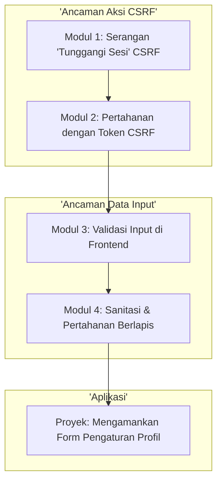

# 📘 Silabus: CSRF dan Input Validation (CI02)

**Judul Pembelajaran: Memvalidasi Setiap Pintu Masuk: Mencegah CSRF dan Mengamankan Input**

Setelah melindungi output, saatnya mengamankan input. Kursus ini fokus pada dua aspek krusial: **Validasi Input** untuk memastikan data yang masuk sesuai format, dan pencegahan **Cross-Site Request Forgery (CSRF)**, serangan licik yang membuat pengguna tanpa sadar melakukan aksi atas nama penyerang.

### 🎯 **Tujuan Utama Pembelajaran**

Setelah menyelesaikan kursus ini, Anda akan mampu:

1. **Memahami Serangan CSRF:** Menjelaskan bagaimana serangan CSRF bekerja dan mengapa ini berbahaya untuk aksi yang mengubah _state_.
2. **Menerapkan Pertahanan CSRF:** Mengimplementasikan pola _Synchronizer Token_ (Token CSRF) sebagai pertahanan utama.
3. **Melakukan Validasi Input di Sisi Klien:** Menggunakan _library_ seperti Zod atau Yup untuk memvalidasi form di React sebelum dikirim.
4. **Memahami Pentingnya Validasi Sisi Server:** Menjelaskan mengapa validasi di sisi klien saja tidak pernah cukup.
5. **Menerapkan Sanitasi Input:** Membersihkan data input untuk menghilangkan karakter atau skrip yang berpotensi berbahaya.

### 🗺️ **Alur Pembelajaran**

Kita akan membahas dua ancaman utama secara terpisah: pertama, serangan yang memanipulasi aksi (CSRF), dan kedua, serangan yang memanipulasi data (input tidak valid).

### 📚 **Modul Pembelajaran**

Berikut adalah rincian materi dari setiap modul.

### **🎭 Modul 1: Serangan "Tunggangi Sesi" (_Cross-Site Request Forgery_ - CSRF)**

**Tujuan Modul:**

- Memahami bagaimana penyerang dapat membuat pengguna yang sudah login untuk tanpa sadar mengirim permintaan ke aplikasi Anda.
- Menganalisis contoh serangan CSRF (misalnya, mengubah email atau kata sandi).
- Membedakan antara CSRF dan XSS.
- Memahami peran _cookies_ dalam memungkinkan serangan CSRF.

**Daftar Lesson:**

- **Lesson 2.1:** Apa Itu CSRF?
- **Lesson 2.2:** Anatomi Serangan CSRF.
- **Lesson 2.3:** CSRF vs. XSS.
- **Lesson 2.4:** Mengapa _Cookies_ Bisa Berbahaya.

**Aktivitas Utama Modul:**

- 💻 **Simulasi:** Peserta melihat demonstrasi bagaimana sebuah halaman web jahat dapat berisi form tersembunyi yang otomatis ter-submit ke aplikasi lain.

### **🎟️ Modul 2: Pertahanan dengan Token CSRF**

**Tujuan Modul:**

- Memahami pola _Synchronizer Token_.
- Mengimplementasikan logika di _backend_ untuk menghasilkan dan memvalidasi token CSRF.
- Mengambil token dari _backend_ dan menyertakannya dalam setiap _request_ yang mengubah _state_ dari _frontend_ React.
- Mengenal pertahanan lain seperti atribut _cookie_ `SameSite`.

**Daftar Lesson:**

- **Lesson 2.1:** Pola _Synchronizer Token_.
- **Lesson 2.2:** Implementasi di Sisi Server.
- **Lesson 2.3:** Implementasi di Sisi Klien.
- **Lesson 2.4:** Pertahanan Tambahan: Atribut `SameSite`.

**Aktivitas Utama Modul:**

- ✍️ **Latihan:** Peserta memodifikasi sebuah _hook_ `useApi` di React untuk secara otomatis mengambil token CSRF dari _endpoint_ `/api/csrf-token` dan menyertakannya dalam _header_ kustom untuk semua permintaan POST/PUT/DELETE.

### **🛡️ Modul 3: Validasi Input di _Frontend_**

**Tujuan Modul:**

- Memahami manfaat validasi di sisi klien (pengalaman pengguna yang lebih baik).
- Menginstal dan menggunakan _library_ validasi skema seperti Zod atau Yup.
- Mengintegrasikan skema validasi dengan _state management_ form (misalnya, dengan React Hook Form).
- Menampilkan pesan eror yang jelas kepada pengguna.

**Daftar Lesson:**

- **Lesson 3.1:** Garis Pertahanan Pertama: Validasi Klien.
- **Lesson 3.2:** Validasi Berbasis Skema dengan Zod/Yup.
- **Lesson 3.3:** Integrasi dengan Form di React.
- **Lesson 3.4:** Memberikan Umpan Balik Eror yang Baik.

**Aktivitas Utama Modul:**

- 🛡️ **Latihan:** Peserta membuat sebuah form registrasi dan mendefinisikan skema Zod untuknya, yang memvalidasi bahwa email valid, dan kata sandi memiliki panjang minimal.

### **🧼 Modul 4: Sanitasi dan Pertahanan Berlapis**

**Tujuan Modul:**

- Memahami kembali mengapa validasi sisi server adalah keharusan mutlak.
- Membedakan antara validasi (memeriksa format) dan sanitasi (membersihkan input).
- Menerapkan sanitasi dasar untuk mencegah injeksi karakter berbahaya.
- Mengadopsi pola pikir pertahanan berlapis (_defense-in-depth_).

**Daftar Lesson:**

- **Lesson 4.1:** Jangan Pernah Percaya Klien.
- **Lesson 4.2:** Validasi vs. Sanitasi Input.
- **Lesson 4.3:** Teknik Sanitasi Dasar.
- **Lesson 4.4:** Filosofi Pertahanan Berlapis.

**Aktivitas Utama Modul:**

- 🚀 **Proyek: Mengamankan Form Pengaturan Profil:** Peserta diberi sebuah form pengaturan profil yang rentan. Tugas mereka adalah: (1) Menambahkan validasi input di sisi klien menggunakan Zod. (2) Mengimplementasikan pertahanan terhadap CSRF dengan mengirim dan memvalidasi token. (3) (Bonus) Menambahkan sanitasi dasar di sisi server (tiruan).

### 📖 **Sumber Belajar Tambahan**

- **Dokumentasi:**
    - [OWASP CSRF Prevention Cheat Sheet](https://cheatsheetseries.owasp.org/cheatsheets/Cross-Site_Request_Forgery_Prevention_Cheat_Sheet.html)
    - [OWASP Input Validation Cheat Sheet](https://cheatsheetseries.owasp.org/cheatsheets/Input_Validation_Cheat_Sheet.html)
- **Library:**
    - [Zod](https://zod.dev/), [Yup](https://github.com/jquense/yup), [React Hook Form](https://react-hook-form.com/).