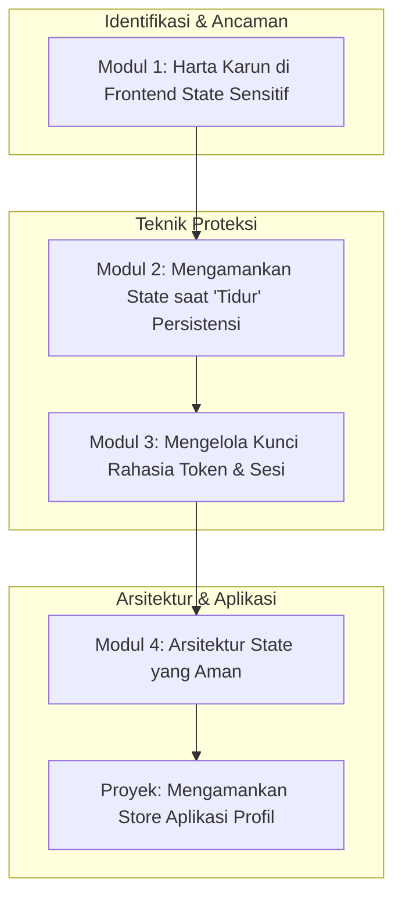

# 📘 Silabus: Secure State Management (CI03)

**Judul Pembelajaran: Menjaga Rahasia di Klien: Mengamankan State Management di React**

_State_ global di aplikasi frontend Anda seringkali berisi data sensitif, seperti informasi pengguna, token, atau preferensi. Kursus ini akan mengajarkan Anda cara mengelola _state_ ini dengan aman menggunakan _library_ seperti **Redux Toolkit** atau **Zustand**, dan cara melindunginya dari kebocoran atau manipulasi yang tidak sah.

### 🎯 **Tujuan Utama Pembelajaran**

Setelah menyelesaikan kursus ini, Anda akan mampu:

1. **Mengidentifikasi Data Sensitif di _State_:** Memetakan bagian mana dari _state_ aplikasi yang berisi informasi sensitif dan memerlukan perlindungan.
2. **Mencegah Kebocoran _State_:** Memahami bagaimana _state_ bisa bocor (misalnya, melalui _logging_ di produksi) dan cara mencegahnya.
3. **Mengamankan Persistensi _State_:** Menggunakan `redux-persist` dengan transformasi untuk mengenkripsi bagian sensitif dari _state_ sebelum menyimpannya ke `localStorage`.
4. **Mengelola Token dan Sesi dengan Aman:** Menerapkan pola untuk menyimpan dan mengakses token autentikasi dari _state_ dengan aman.
5. **Memisahkan _State_ Publik dan Privat:** Merancang struktur _store_ yang memisahkan data yang aman untuk ditampilkan dari data yang harus tetap privat.

### 🗺️ **Alur Pembelajaran**

Kita akan mulai dari mengidentifikasi "harta karun" (_state_ sensitif), lalu belajar cara melindunginya saat disimpan, saat digunakan, dan terakhir, menstrukturkannya dengan aman.

### 📚 **Modul Pembelajaran**

Berikut adalah rincian materi dari setiap modul.

### **💎 Modul 1: Harta Karun di _Frontend_ (_State_ Sensitif)**

**Tujuan Modul:**

- Memetakan data apa saja yang dianggap sensitif di _state_ (token, PII, dll.).
- Memahami risiko dari mengekspos _state_ di _window object_ atau _logging_ produksi.
- Menggunakan Redux DevTools dengan aman (menonaktifkannya di produksi).
- Memahami bahwa semua yang ada di klien pada dasarnya tidak aman, dan tujuannya adalah mitigasi.

**Daftar Lesson:**

- **Lesson 3.1:** Apa yang Perlu Anda Lindungi di _State_?
- **Lesson 3.2:** Risiko Kebocoran _State_.
- **Lesson 3.3:** Menggunakan DevTools dengan Aman.
- **Lesson 3.4:** Prinsip Keamanan Sisi Klien.

**Aktivitas Utama Modul:**

- ✍️ **Latihan:** Peserta menganalisis sebuah contoh _state_ aplikasi dan membuat daftar _field_ mana yang mereka anggap sensitif dan memerlukan perlakuan khusus.

### **🔒 Modul 2: Mengamankan _State_ saat "Tidur" (Persistensi Aman)**

**Tujuan Modul:**

- Menggunakan `redux-persist` untuk menyimpan _state_ ke `localStorage`.
- Memahami risiko menyimpan data sensitif sebagai teks biasa di `localStorage`.
- Menggunakan `redux-persist-transform-encrypt` untuk mengenkripsi _slice_ tertentu dari _state_.
- Mengelola _secret key_ untuk enkripsi dengan aman.

**Daftar Lesson:**

- **Lesson 3.1:** Persistensi _State_ dengan `redux-persist`.
- **Lesson 3.2:** Bahaya `localStorage`.
- **Lesson 3.3:** Mengenkripsi _State_ yang Disimpan.
- **Lesson 3.4:** Manajemen Kunci Enkripsi.

**Aktivitas Utama Modul:**

- 💻 **Latihan:** Peserta mengimplementasikan `redux-persist` dan menerapkan transformasi enkripsi pada _slice_ `auth` yang berisi token pengguna.

### **🔑 Modul 3: Mengelola Kunci Rahasia (Token dan Sesi)**

**Tujuan Modul:**

- Merancang _slice_ `auth` di Redux/Zustand untuk menyimpan token dan status autentikasi.
- Membuat _selectors_ atau _getter_ untuk mengakses token.
- Menggunakan _middleware_ di _layer_ API untuk secara otomatis menyisipkan token dari _state_ ke _header_ `Authorization`.
- Membersihkan _state_ autentikasi saat _logout_.

**Daftar Lesson:**

- **Lesson 3.1:** Merancang _Auth Slice_.
- **Lesson 3.2:** Mengakses Token dari _State_.
- **Lesson 3.3:** Integrasi Otomatis dengan Panggilan API.
- **Lesson 3.4:** Alur Kerja _Logout_ yang Aman.

**Aktivitas Utama Modul:**

- 🔑 **Latihan:** Peserta membuat sebuah _middleware_ Axios yang membaca token dari _store_ Redux dan menambahkannya ke setiap permintaan keluar.

### **🏛️ Modul 4: Arsitektur _State_ yang Aman**

**Tujuan Modul:**

- Memisahkan _state_ server (_server cache_) dari _state_ UI.
- Menggunakan _library_ seperti React Query atau RTK Query untuk mengelola _server cache_.
- Menyimpan data sensitif hanya selama diperlukan.
- Merancang _selectors_ yang tidak mengekspos data lebih dari yang dibutuhkan oleh komponen.

**Daftar Lesson:**

- **Lesson 4.1:** _Server Cache_ vs. _UI State_.
- **Lesson 4.2:** Mengelola _Server State_ dengan React Query/RTK Query.
- **Lesson 4.3:** Prinsip Kebutuhan Minimal Data.
- **Lesson 4.4:** Merancang _Selectors_ yang Aman.

**Aktivitas Utama Modul:**

- 🚀 **Proyek: Mengamankan _Store_ Aplikasi Profil:** Peserta diberi sebuah aplikasi profil pengguna sederhana yang menyimpan semua data (termasuk token) sebagai teks biasa di `localStorage`. Tugas mereka adalah: (1) Merefaktornya untuk menggunakan Redux Toolkit. (2) Mengamankan persistensi _state_ `auth` dengan enkripsi. (3) Membuat _middleware_ API untuk menyisipkan token secara otomatis.

### 📖 **Sumber Belajar Tambahan**

- **Dokumentasi:**
    - [Redux Toolkit Docs](https://redux-toolkit.js.org/)
    - [Zustand on GitHub](https://github.com/pmndrs/zustand)
- **Library:**
    - [`redux-persist`](https://www.google.com/search?q=%5Bhttps://github.com/rt2zz/redux-persist%5D\(https://github.com/rt2zz/redux-persist\))
    - [`redux-persist-transform-encrypt`](https://www.google.com/search?q=%5Bhttps://github.com/maxence-charriere/redux-persist-transform-encrypt%5D\(https://github.com/maxence-charriere/redux-persist-transform-encrypt\))