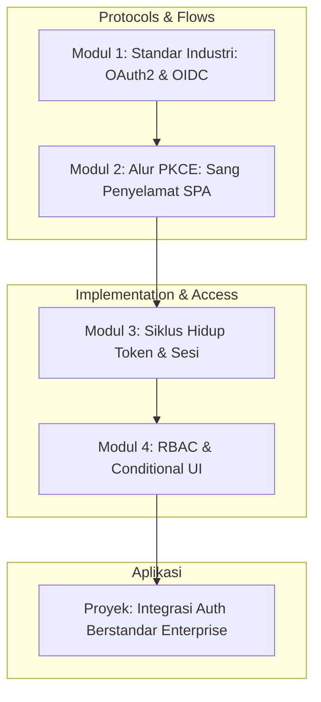

# 📘 Silabus: Secure Authentication (AA01)

**Judul Pembelajaran: Gerbang Utama yang Tak Terbobol: Secure Authentication**

Autentikasi bukan sekadar form login. Di dunia aplikasi web modern (SPA), autentikasi melibatkan protokol kompleks untuk memastikan identitas pengguna tetap aman meskipun melewati berbagai jaringan dan perangkat. Kursus ini membawa Anda masuk ke standar industri dalam mengamankan identitas pengguna menggunakan OAuth2, OIDC, dan teknik modern lainnya.

### 🎯 **Tujuan Utama Pembelajaran**

Setelah menyelesaikan kursus ini, Anda akan mampu:

1. **Mastering OAuth2 & OIDC:** Memahami perbedaan antara otorisasi (OAuth2) dan autentikasi (OIDC) serta cara kerjanya di browser.
2. **Implementasi PKCE:** Menerapkan alur _Authorization Code Flow with PKCE_ sebagai standar emas keamanan SPA.
3. **Manajemen Token Lanjut:** Mengelola _Silent Refresh_ dan _Token Rotation_ untuk menjaga user tetap login tanpa mengorbankan keamanan.
4. **Keamanan SDK:** Memilih dan mengintegrasikan SDK autentikasi (Auth0, Firebase, Clerk) dengan konfigurasi yang paling aman.
5. **Frontend RBAC:** Membangun sistem izin akses (_Permissions_) yang dinamis untuk mengatur apa yang bisa dilihat dan dilakukan user di UI.

### 🗺️ **Alur Pembelajaran**

Mulai dari teori protokol, beralih ke implementasi alur yang aman, dan diakhiri dengan manajemen hak akses.

### 📚 **Modul Pembelajaran**

#### 🏛️ Modul 1: Standar Industri: OAuth2 & OIDC

**Tujuan Modul:**

- Memahami sejarah autentikasi web dan mengapa protokol lama ditinggalkan.
- Membedah peran dalam OAuth2: _Resource Owner, Client, Authorization Server, Resource Server_.
- Mengenal ID Token (JWT) dan Access Token.

**Daftar Lesson:**

- **Lesson 1.1:** Kenapa Kita Butuh OAuth2 & OIDC?
- **Lesson 1.2:** Anatomi Token JWT yang Aman.
- **Lesson 1.3:** Delegasi vs Identitas.

#### 🛡️ Modul 2: Alur PKCE: Sang Penyelamat SPA

**Tujuan Modul:**

- Memahami kenapa _Implicit Grant_ sudah tidak aman untuk frontend.
- Simulasi alur _Code Challenge_ dan _Code Verifier_ (PKCE).
- Mengonfigurasi redirect URL dan _Strict Origin_ pada provider.

**Daftar Lesson:**

- **Lesson 2.1:** Kematian Implicit Flow.
- **Lesson 2.2:** Deep Dive: PKCE Mechanism.
- **Lesson 2.3:** Mengamankan Redirect & Callback.

#### 🔄 Modul 3: Siklus Hidup Token & Sesi

**Tujuan Modul:**

- Menangani pembaruan token secara otomatis (Silent Refresh) menggunakan iframe atau refresh token.
- Mengatasi masalah "Race Condition" saat beberapa request butuh refresh token sekaligus.
- Implementasi Logout global (menghapus session di server dan klien).

**Daftar Lesson:**

- **Lesson 3.1:** Managing Token Expiry.
- **Lesson 3.2:** Silent Refresh Patterns.
- **Lesson 3.3:** Graceful Session Termination.

#### 🔑 Modul 4: RBAC & Conditional UI

**Tujuan Modul:**

- Membaca "Claims" dari token untuk menentukan peran user (Admin, Editor, Viewer).
- Membuat _Protected Routes_ dan _Guard Components_ di React.
- Sinkronisasi izin antara frontend dan backend (Ingat: Backend adalah pemutus akhir!).

**Daftar Lesson:**

- **Lesson 4.1:** Perancangan Role & Permission di Frontend.
- **Lesson 4.2:** Higher-Order Components untuk Access Control.
- **Lesson 4.3:** Sinkronisasi State Izin secara Real-time.

**Aktivitas Utama Modul:**

- 🚀 **Proyek: Integrasi Auth Berstandar Enterprise:** Anda akan mengintegrasikan aplikasi React dengan Identity Provider (seperti Auth0 atau Keycloak) menggunakan alur PKCE, mengelola token secara aman, dan menampilkan menu UI yang berbeda berdasarkan Role user.

### 📖 **Sumber Belajar Tambahan**

- **Dokumentasi:**
  - [OAuth2.1 Draft (Recommended flows)](https://oauth.net/2.1/)
  - [PKCE Explained (Auth0)](https://auth0.com/docs/get-started/authentication-and-authorization-flow/authorization-code-flow-with-pkce)
  - [OpenID Connect Core](https://openid.net/specs/openid-connect-core-1_0.html)
- **Library:**
  - [oidc-client-ts](https://github.com/authts/oidc-client-ts)
  - [MSAL.js (Microsoft Authentication Library)](https://github.com/AzureAD/microsoft-authentication-library-for-js)
  - [CASL (Library untuk RBAC/ACL)](https://casl.js.org/)
