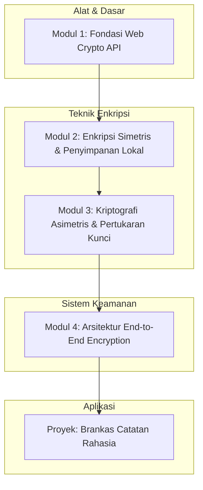

# 📘 Silabus: Client-Side Encryption (AA02)

**Judul Pembelajaran: Brankas Digital di Browser: Client-Side Encryption & Web Crypto**

Keamanan data tidak boleh hanya mengandalkan HTTPS saat transit. Untuk data yang sangat sensitif (misalnya rekam medis, rahasia pribadi, atau kunci privat), kita perlu memastikan bahwa server pun tidak bisa membacanya. Kursus ini membahas bagaimana mengimplementasikan **End-to-End Encryption (E2EE)** dan enkripsi data lokal menggunakan teknologi native browser.

### 🎯 **Tujuan Utama Pembelajaran**

Setelah menyelesaikan kursus ini, Anda akan mampu:

1. **Memahami Web Crypto API:** Menggunakan fitur native browser (`window.crypto.subtle`) untuk operasi kriptografi berperforma tinggi.
2. **Implementasi E2EE:** Membangun alur di mana data dienkripsi di pengirim dan hanya bisa didekripsi oleh penerima yang sah.
3. **Manajemen Kunci yang Aman:** Memahami teknik derivasi kunci dari password (PBKDF2) dan penyimpanan kunci non-exportable di IndexedDB.
4. **Enkripsi Data Lokal:** Melindungi data yang disimpan di `localStorage` atau `IndexedDB` agar tidak terbaca meskipun perangkat fisik dicuri.
5. **Perbandingan Library:** Mengetahui kapan harus menggunakan Web Crypto API native vs library eksternal (CryptoJS) dan risikonya.

### 🗺️ **Alur Pembelajaran**

Kita mulai dari memahami alat dasar (Web Crypto), beralih ke enkripsi simetris dan asimetris, lalu menggabungkannya dalam proyek nyata.

### 📚 **Modul Pembelajaran**

#### 🏗️ Modul 1: Fondasi Web Crypto API

**Tujuan Modul:**

- Memahami kenapa native API lebih baik dari library JS biasa (performa & keamanan).
- Mengenal objek `crypto` dan `crypto.subtle`.
- Menangani operasi asinkron (Promises) dalam kriptografi.

**Daftar Lesson:**

- **Lesson 1.1:** Sejarah & Evolusi Kriptografi Web.
- **Lesson 1.2:** Pengenalan `window.crypto` & `SubtleCrypto`.
- **Lesson 1.3:** Generating Random Values (CSPRNG).

#### 🔐 Modul 2: Enkripsi Simetris & Penyimpanan Lokal (AES)

**Tujuan Modul:**

- Menggunakan algoritma AES-GCM untuk enkripsi data cepat.
- Derivasi kunci dari password user menggunakan PBKDF2 + Salt.
- Praktek mengenkripsi dan menyimpan objek JSON ke IndexedDB.

**Daftar Lesson:**

- **Lesson 2.1:** Keamanan AES-GCM: IV, Salt, dan Tag.
- **Lesson 2.2:** Password-Based Key Derivation (PBKDF2).
- **Lesson 2.3:** Mengamankan Data Offline (PWA/Mobile Web).

#### 🔑 Modul 3: Kriptografi Asimetris & Pertukaran Kunci (RSA/ECDH)

**Tujuan Modul:**

- Membuat pasangan kunci (Public & Private Key).
- Memahami konsep Digital Signature untuk memastikan integritas data.
- Mengimplementasikan Diffie-Hellman (ECDH) untuk pertukaran kunci rahasia secara aman.

**Daftar Lesson:**

- **Lesson 3.1:** RSA-OAEP vs ECDSA.
- **Lesson 3.2:** Key Export & Import (JWK, PEM).
- **Lesson 3.3:** Verifikasi Integritas dengan Signatures.

#### 🏰 Modul 4: Arsitektur End-to-End Encryption (E2EE)

**Tujuan Modul:**

- Merancang sistem di mana server hanya menyimpan "cipher text" (data terenkripsi).
- Mengelola sinkronisasi kunci antar perangkat milik pengguna.
- Memahami ancaman terhadap E2EE (Metadata leakage, UI redressing).

**Daftar Lesson:**

- **Lesson 4.1:** Alur Kerja E2EE di Aplikasi Chat/Notion-like.
- **Lesson 4.2:** Tantangan Key Recovery & Zero-Knowledge Architecture.
- **Lesson 4.3:** Audit Keamanan pada Implementasi E2EE.

**Aktivitas Utama Modul:**

- 🚀 **Proyek: Brankas Catatan Rahasia:** Anda akan membangun aplikasi catatan sederhana yang menggunakan password user untuk mengenkripsi semua data sebelum dikirim ke server. Server tidak akan pernah memiliki kunci asli maupun akses ke teks catatan pengguna.

### 📖 **Sumber Belajar Tambahan**

- **Dokumentasi:**
  - [MDN: Web Crypto API](https://developer.mozilla.org/en-US/docs/Web/API/Web_Crypto_API)
  - [W3C Web Cryptography API Specification](https://www.w3.org/TR/WebCryptoAPI/)
  - [WebCrypto Examples by PeculiarVentures](https://github.com/PeculiarVentures/webcrypto-liner)
- **Library:**
  - [WebCrypto-Liner (Fallback for older browsers)](https://github.com/PeculiarVentures/webcrypto-liner)
  - [Node-Forge (Hybrid environments)](https://github.com/digitalbazaar/forge)
