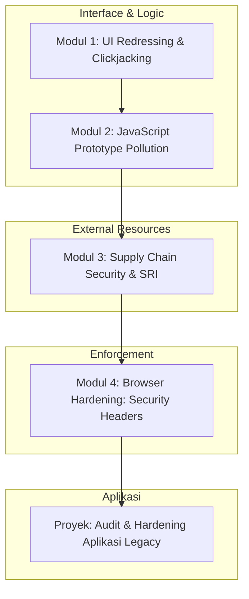

# 📘 Silabus: Advanced Threat Mitigation (AE01)

**Judul Pembelajaran: Deteksi dan Pemusnahan: Mitigasi Ancaman Tingkat Lanjut**

Setelah menguasai dasar-dasar pertahanan (XSS, CSRF, Auth), Anda kini siap untuk menghadapi ancaman yang lebih halus dan kompleks yang seringkali luput dari perhatian. Kursus ini membahas teknik mitigasi untuk serangan yang mengeksploitasi perilaku browser, integritas supply chain, dan celah logika dalam eksekusi JavaScript.

### 🎯 **Tujuan Utama Pembelajaran**

Setelah menyelesaikan kursus ini, Anda akan mampu:

1. **Anti-Clickjacking:** Menggunakan `frame-ancestors` (CSP) dan `X-Frame-Options` untuk mencegah manipulasi UI.
2. **Integritas Sumber Daya (SRI):** Memastikan library pihak ketiga (CDN) tidak disisipi kode jahat menggunakan Subresource Integrity.
3. **Penyelamatan Prototype:** Memahami dan mencegah _Prototype Pollution_ yang bisa merusak logika aplikasi secara global.
4. **Header Keamanan Proaktif:** Mengonfigurasi HSTS, Permissions-Policy, dan Expect-CT untuk hardening browser.
5. **Mitigasi Open Redirects:** Mengamankan fitur navigasi dinamis agar tidak bisa disalahgunakan untuk phishing.

### 🗺️ **Alur Pembelajaran**

Kita akan belajar mengamankan bingkai aplikasi (Bingkai), lalu isi kodenya (Integritas), dan terakhir perilaku navigasi dan header HTTP.

### 📚 **Modul Pembelajaran**

#### 🖼️ Modul 1: UI Redressing & Clickjacking

**Tujuan Modul:**

- Memahami bagaimana penyerang menumpuk elemen transparan di atas tombol sah.
- Mengonfigurasi kebijakan CSP `frame-ancestors` yang tepat.
- Memahami keterbatasan `X-Frame-Options` di browser modern.

**Daftar Lesson:**

- **Lesson 1.1:** Anatomi Serangan Clickjacking.
- **Lesson 1.2:** CSP vs X-Frame-Options.
- **Lesson 1.3:** Drag-and-Drop Clickjacking & Overlay Attacks.

#### 🧪 Modul 2: JavaScript Prototype Pollution

**Tujuan Modul:**

- Memahami konsep prototype di JS dan bagaimana ia bisa "dikotori".
- Analisis kasus nyata pada library populer (misal: `lodash`, `jquery`).
- Teknik pencegahan: `Object.freeze`, `Map`, dan skema validasi input untuk objek.

**Daftar Lesson:**

- **Lesson 2.1:** Apa itu Prototype Pollution?
- **Lesson 2.2:** Mendeteksi Titik Lemah pada Deep Merge & Assignment.
- **Lesson 2.3:** Menulis Kode JS yang Polusi-Resistant.

#### 📦 Modul 3: Supply Chain Security (SRI & Permissions)

**Tujuan Modul:**

- Mengimplementasikan SRI (Subresource Integrity) pada script CDN.
- Menggunakan `Permissions-Policy` untuk mematikan fitur browser yang tidak perlu (Camera, Mic, Geolocation).
- Memahami risiko "Vendor Lock-in" dan "In-browser Malware".

**Daftar Lesson:**

- **Lesson 3.1:** SRI: Verifikasi Hash untuk Library Eksternal.
- **Lesson 3.2:** Permissions Policy: Mengurangi Permukaan Serangan.
- **Lesson 3.3:** Monitoring Pelanggaran Keamanan (Reporting API).

#### 🛡️ Modul 4: Browser Hardening: Security Headers (HSTS & Extensions)

**Tujuan Modul:**

- Mengaktifkan HSTS untuk memaksa HTTPS secara permanen di browser.
- Mempelajari header `X-Content-Type-Options: nosniff` untuk mencegah MIME-sniffing.
- Membahas ancaman dari ekstensi browser jahat dan cara mitigasinya.

**Daftar Lesson:**

- **Lesson 4.1:** Hardening dengan HSTS & Preload Lists.
- **Lesson 4.2:** Metadata Security: Referrer-Policy.
- **Lesson 4.3:** Mengamankan Redirects & Forwards.

**Aktivitas Utama Modul:**

- 🚀 **Proyek: Audit & Hardening Aplikasi Legacy:** Anda akan diberikan sebuah aplikasi "tua" yang memiliki banyak celah (bisa di-clickjack, tidak punya SRI, rentan prototype pollution). Tugas Anda adalah melakukan audit dan menerapkan semua header dan teknik mitigasi yang telah dipelajari.

### 📖 **Sumber Belajar Tambahan**

- **Dokumentasi:**
  - [OWASP Clickjacking Defense Cheat Sheet](https://cheatsheetseries.owasp.org/cheatsheets/Clickjacking_Defense_Cheat_Sheet.html)
  - [MDN: Subresource Integrity](https://developer.mozilla.org/en-US/docs/Web/Security/Subresource_Integrity)
  - [Mozilla Observatory (Header Scanner)](https://observatory.mozilla.org/)
- **Library:**
  - [Helmet (Express - Reference for header types)](https://helmetjs.github.io/)
  - [Zod (For object schema validation)](https://zod.dev/)
