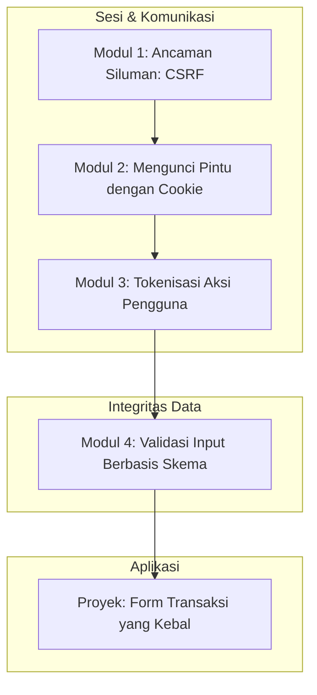

# 📘 Silabus: CSRF & Input Validation (CI02)

**Judul Pembelajaran: Mencegah Manipulasi dan Data Kotor: CSRF & Validasi Input**

Setelah memahami bagaimana menjaga browser dari skrip jahat (XSS), langkah selanjutnya adalah memastikan bahwa setiap permintaan (request) yang datang ke server benar-benar berasal dari pengguna kita yang sah, dan data yang dikirimkan bersih serta sesuai aturan. Kursus ini membahas dua pilar penting: **Cross-Site Request Forgery (CSRF)** dan **Input Validation**.

### 🎯 **Tujuan Utama Pembelajaran**

Setelah menyelesaikan kursus ini, Anda akan mampu:

1. **Mengenali Serangan CSRF:** Menjelaskan bagaimana penyerang bisa "meminjam" identitas pengguna untuk melakukan aksi yang tidak diinginkan.
2. **Mengamankan Cookie:** Menggunakan atribut `SameSite`, `Secure`, dan `HttpOnly` untuk benteng pertahanan pertama.
3. **Implementasi Anti-CSRF Token:** Menambahkan mekanisme validasi token pada header request (X-CSRF-Token).
4. **Validasi Input yang Elegan:** Menggunakan `Zod` dan `React Hook Form` untuk memastikan integritas data di sisi klien.
5. **Pola Pikir "Always Validate":** Memahami mengapa validasi frontend hanyalah untuk UX, dan validasi backend adalah mutlak untuk keamanan.

### 🗺️ **Alur Pembelajaran**

Kita akan belajar cara mengamankan jalur komunikasi (CSRF), lalu cara mengamankan data yang lewat di jalur tersebut (Input Validation).

### 📚 **Modul Pembelajaran**

#### 🕵️ Modul 1: Ancaman Siluman: _Cross-Site Request Forgery_ (CSRF)

**Tujuan Modul:**

- Memahami konsep dasar CSRF: memanfaatkan kepercayaan server terhadap browser user.
- Melihat demo skenario serangan CSRF pada form transfer dana atau ganti password.
- Membedakan CSRF dengan XSS.

**Daftar Lesson:**

- **Lesson 1.1:** Anatomi Serangan CSRF.
- **Lesson 1.2:** Mengapa Browser "Membantu" Penyerang.
- **Lesson 1.3:** Dampak CSRF pada Aplikasi Finansial dan Admin.

#### 🍪 Modul 2: Mengunci Pintu dengan Cookie (SameSite & Friends)

**Tujuan Modul:**

- Mengkonfigurasi cookie agar tidak dikirimkan pada permintaan lintas situs.
- Memahami perbedaan `SameSite=Lax`, `Strict`, dan `None`.
- Menerapkan `HttpOnly` untuk mencegah pencurian sesi via JS.

**Daftar Lesson:**

- **Lesson 2.1:** Evolusi Keamanan Cookie.
- **Lesson 2.2:** Deep Dive: SameSite Attribute.
- **Lesson 2.3:** Membangun Sesi yang Aman di Frontend.

#### 🔑 Modul 3: Tokenisasi Aksi Pengguna (Anti-CSRF Tokens)

**Tujuan Modul:**

- Mengimplementasikan mekanisme Synchronizer Token Pattern.
- Mempelajari cara mengirimkan token via Custom Headers (misal: `X-CSRF-Token`).
- Menangani siklus hidup token di aplikasi Single Page Application (SPA).

**Daftar Lesson:**

- **Lesson 3.1:** Cara Kerja Anti-CSRF Token.
- **Lesson 3.2:** Integrasi Axios/Fetch dengan Header Keamanan.
- **Lesson 3.3:** Double Submit Cookie Pattern (Alternatif).

#### 📝 Modul 4: Validasi Input Berbasis Skema (Zod & React Hook Form)

**Tujuan Modul:**

- Menggunakan `Zod` untuk mendefinisikan "Single Source of Truth" untuk tipe data.
- Mengintegrasikan Zod dengan `React Hook Form` untuk validasi real-time.
- Melakukan sanitasi tipe data sederhana (trimming, format coercion).

**Daftar Lesson:**

- **Lesson 4.1:** Kenapa Validasi Tipe Saja Tidak Cukup.
- **Lesson 4.2:** Dasar-dasar Zod untuk Frontend.
- **Lesson 4.3:** Form yang Aman dan User-Friendly.

**Aktivitas Utama Modul:**

- 🚀 **Proyek: Form Transaksi yang Kebal:** Anda akan memperbaiki sebuah aplikasi "E-Wallet" sederhana yang rentan CSRF dan tidak memiliki validasi form. Anda harus menambahkan proteksi cookie, token, dan validasi Zod.

### 📖 **Sumber Belajar Tambahan**

- **Dokumentasi:**
  - [OWASP CSRF Prevention Cheat Sheet](https://cheatsheetseries.owasp.org/cheatsheets/Cross-Site_Request_Forgery_Prevention_Cheat_Sheet.html)
  - [MDN: SameSite cookies](https://developer.mozilla.org/en-US/docs/Web/HTTP/Headers/Set-Cookie/SameSite)
  - [Zod Documentation](https://zod.dev/)
- **Library:**
  - [React Hook Form](https://react-hook-form.com/)
  - [Zod](https://github.com/colinhacks/zod)
