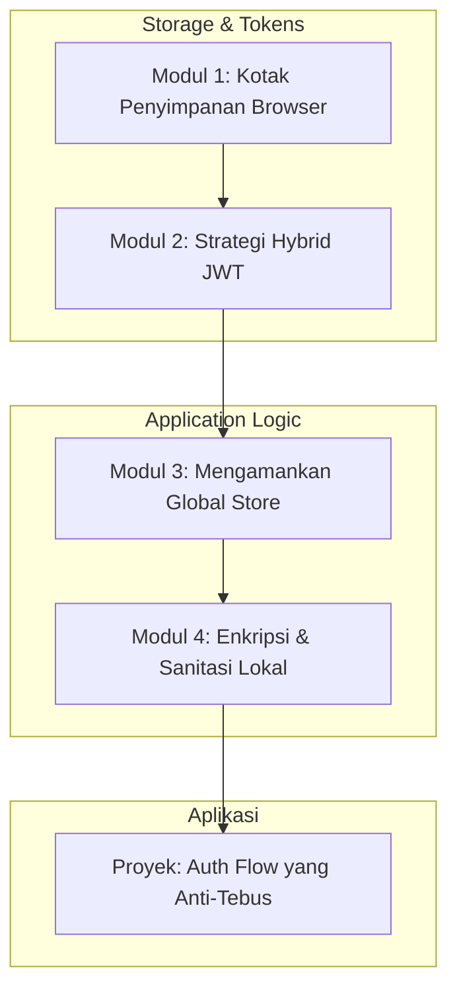

# 📘 Silabus: Secure State Management (CI03)

**Judul Pembelajaran: Menjaga Rahasia di Balik Layar: Secure State Management**

Sebagai developer frontend, kita sering menyimpan data di browser agar aplikasi terasa cepat dan responsif. Namun, browser adalah lingkungan yang "bermusuhan". Jika kita salah menyimpan data sensitif, penyerang bisa dengan mudah mengambilnya. Kursus ini membahas bagaimana mengelola state dan data penyimpanan browser dengan prinsip keamanan yang ketat.

### 🎯 **Tujuan Utama Pembelajaran**

Setelah menyelesaikan kursus ini, Anda akan mampu:

1. **Evaluasi Opsi Penyimpanan:** Memahami kapan menggunakan `localStorage`, `sessionStorage`, `Cookies`, atau `IndexedDB` berdasarkan profil risiko.
2. **Strategi Penyimpanan Token:** Mengimplementasikan penyimpanan JWT yang aman untuk memitigasi pencurian identitas (Access Token vs Refresh Token).
3. **Keamanan State Global:** Melindungi store (Redux, Zustand, dll.) dari kebocoran data sensitif melalui plugin atau devtools.
4. **Sanitasi dan Enkripsi State:** Mengetahui kapan harus melakukan enkripsi data di sisi klien sebelum disimpan ke storage tetap.
5. **Session Lifecycle Management:** Mengelola pembersihan data secara otomatis saat pengguna logout atau sesi berakhir.

### 🗺️ **Alur Pembelajaran**

Kita akan mulai dari memahami tempat penyimpanan di browser, lalu fokus pada pengamanan token, dan terakhir pada pengamanan state aplikasi secara keseluruhan.

### 📚 **Modul Pembelajaran**

#### 📦 Modul 1: Kotak Penyimpanan Browser (The Risk Profile)

**Tujuan Modul:**

- Membedakan karakteristik teknis dan keamanan dari Web Storage API vs Cookies.
- Memahami mengapa `localStorage` adalah target utama serangan XSS.
- Menganalisis batasan `IndexedDB` untuk data besar namun sensitif.

**Daftar Lesson:**

- **Lesson 1.1:** LocalStorage vs SessionStorage vs Cookies.
- **Lesson 1.2:** Bahaya Persistensi Data Sensitif.
- **Lesson 1.3:** Memilih Storage yang Tepat untuk Berbagai Kasus.

#### 🔐 Modul 2: Strategi Hybrid JWT (Access & Refresh Tokens)

**Tujuan Modul:**

- Menerapkan pola: Access Token di memori (JS Variable) dan Refresh Token di HttpOnly Cookie.
- Mengatasi masalah kehilangan token saat halaman direfresh.
- Memahami mekanisme Token Rotation untuk keamanan tambahan.

**Daftar Lesson:**

- **Lesson 2.1:** Kenapa JWT di LocalStorage itu Berbahaya.
- **Lesson 2.2:** Arsitektur Hybrid Storage.
- **Lesson 2.3:** Implementasi Silent Refresh.

#### 🛡️ Modul 3: Mengamankan Global Store (Redux, Zustand, Context)

**Tujuan Modul:**

- Mengatur apa yang boleh dan tidak boleh masuk ke dalam state global.
- Mematikan Redux DevTools di lingkungan produksi.
- Mencegah manipulasi state melalui konsol browser.

**Daftar Lesson:**

- **Lesson 3.1:** State Minimization & Sensitive Data Filtering.
- **Lesson 3.2:** Production Hardening for State Managers.
- **Lesson 3.3:** Menangani Logs & Error Reporting secara Aman.

#### 🧼 Modul 4: Enkripsi & Sanitasi Lokal

**Tujuan Modul:**

- Menggunakan library enkripsi ringan (seperti `crypto-js`) untuk data non-auth yang sensitif.
- Melakukan pembersihan storage secara proaktif (Clear on logout).
- Menangani skenario "Tab Synchronization" tanpa membocorkan data antar tab.

**Daftar Lesson:**

- **Lesson 4.1:** Dasar Enkripsi Client-Side (Kapan & Kenapa).
- **Lesson 4.2:** Implementasi Logout yang Bersih.
- **Lesson 4.3:** Keamanan Storage di Mobile Web & PWAs.

**Aktivitas Utama Modul:**

- 🚀 **Proyek: Auth Flow yang Anti-Tebus:** Anda akan membangun sistem autentikasi di React yang menggunakan pola Hybrid JWT. Anda akan memastikan token tidak bisa dicuri via XSS dan state aplikasi dibersihkan dengan sempurna saat pengguna keluar.

### 📖 **Sumber Belajar Tambahan**

- **Dokumentasi:**
  - [Auth0: Where to store tokens](https://auth0.com/docs/secure/security-guidance/auth-stock-tokens)
  - [Zustand Documentation (Persistence)](https://docs.pmnd.rs/zustand/integrations/persisting-store-data)
  - [MDN: Using the Web Storage API](https://developer.mozilla.org/en-US/docs/Web/API/Web_Storage_API/Using_the_Web_Storage_API)
- **Library:**
  - [Zustand](https://github.com/pmndrs/zustand)
  - [CryptoJS](https://github.com/brix/crypto-js)
  - [Axios HTTP Interceptors](https://axios-http.com/docs/interceptors)
